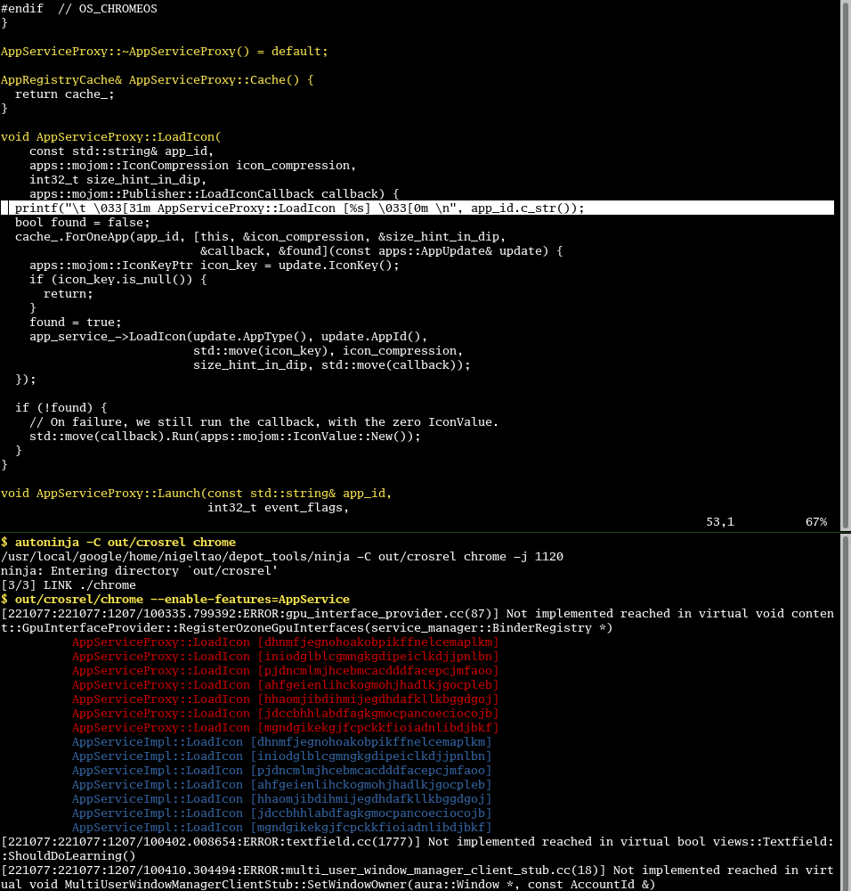
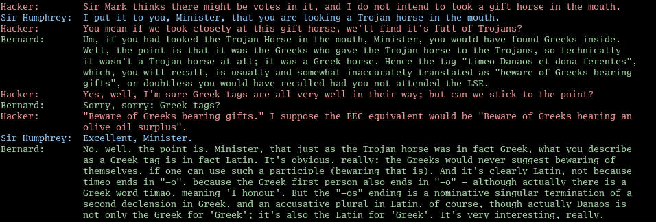

# Colorful Text for Everyday Programming

As a programmer, a lot of my working day consists of reading text, whether
editing source code, interacting with a terminal or puzzling over debugging
messages. Using color to highlight or delimit parts of that text can make
scanning long blocks for patterns or finer detail easier.

This isn't a new idea. Syntax highlighting has been a thing for decades. Still,
the way I use syntax highlighting is unusual, compared to how I often see other
people use it. Details below.

This screenshot shows two terminals. The top one is vim (editing C++), the
bottom one is bash.




## Syntax Highlighting

In my C++ code, I don't like traditional syntax highlighting. I find colorful
Christmas-tree text distracting. Instead, I want to be able to quickly see
where classes and functions start. I make that stand out (yellow vs white, on
black) the way section headers in this document stand out by being set in
bigger or bolder fonts.

I do it like this, in my `~/.vim/syntax/cpp.vim` file:

```
if exists("b:current_syntax")
    finish
endif
let b:current_syntax = "cpp"
syn match cppDecl /^[a-zA-Z].*/
highlight cppDecl ctermfg=yellow
```

The `/^[a-zA-Z].*/` regular expression isn't 100% accurate at parsing C++
declarations, even assuming `clang-format`'ed C++ code. But it doesn't have to
be perfect. The simple thing works well enough.


## Shell Prompts

In my terminal, I like the things that I type to be yellow and the computer's
response to be white.

It might not be the most correct way to do it, but I do it like this, in my
`.bashrc` file (_the following snippet was updated on 2020-05-05_):

```
if [ "$TERM" = "xterm-256color" ]; then
    PS0='\033[0m'
    PS1='\[\033[1;33m\]\$ '
fi
```

You may need to change `xterm-256color` to match your default environment's
`$TERM` variable. Or do something smarter with the `tput` program. But once
again, this simple thing works for me.


## Printf Debugging

In my printf debugging, I use [ANSI color
codes](https://en.wikipedia.org/wiki/ANSI_escape_code#Colors) like `\033[31m`
to make different printf or log statements distinct, especially from other
people's existing (vanilla white) log messages. For example, all the printf's
in the Foo class could be red (`31m`), the Bar class gets blue (`34m`), and
it's easier to eyeball that every Foo call leads to a matching Bar call, or
that "a red log line should be followed by five-ish green lines then a blue
line". If that expectation isn't true, it stands out. I don't check these
colorful printf's in, this is just while I've got work-in-progress.

I do it like this, defining a macro in my `~/.vimrc` file:

```
let @p = "oprintf(\"\\t \\033[31m X \\033[0m \\n\");\033FXcl"
```

The first two `033` instances, octal numbers for the ANSI ESC character, are
double backslashed because they're part of the C string literal inside the Vim
macro, and will be written out (e.g. to stdout or stderr). The final `033`
instance is single backslashed because it's only in the Vim macro, and escapes
(gets you out of) Vim's insert mode. The subsequent `FXcl` encodes Vim commands
that sets you up to edit the placeholder "X" message.

_Update on 2024-10-07: if the ANSI color codes are hard to remember, my
colleague [Izidor Matušov] notes that printf'ing colorful emoji (e.g. Unicode's
various hearts: 💙, 💚, 💛, etc) will also stand out in a wall of log text._


## Dialogue

The "Shell Prompts" section above adds contextual highlighting to a terminal
session, something akin to a dialogue between me and my computer. With dialogue
between humans, I don't imagine that 'traditional' programming-style syntax
highlighting, where nouns are red and verbs are blue, would be helpful.

It's not a novel idea, in that I'm sure chat clients have been doing this for
ages, but I sometimes wonder if e.g. reading a book, graphic novel or
screenplay would be easier if different people's lines were in different
colors.




---

Published: 2018-12-12
