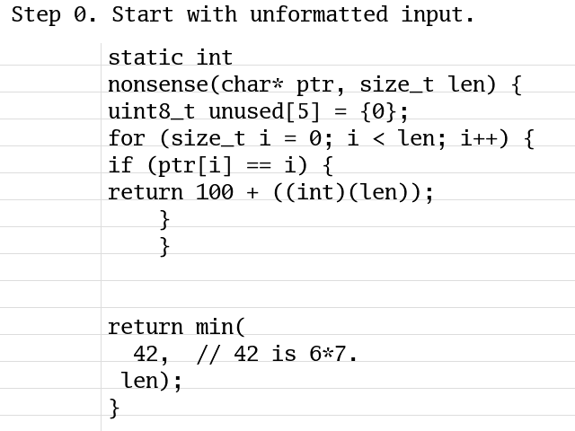

# Dumbindent: When 93% of the Time was Spent in Clang-Format

_Summary: The Wuffs compiler outputs C code. When compiling its standard
library, over 93% of the time (2.680 out of 2.855 seconds) was spent formatting
that C code with `clang-format`. `dumbindent` is a new command-line tool (and
Go package) that formats C code. Its output is not as 'pretty', but it can be
over 80 times faster than `clang-format` (0.008 versus 0.668 seconds to format
12k lines of C code)._

## Generating C Code

[Wuffs](https://github.com/google/wuffs) is a memory-safe programming language
and a standard library written in that language. ["Why don't you use _X_
instead?"](https://github.com/google/wuffs/blob/master/doc/related-work.md) is
a frequently asked question, and Rust is a frequent _X_. One difference from
Rust is that memory safety (e.g. array index bounds checks) is enforced
entirely [at compile
time](https://github.com/google/wuffs/blob/master/doc/note/bounds-checking.md),
not at run time.

Another difference (compared to Rust's primary implementation) is that the
Wuffs compiler is a
[transpiler](https://en.wikipedia.org/wiki/Source-to-source_compiler), like the
very first [C++ compiler](https://en.wikipedia.org/wiki/Cfront). It outputs C
code, not object code. That's not without its costs, but one benefit is that
the generated C code's performance then be compared across different C
compilers. For cases where [Clang/LLVM is 1.3x slower than
gcc](https://bugs.llvm.org/show_bug.cgi?id=35567), we might never have known
how well Wuffs (the language) could perform if its implementation went straight
to object code via LLVM.

## Compilation Times

Another frequent _X_ is something based on theorem provers or
[SMT](https://en.wikipedia.org/wiki/Satisfiability_modulo_theories) solvers,
such as [Z3](https://github.com/Z3Prover/z3). Table 1 from [one Z3
example](http://www.andrew.cmu.edu/user/bparno/papers/vale.pdf) reports
verification times measured in _minutes_.

In contrast, Wuffs aims for _sub-second_ compilation times, including
compile-time proofs of memory safety. However, over the lifetime of the
project, compiling its standard library (currently about 8k lines of Wuffs code
that becomes 25k lines of C code) had crept up to over a couple of seconds on a
mid-range laptop. This is far from the worst experience that programmers face
(cue the obligatory ["my code's compiling"](https://xkcd.com/303/) XKCD comic),
but it's still a noticable pause in the edit-compile-run cycle.

The final step of generating the C code was
[formatting](https://www.quotes.net/show-quote/33136) it. The title and summary
of this blog post has already spoiled the punchline. After making that final
step optional, it turned out that [over 93% of the
time](https://github.com/google/wuffs/commit/ddc8973ef0d2836a7713b7a6ca1dcbaa14f9998e)
(2.680 out of 2.855 seconds) was not spent parsing, type checking, bounds
checking, analyzing data flow, generating code or any of the other things you'd
normally learn about in a compiler textbook. It was spent formatting that C
code with `clang-format`.

One reason that it took so long was that the generated code was formatted
twice. Each package in Wuffs' standard library (e.g. GIF, JSON and ZLIB) is
compiled and formatted separately. The per-package output is then amalgamated
([similar to SQLite](https://www.sqlite.org/amalgamation.html)) into a [single
file C
library](https://github.com/nothings/stb/blob/master/docs/stb_howto.txt), and
formatted again. That second formatting was mostly redundant and was easily
made entirely redundant. [Removing that second
formatting](https://github.com/google/wuffs/commit/3efb204f4ebaf5bcb4a77ebe671a34f992e025d7)
almost halved the time spent generating the Wuffs standard library's C form.

A similar
[optimization](https://github.com/google/wuffs/commit/58a48d5a541ce5ffdbdc78d6bde37c55b74f28b1),
avoiding re-formatting the already-formatted, hand-written Wuffs-C interop
code, knocked off another chunk of time. Nonetheless, those two changes only
brought 93% down to 81%.

## Formatting Is Hard

`clang-format` solves a hard problem: given an arbitrary C program as input
(perhaps an invalid one, containing syntax errors), produce something that
looks consistent and 'pretty', without altering the semantics of that program.

Because C/C++ became popular long before auto-formatters became popular (and
e.g. part of pre-submit hooks), there are many different (and incompatible)
[C/C++ styles](https://en.wikipedia.org/wiki/Indentation_style#Styles) in use.
`clang-format` is not a _bad_ program. It's a _big_ program (for something that
'merely' takes text input and prints text output). Its [source
code](https://github.com/llvm/llvm-project/tree/master/clang/lib/Format) weighs
over 20k lines of C++ code, excluding its unit tests and dependencies. It has
over 100 configuration options (which is still far less than `uncrustify`'s
[735 configuration
options](https://github.com/uncrustify/uncrustify/blob/c7e1f366bab5496e79ef1939b295dc8071de1d9c/README.md#features)):

    $ clang-format-9 -dump-config | wc -l
    127

Code formatting not just a hard problem, it's really hard. Bob Nystrom's a
smart programmer. [Crafting Interpreters](https://craftinginterpreters.com/) is
a fantastic book. His ["What Color is Your
Function?"](https://journal.stuffwithstuff.com/2015/02/01/what-color-is-your-function/)
article is often cited, and asynchronous programming is famously difficult. But
he called `dartfmt`, a source code formatter, ["The Hardest Program I've Ever
Written"](https://journal.stuffwithstuff.com/2015/09/08/the-hardest-program-ive-ever-written/).
Why is formatting hard? Bob says:

> If every statement fit within the column limit of the page, yup. It's a piece
> of cake. (I think that's what `gofmt` does.) But our formatter also keeps
> your code within the line length limit. That means adding line breaks (or
> "splits" as the formatter calls them), and determining the best place to add
> those is famously hard... The search space we have to cover is
> _exponentially_ large, and even ranking different solutions is a subtle
> problem.

Column limits make it essentially hard. More on that later.

## Dumbindent

Wuffs doesn't need a big formatter. It doesn't need to handle a hundred
different hand-written C/C++ styles, only the C that it automatically generates
itself. It only needs a "piece of cake", [low INT, high
WIS](/blog/2019/xyz-abc-problem.html), `gofmt`-like solution. The 'unformatted'
C code, by construction, already has line breaks in sensible places. The
formatter only needs to fix up the horizontal formatting (i.e. indentation) due
to nested `{}` braces and `()` parentheses.

Hence [`dumbindent`](https://godoc.org/github.com/google/wuffs/lib/dumbindent)
was born, a dumb-but-fast formatter for C (and  C-like) programs. Just like
building Lego, when building software, sometimes the [dumb
approach](https://www.youtube.com/watch?v=-JHX1w2rkPY) can [solve the
problem](https://www.youtube.com/watch?v=H1IXT7GRAFI), beautiful in its own
way.

`dumbindent` has no column limit. It will not break a long line into two medium
ones nor merge two short lines into one medium one. It takes existing lines as
they are, and only shifts them left or right. The
[implementation](https://github.com/google/wuffs/tree/master/lib/dumbindent) is
under 0.6k lines of Go code. Here's an animation of how it works on some
nonsensical, slightly-badly formatted input:

If you want to linger on individual animation frames:

- [Step 0. Start with unformatted input.](./dumbindent-animation-0.png)
- [Step 1. Remove old indentation.](./dumbindent-animation-1.png)
- [Step 2. Focus on braces and parentheses.](./dumbindent-animation-2.png)
- [Step 3. Count not-yet-balanced braces.](./dumbindent-animation-3.png)
- [Step 4. Note not-yet-balanced parentheses.](./dumbindent-animation-4.png)
- [Step 5. Apply new indentation.](./dumbindent-animation-5.png)
- [Step 6. Finish with formatted output.](./dumbindent-animation-6.png)

Replacing "run it through `clang-format`" with "run it through `dumbindent`"
made Wuffs' generated C code slightly less 'pretty', but doing so was [notably
faster](https://github.com/google/wuffs/commit/12b0f4c0bc77f722e90200989ab7b60ad3bbd2ba)
and formatting time dropped from 81% to something negligible. Subjectively,
Wuffs' edit-compile-run cycle felt snappier and happier.

## A Command-Line Tool

Another data point takes Wuffs' amalgamated file (here, the 12k lines of C code
from an older but unchanging Wuffs release), and formats it again. On this task
`dumbindent` was [70 times
faster](https://github.com/google/wuffs/blob/12b0f4c0bc77f722e90200989ab7b60ad3bbd2ba/cmd/dumbindent/main.go#L32-L44)
than `clang-format-5.0`, and [80 times
faster](https://github.com/google/wuffs/commit/8bf4084c8b92d7037db592342ba3025b90244419)
than `clang-format-9`:

    $ wc release/c/wuffs-v0.2.c
     11858  35980 431885 release/c/wuffs-v0.2.c

    $ time dumbindent                               < release/c/wuffs-v0.2.c > /dev/null
    real    0m0.008s
    user    0m0.005s
    sys     0m0.005s

    $ time clang-format-9                           < release/c/wuffs-v0.2.c > /dev/null
    real    0m0.668s
    user    0m0.618s
    sys     0m0.032s

    $ time clang-format-9 -style='{ColumnLimit: 0}' < release/c/wuffs-v0.2.c > /dev/null
    real    0m0.641s
    user    0m0.585s
    sys     0m0.037s

Giving `clang-format-9` no column limit at all helped a little, but not a lot.
I don't know exactly what `clang-format-9` was doing with its time, but perhaps
whatever it was isn't essentially hard, only accidentally hard (and therefore
possibly fixable?). That investigation is for another time, though, and most
probably for another person.

If you want to try the `dumbindent` command-line tool yourself, after
[installing Go](https://golang.org/dl/), it should suffice to run:

    $ go get github.com/google/wuffs/cmd/dumbindent

## SQLite

Trying a similar comparison on SQLite's [amalgamated C
file](https://www.sqlite.org/download.html) (230k lines of C code) was even
more [dramatic](https://bugs.llvm.org/show_bug.cgi?id=27093#c2):

    $ wc sqlite-amalgamation-3320200/sqlite3.c
     229616 1049648 8115947 sqlite-amalgamation-3320200/sqlite3.c

    $ time dumbindent     < sqlite-amalgamation-3320200/sqlite3.c > /dev/null
    real    0m0.137s
    user    0m0.075s
    sys     0m0.034s

    $ time clang-format-9 < sqlite-amalgamation-3320200/sqlite3.c > /dev/null
    LLVM ERROR: out of memory
    Stack dump:
    0.      Program arguments: clang-format-9
    /usr/lib/x86_64-linux-gnu/libLLVM-9.so.1(_ZN4llvm3sys15PrintStackTraceERNS_11raw_ostreamE+0x1f)[0x7ff55208135f]
    /usr/lib/x86_64-linux-gnu/libLLVM-9.so.1(_ZN4llvm3sys17RunSignalHandlersEv+0x50)[0x7ff55207f780]
    /usr/lib/x86_64-linux-gnu/libLLVM-9.so.1(+0xa38761)[0x7ff552081761]
    /lib/x86_64-linux-gnu/libpthread.so.0(+0x12890)[0x7ff55143c890]
    /lib/x86_64-linux-gnu/libc.so.6(gsignal+0xc7)[0x7ff54e2f3e97]
    /lib/x86_64-linux-gnu/libc.so.6(abort+0x141)[0x7ff54e2f5801]
    /usr/lib/x86_64-linux-gnu/libLLVM-9.so.1(_ZN4llvm22report_bad_alloc_errorEPKcb+0x93)[0x7ff551fe60a3]
    /usr/lib/x86_64-linux-gnu/libclang-cpp.so.9(_ZN4llvm23SmallVectorTemplateBaseIN5clang6format13UnwrappedLineELb0EE4growEm+0xbe)[0x7ff550e007be]
    /usr/lib/x86_64-linux-gnu/libclang-cpp.so.9(_ZN5clang6format13TokenAnalyzer20consumeUnwrappedLineERKNS0_13UnwrappedLineE+0x121)[0x7ff550dffb21]
    /usr/lib/x86_64-linux-gnu/libclang-cpp.so.9(_ZN5clang6format19UnwrappedLineParser5parseEv+0x119)[0x7ff550e10089]
    /usr/lib/x86_64-linux-gnu/libclang-cpp.so.9(_ZN5clang6format13TokenAnalyzer7processEv+0xcf)[0x7ff550dfee2f]
    /usr/lib/x86_64-linux-gnu/libclang-cpp.so.9(_ZN5clang6format13guessLanguageEN4llvm9StringRefES2_+0x2d8)[0x7ff550de2728]
    /usr/lib/x86_64-linux-gnu/libclang-cpp.so.9(_ZN5clang6format8getStyleEN4llvm9StringRefES2_S2_S2_PNS1_3vfs10FileSystemE+0x59)[0x7ff550de2859]
    clang-format-9[0x4064ef]
    clang-format-9[0x405688]
    /lib/x86_64-linux-gnu/libc.so.6(__libc_start_main+0xe7)[0x7ff54e2d6b97]
    clang-format-9[0x40509a]
    Aborted (core dumped)
    real    0m25.782s
    user    0m18.505s
    sys     0m3.049s

## Caveats

`dumbindent` does not solve all the problems that `clang-format` or other
formatters do. It does not _parse_ the input as C/C++ source code.

In particular, it does not solve C++'s [most vexing
parse](https://en.wikipedia.org/wiki/Most_vexing_parse) or otherwise determine
whether `"x*y"` is a multiplication or a type definition (where `y` is a
pointer-to-`x` typed variable or function argument, such as `"int*p"`). For a
type definition, where other formatting algorithms would re-write around the
`"*"` as either `"x* y"` or `"x *y"`, `dumbindent` will not insert spaces.

Similarly, `dumbindent` will not correct this mis-indentation:

    if (condition)
      goto fail;
      goto fail;

Instead, when automatically or manually generating the input for `dumbindent`,
it is recommended to always emit `{}` curly braces, even for what would
otherwise be 'one-liner' if statements.

Having said that, `dumbindent` is available as the previously mentioned
command-line tool and as [a Go
package](https://godoc.org/github.com/google/wuffs/lib/dumbindent). If it works
for you, great. If it doesn't work for you, don't use it. :-)

## On Related Work

This blog post is critical of other software, especially `clang-format`. To be
clear, Rust, Clang, LLVM, Z3, etc. are not bad technologies. They are great
technologies that solve real and important problems, and have orders of
magnitude more users that Wuffs and `dumbindent` do. They're also solving
similar-but-different problems in different contexts and coming from different
histories. Software is not a zero-sum game. Engineering is trade-offs.

---

Published: 2020-06-15
