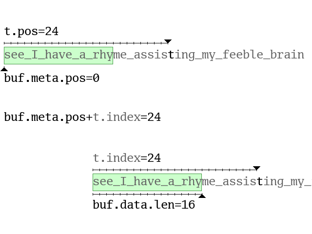
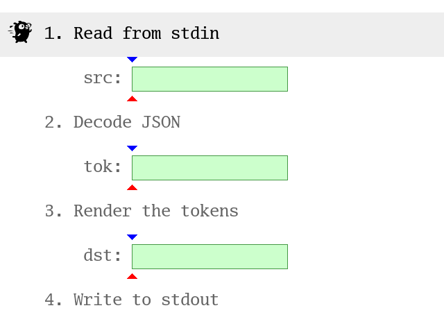

# Jsonptr: Using Wuffs' Memory-Safe, Zero-Allocation JSON Decoder

_Summary: `jsonptr` is a new, sandboxed command-line tool that formats JSON and
speaks the JSON Pointer query syntax. Wuffs standard library's JSON decoder can
run in O(1) memory, even with arbitrarily long input (containing arbitrarily
long strings) because it uses multiple tokens to represent each JSON string.
Processing the JSON Pointer query during (instead of after) parsing can
dramatically impact performance. `jsonptr` can be faster, tighter (use less
memory) and safer than alternatives such as `jq`, `serde_json` and `simdjson`._

## `jsonptr`

[`jsonptr`](https://github.com/google/wuffs/blob/a325d7860f9c922b805d959a7f66c726adc92593/example/jsonptr/jsonptr.cc) is
a command-line formatter for [JSON](https://www.json.org/), a ubiquitous,
human-readable file format. It also implements the [JSON
Pointer](https://www.ietf.org/rfc/rfc6901.txt) syntax for identifying a
sub-node of the JSON input. For example, Chromium's Preferences files are
compact (minified, with no extra whitespace or line breaks) but `jsonptr` can
make them more readable.

    $ git clone https://github.com/google/wuffs.git
    $ g++ -O3 -Wall wuffs/example/jsonptr/jsonptr.cc -o my-jsonptr
    $ ./my-jsonptr -query=/browser/window_placement \
    > ~/.config/google-chrome/Profile\ 1/Preferences
    {
        "bottom": 1200,
        "docked": false,
        "left": 0,
        "maximized": false,
        "right": 1920,
        "top": 0,
        "work_area_bottom": 1200,
        "work_area_left": 0,
        "work_area_right": 1920,
        "work_area_top": 0
    }

By itself, that's not particularly novel. Many existing JSON processing tools
do this. Picking `jq` as a popular example, its syntax isn't JSON Pointer
syntax, but `jq .browser.window_placement ~/.config/google-chrome/Profile\
1/Preferences` will print something similar, and `jq` comes with [many more
useful features](https://stedolan.github.io/jq/manual/).

Looking closer, there are several advantages to `jsonptr`. **The first is
speed**. Here are some numbers from throwing an `x86_64` Broadwell desktop CPU
at some JSON files from the
[`miloyip/nativejson-benchmark`](https://github.com/miloyip/nativejson-benchmark)
and [`zemirco/sf-city-lots-json`](https://github.com/zemirco/sf-city-lots-json)
repositories. The `time` output (and later, the `/usr/bin/time` output), a
median of three runs, has been edited for brevity and embellished with a N.NNx
ratio (N.NN greater than 1 means that `jsonptr` is better).

    $ time ./my-jsonptr < canada.json       > /dev/null
    real    0m0.013s  (1.00x by definition)
    $ time ./my-jsonptr < citm_catalog.json > /dev/null
    real    0m0.006s  (1.00x by definition)
    $ time ./my-jsonptr < citylots.json     > /dev/null
    real    0m1.119s  (1.00x by definition)
    $ time ./my-jsonptr < twitter.json      > /dev/null
    real    0m0.004s  (1.00x by definition)
    
    $ time jq .         < canada.json       > /dev/null
    real    0m0.238s  (18.3x vs jsonptr)
    $ time jq .         < citm_catalog.json > /dev/null
    real    0m0.095s  (15.8x vs jsonptr)
    $ time jq .         < citylots.json     > /dev/null
    real    0m15.533s (13.9x vs jsonptr)
    $ time jq .         < twitter.json      > /dev/null
    real    0m0.062s  (15.5x vs jsonptr)

Both `jsonptr` and `jq` can emit compact output, reducing the running time.

    $ time ./my-jsonptr -compact-output < citylots.json > /dev/null
    real    0m0.863s   (1.00x by definition)
    
    $ time jq --compact-output .        < citylots.json > /dev/null
    real    0m12.140s  (14.1x vs jsonptr -compact-output)

**The second is memory usage**.

    $ /usr/bin/time -v ./my-jsonptr < canada.json > /dev/null
    Maximum resident set size (kbytes): 1096   (1.00x by definition)

    $ /usr/bin/time -v jq .         < canada.json > /dev/null
    Maximum resident set size (kbytes): 18900  (17.2x vs jsonptr)

**The third is safety**. `jq` is written in C, a memory-unsafe language. The
[`jsonptr.cc`](https://github.com/google/wuffs/blob/a325d7860f9c922b805d959a7f66c726adc92593/example/jsonptr/jsonptr.cc)
file is written in C++, also memory-unsafe, but the core JSON decoder is
written in [Wuffs](https://github.com/google/wuffs), a
[memory-safe](https://github.com/google/wuffs/blob/a325d7860f9c922b805d959a7f66c726adc92593/doc/note/memory-safety.md)
language designed for crafting
[hermetic](https://github.com/google/wuffs/blob/a325d7860f9c922b805d959a7f66c726adc92593/doc/note/hermeticity.md)
libraries.

### Sandboxing

For additional defence in depth, on Linux, the second thing that `jsonptr`'s
`main` function does is to
[self-impose](https://github.com/google/wuffs/blob/a325d7860f9c922b805d959a7f66c726adc92593/example/jsonptr/jsonptr.cc#L1434)
a [`SECCOMP_MODE_STRICT`](https://man7.org/linux/man-pages/man2/seccomp.2.html)
sandbox. The first thing that it does is to open (but not read) the file named
in the command line arguments, which the sandbox would otherwise prohibit.

A `SECCOMP_MODE_STRICT` sandbox effectively restricts the program to only read
from the input file, compute on its bytes and write to `stdout`. Even if

1. malicious input tickled
2. a bug in Wuffs' JSON library that combined with
3. a bug in the Wuffs compiler's proofs of safety

decoding such input still couldn't access the file system or the network, run
other programs, etc.

One implication of the `SECCOMP_MODE_STRICT` sandbox is that **the program
cannot dynamically allocate memory**, and indeed, Wuffs' JSON library runs with
zero dynamic allocations. It never calls `malloc` or invokes `new`. That's not
"zero dynamic allocations in the steady state", that's "zero dynamic
allocations, full stop".

The program statically allocates [three 32 KiB
buffers](https://github.com/google/wuffs/blob/a325d7860f9c922b805d959a7f66c726adc92593/example/jsonptr/jsonptr.cc#L438-L447)
for the JSON decoder to use, but `jsonptr` can still handle megabytes of input,
or even individual megabyte-long JSON strings. How it does this is discussed
further below, starting with the "Wuffs Buffers" section.

Being sandboxed means that it's less worrisome to process untrusted files from
the network, even when downloading over HTTP (not HTTPS).

    $ # prize.json has no line breaks.
    $ wget -q -O - http://api.nobelprize.org/v1/prize.json | wc
          0   14703  216670
    $ # jsonptr can make it more human-readable.
    $ wget -q -O - http://api.nobelprize.org/v1/prize.json | \
    > ./my-jsonptr | head -n 20
    {
        "prizes": [
            {
                "year": "2019",
                "category": "chemistry",
                "laureates": [
                    {
                        "id": "976",
                        "firstname": "John",
                        "surname": "Goodenough",
                        "motivation": "\"for the development of lithium-ion batteries\"",
                        "share": "3"
                    },
                    {
                        "id": "977",
                        "firstname": "M. Stanley",
                        "surname": "Whittingham",
                        "motivation": "\"for the development of lithium-ion batteries\"",
                        "share": "3"
                    },

For an additional party trick, `jsonptr` can print a depth-limited summary of
the JSON node tree.

    $ wget -q -O - http://api.nobelprize.org/v1/prize.json | \
    > ./my-jsonptr -query=/prizes/0 -max-output-depth=2
    {
        "year": "2019",
        "category": "chemistry",
        "laureates": [
            "{…}",
            "{…}",
            "{…}"
        ]
    }

## Trade-Offs

To be clear, `jq` (or any other software discussed below) isn't bad software.
It's great software, deserving its many happy users. There's simply trade-offs
where `jsonptr` and `jq` make different but equally reasonable choices.

### Sorting Keys

Unlike `jsonptr`, `jq` is able to sort object keys.

    $ echo '{"three":3,"four":4}' | ./my-jsonptr
    {
        "three": 3,
        "four": 4
    }
    $ echo '{"three":3,"four":4}' | jq .
    {
      "three": 3,
      "four": 4
    }
    $ echo '{"three":3,"four":4}' | jq --sort-keys .
    {
      "four": 4,
      "three": 3
    }

Sorting keys is certainly a useful feature, and while the [JSON specification
(RFC 8259)](https://www.ietf.org/rfc/rfc8259.txt) does not rule out duplicate
keys, many applications assume (often implicitly) that keys are unique, and
sorting keys helps efficiently detect duplicates.

However, if the top-level JSON value is an object (a dictionary of key-value
pairs) then a formatter cannot print anything other than the opening `{`
character until the entire value is parsed. **This requires `O(N)` memory,
where `N` is the length of the input**. In comparison, the `jsonptr` program
does not sort keys and requires only `O(1)` memory. Again, neither better or
worse per se, just making different trade-offs.

### Parsing Numbers

Unlike `jsonptr`, `jq` will convert JSON numbers from strings (`"123"` being
one two three) to numbers (`123` being one hundred and twenty three), using
IEEE 754 `double` precision.

    $ echo 0.99999999999999999 | ./my-jsonptr
    0.99999999999999999
    $ echo 0.99999999999999999 | jq .
    1

This is certainly useful when comparing values to other numbers. `jq`'s query
language allows filters like `map(select(. >= 2))`. It's also more convenient,
for a programming API instead of a command-line tool, to work with JSON numbers
as a `double` instead of a `std::string`. Nonetheless, having the parser
(instead of the caller) always convert from `std::string` to `double` can be
surprisingly expensive. **Optimizing `StringToDouble` (or its equivalent) can
dramatically [speed up a JSON
parser](https://github.com/google/double-conversion/issues/137)**. For a
formatter, skipping a redundant `StringToDouble` and `DoubleToString` round
trip entirely means a faster program.

## Rust

Wuffs is most often compared with [Rust](https://www.rust-lang.org/). Both are
memory-safe (but not garbage collected) languages with C/C++ interoperability.

One difference is that Wuffs' standard library is transpiled to C, not compiled
to object code, so that existing C/C++ projects can **use Wuffs' standard
library like any other third party C library** (it's just not hand-written C),
without needing to pull in another language toolchain. The "`git clone` and
then `g++`" instructions at the top of this article do not involve "install the
Wuffs compiler".

Again, neither better or worse per se, just making different trade-offs.
There's also the [`mrustc`](https://github.com/thepowersgang/mrustc)
alternative Rust compiler, a work-in-progress.

### `jsonxf`

`jsonxf` is a JSON pretty-printer written in Rust (without any use of
`unsafe`). The `-m` flag minifies output.

    $ cargo install jsonxf
    $ time ~/.cargo/bin/jsonxf    < citylots.json > /dev/null
    real    0m1.928s  (1.72x vs jsonptr)
    $ time ~/.cargo/bin/jsonxf -m < citylots.json > /dev/null
    real    0m1.871s  (2.17x vs jsonptr)

It does not validate JSON escape sequences. This is [a deliberate design
decision](https://github.com/gamache/jsonxf/blob/cd2835dc33f6c03999baa4ae4a9ff1dbd860134e/src/jsonxf.rs#L12-L15),
not a bug, but it is a point of difference from `jsonptr`.

    $ echo -n '"Backslash-t (\t) is   valid JSON."' | ./my-jsonptr; echo $?
    "Backslash-t (\t) is   valid JSON."
    0
    $ echo -n '"Backslash-a (\a) is invalid JSON."' | ./my-jsonptr; echo $?
    "Backslash-a (
    json: bad backslash-escape
    1
    $ echo -n '"No final double-quote'              | ./my-jsonptr; echo $?
    "No final double-quote
    json: bad input
    1
    
    $ echo -n '"Backslash-t (\t) is   valid JSON."' | ~/.cargo/bin/jsonxf; echo $?
    "Backslash-t (\t) is   valid JSON."0
    $ echo -n '"Backslash-a (\a) is invalid JSON."' | ~/.cargo/bin/jsonxf; echo $?
    "Backslash-a (\a) is invalid JSON."0
    $ echo -n '"No final double-quote'              | ~/.cargo/bin/jsonxf; echo $?
    "No final double-quote0

Wuffs' decoder also handles Unicode surrogate pairs (and detects their misuse).

    $ echo '"Surrogates are a \uD83D\udca9."' | ./my-jsonptr
    "Surrogates are a 💩."
    $ echo '"Surrogates are a \uD83D\u0009."' | ./my-jsonptr
    "Surrogates are a
    json: bad backslash-escape

`jsonptr`
[passes](https://github.com/google/wuffs/blob/a325d7860f9c922b805d959a7f66c726adc92593/script/run-json-test-suite.sh)
all [318 test cases](https://github.com/nst/JSONTestSuite), positive and
negative, associated with the "[Parsing JSON is a
Minefield](http://seriot.ch/parsing_json.php)" article.

### `serde_json`

[`serde_json`](https://docs.rs/serde_json/1.0.57/serde_json/index.html) is a
popular Rust crate for processing JSON. As the "serde" name suggests, its
primary focus is on serializing and deserializing. For numbers, this means
`StringToDouble` and `DoubleToString` equivalents. It can also implement a JSON
formatter, with the redundant computation cost as discussed in the "Parsing
Numbers" section above.

    $ cat src/main.rs
    fn main() -> Result<(), Box<serde_json::error::Error>> {
        let mut compact = false;
        let mut only = false;
        let mut query = "".to_string();
        for arg in std::env::args().skip(1) {
            if arg == "-c" {
                compact = true;
            } else if arg == "-only-parse-dont-output" {
                only = true;
            } else {
                query = arg;
            }
        }
        let reader = std::io::BufReader::new(std::io::stdin());
        let writer = std::io::BufWriter::new(std::io::stdout());
        let value: serde_json::Value = serde_json::from_reader(reader)?;
        if only {
            // No-op.
        } else if compact {
            serde_json::to_writer(writer, value.pointer(&query).unwrap())?;
        } else {
            serde_json::to_writer_pretty(writer, value.pointer(&query).unwrap())?;
        }
        Ok(())
    }
    $ cargo build --release
    $ cp target/release/serdejson ./my-serdejson
    $ echo '[0.5, 0.99999999999999999, 2, 123.456789]' | ./my-serdejson -c
    [0.5,1.0,2,123.456789]
    $ time ./my-serdejson    < citylots.json > /dev/null
    real    0m5.969s  (5.33x vs jsonptr)
    $ time ./my-serdejson -c < citylots.json > /dev/null
    real    0m4.891s  (5.67x vs jsonnptr -compact-output)
    $ echo -n '"Backslash-a (\a) is invalid JSON."' | ./my-serdejson; echo $?
    Error: Error("invalid escape", line: 1, column: 16)
    1

The `-only-parse-dont-output` flag and the `query` command line argument are
discussed in the "Query Dependent Running Time" section below.

### `serde_json_core`

[`serde_json_core`](https://docs.rs/serde-json-core/0.1.0/serde_json_core/) is
zero-allocation but it requires the input to be entirely in memory and does not
handle escape sequences within JSON strings.

## Wuffs Buffers

Wuffs' decoders are
[coroutines](https://github.com/google/wuffs/blob/a325d7860f9c922b805d959a7f66c726adc92593/doc/note/coroutines.md)
that process arbitrarily long inputs and outputs by operating on finite length
buffers. Just as (finite length) glass-bottom boats can glide along an
arbitrarily long stream of water, Wuffs' finite lengths buffers can glide along
an arbitrarily long stream of bytes, viewing part of the stream at any point in
time. *Motion* is where early bytes leave the buffer and later bytes enter the
buffer.

Each stream byte has up to three locations (numbers) associated with it:

- Its *position* is the offset relative to the start of the stream. It stays
  constant under motion.
- Its *index* is the offset relative to the start of the buffer, when the byte
  is in view. It varies under motion.
- Its *address* is the memory location (the C/C++ pointer value), when the byte
  is in view. It varies under motion and also if the buffer's backing store is
  moved or re-sized.

A buffer `buf` consists of data (the pointer and length of its backing store,
what Wuffs calls a slice and C/C++ calls a fixed-size array) and some metadata
(including a *buffer position*) so that a stream byte `t` satisfies these
identities:

- `t.pos  = t.index + buf.meta.pos`
- `t.addr = t.index + buf.data.ptr`

There are two equivalent visualizations of this, duals of each other, where one
thing (the stream or buffer) stays still and the other thing (the buffer or
stream) moves. For example, here's a stream containing "see I have a rhyme
assisting my feeble brain" (the gray text), a 16-byte buffer (the green
rectangles) and a focus on the 't' byte (which is in view when `t.index < 16`).

### Readers, Writers and Compactions

To simplify the animation above, motion was only one byte at a time and the
buffer was always full. In practice, for efficiency, motion often takes bigger,
jerkier steps. Furthermore, just like how a Unix pipe has a reader end and a
writer end, a buffer's metadata also has a *reader index* `meta.ri` and a
*writer index* `meta.wi`.

- *Filling* or writing to a buffer (e.g. copying from `stdin` to a buffer)
  involves writing some number `wn` of bytes starting at `meta.wi` and
  incrementing `meta.wi` by `wn`.
- The `writer_length`, defined as `(data.len - meta.wi)`, is the maximum number
  of bytes that can be written: you can't write past the end of the buffer.
- *Draining* or reading from a buffer (e.g. copying from a buffer to `stdout`)
  involves reading some number `rn` of bytes starting at `meta.ri` and
  incrementing `meta.ri` by `rn`.
- The `reader_length`, defined as `(meta.wi - meta.ri)` is the maximum number
  of bytes that can be read: you can't read what hasn't been written yet (and
  you therefore also cannot read past the end of the buffer).

The `meta` fields can vary over time, but three invariants must always hold
(and are enforced in Wuffs code by the Wuffs compiler) which together also
imply `(writer_length <= data.len)` and `(reader_length <= data.len)`:

- `0       <= meta.ri`, trivially true because `meta.ri` is unsigned.
- `meta.ri <= meta.wi`
- `meta.wi <= data.len`

Filling increases `meta.wi` and draining increases `meta.ri`. Those indexes are
decreased by *compactions*: the buffers are linear, not circular. Compactions
move any written-but-not-read-yet bytes (there are `reader_length` of them) to
the start of the buffer and lowers `meta.wi`, lowers `meta.ri` and raises
`meta.position` all by the same amount so that `meta.ri` becomes zero.
Compactions change the writer and reader *indexes* but do not change the writer
and reader *positions*.

Here's another animation (again with a `data.len = 16` buffer) where fills are
as large as possible and drains stop at word boundaries. The blue (writer) and
red (reader) triangles show the positions or indexes and yellow backgrounds
show compactions. Question marks show buffer elements with undefined values:
Wuffs code cannot read them. Filler versus non-filler is discussed in the
"Wuffs Tokens" section below.

For completeness, a buffer's `meta` also contains a boolean `closed` field, set
true when no more writes are expected (e.g. we've reached the end of `stdin`).
Here's the complete C type definition for Wuffs-C interop (byte buffers are
also called I/O buffers).

    typedef struct {
      uint8_t* ptr;
      size_t len;
    } wuffs_base__slice_u8;
    
    typedef struct {
      size_t wi;     // Write index. Invariant: wi <= len.
      size_t ri;     // Read  index. Invariant: ri <= wi.
      uint64_t pos;  // Buffer position (relative to the start of stream).
      bool closed;   // No further writes are expected.
    } wuffs_base__io_buffer_meta;
    
    typedef struct {
      wuffs_base__slice_u8 data;
      wuffs_base__io_buffer_meta meta;
    } wuffs_base__io_buffer;

In Wuffs code, structs have public methods but private fields. A
`base.io_reader` is just an I/O buffer that only has drain-related methods (and
no fill-related methods) and a `base.io_writer` is vice versa. For example, if
`r` is a `base.io_reader` then `r.length()` is the `reader_length`. The Wuffs
compiler will reject e.g. a `r.peek_u32le()` call unless there's also
[proof](https://github.com/google/wuffs/blob/a325d7860f9c922b805d959a7f66c726adc92593/doc/note/facts.md)
that `(r.length() >= 4)`.

## Wuffs Tokens

Wuffs' JSON decoder emits tokens, like other
[SAX](https://en.wikipedia.org/wiki/Simple_API_for_XML)-style decoders
(although others sometimes call them events and sometimes invoke callbacks
rather than emit values). Most of the tokens are straightfoward: JSON values
like `true` and `12.3` each become one token. JSON's optional whitespace become
'filler' tokens, explicit in the token stream (because each token's *position*,
used in the same sense as a buffer *position*, is implicitly calculated as the
sum of all previous tokens' lengths) but otherwise ignored.

Somewhat unusually, punctuation like `:` colons and `,` commas (but not `[]`
brackets and `{}` braces) are also considered 'filler'. They are part of the
syntax (to be consistent with JavaScript) but, in hindsight, [semantically
unnecessary](https://www.tbray.org/ongoing/When/201x/2016/08/20/Fixing-JSON#p-1).

More unusually, **each JSON string is represented by multiple Wuffs tokens**.
One reason for this is that Wuffs token have a maximum length of 65,535 bytes
(discussed in the "64-Bit Token Representation" section below), even if the
source buffer is longer. For example, a 200,000 byte JSON string could decode
as three 65,535 byte tokens and some shorter residual tokens that make up the
remaining 3,395 bytes. For the `jsonptr` program, which uses a 32 KiB source
buffer, no token will be longer than 32 KiB.

Even if a JSON string measures under 65,536 (or 32,768) bytes, it decomposes
into multiple Wuffs tokens. Consider the JSON string `"\u0009½+\u00BD=1\n"`.
Different parts of the input string (in the JSON format) are converted
differently to produce their contribution to the decoded string. For example,
the `½+` input bytes map 1-to-1, even though some of those bytes are UTF-8 but
not ASCII. The 6-byte `\u0009` decodes to a single Unicode code point, U+0009
CHARACTER TABULATION, commonly known as the ASCII tab character. The `"` quotes
that book-end the input are syntactically necessary but contribute nothing to
the decoded string. That input (remembering that the UTF-8 encoding of ½ is the
two bytes `C2 BD`), a single JSON string, could be split into 7 Wuffs tokens
(labeled `t0` ... `t6`) that combine for 9 decoded bytes.

    Chars:   "  \  u  0  0  0  9  ½     +  \  u  0  0  B  D  =  1  \  n  "
    Hex:     22 5C 75 30 30 30 39 C2 BD 2B 5C 75 30 30 42 44 3D 31 5C 6E 22
    Tokens:  t0 t1--------------- t2------ t3--------------- t4--- t5--- t6
    Decoded:    09                C2 BD 2B C2 BD             3D 31 0A

There is more than one valid tokenization. This example might split into more
than 7 tokens (for the same 9 decoded bytes), if the JSON string crosses an
`io_buffer` boundary. The Wuffs JSON decoder will not emit a token that breaks
a multi-byte UTF-8 code point or a multi-byte JSON backslash escape. The `C2 BD
2B` fragment could split as `C2 BD;2B` (for two tokens instead of one) but not
`C2;BD 2B`. If the `io_buffer`'s `meta.wi` was just after the `C2` byte then
the Wuffs JSON decoder would not consume it but instead yield a `"$short read"`
[coroutine
suspension](https://github.com/google/wuffs/blob/a325d7860f9c922b805d959a7f66c726adc92593/doc/note/coroutines.md)
(or an error if `meta.closed` was true) saying it wants more input before
outputting the next token.

"9 decoded bytes" means that the in-memory representation (e.g. as a C++
`std::string`) of that JSON string input would have length 9. The `jsonptr`
program outputs valid JSON (including `"` quotes and escape codes), so its
output is longer than the in-memory form (but can be shorter than the input).

    $ echo '"\u0009½+\u00BD=1\n"' | ./my-jsonptr
    "\t½+½=1\n"

### 64-Bit Token Representation

Wuffs tokens are not a `struct` (or `enum` or `union`) that has e.g. a `double`
field, a `std::string` field, etc. In the worst case, `std::string` or
`std::vector` fields require dynamic allocation of `O(N)` memory, where `N` is
the length of the input. Instead, **Wuffs tokens are simply `uint64_t`
values**. 16 of its 64 bits are the token length (and hence the maximum token
length is 65,535 bytes). 1 bit groups consecutive tokens into larger token
chains (e.g. the 7 tokens in the JSON string example above would form a single
token chain where the first 6 tokens have the 'continued' bit set). 46 bits are
the token value, discriminating filler from numbers from string-fragments (that
map 1-to-1) from other string-fragments (like the `"` quotes that map 1-to-0)
from other string-fragments (that map to a single Unicode code point), etc. The
last bit is an extension mechanism when 46 value bits aren't enough. The
[Tokens](https://github.com/google/wuffs/blob/a325d7860f9c922b805d959a7f66c726adc92593/doc/note/tokens.md)
note has more details on e.g. a token value's `vbc` and `vbd` bits.

"Unicode code point" tokens dedicate 21 of their value bits to hold the code
point inline (the maximum valid code point is U+10FFFF), but "string fragment"
tokens don't contain the (variable length) string contents inline. Instead,
each token's position in the I/O stream is the sum of the previous tokens'
lengths, and converting an I/O position to a buffer address (see the "Wuffs
Buffers" section above) produces a pointer. Combining that pointer with the
token length recovers the source data (a pointer-length pair) and the token
value describes how to convert from source bytes to destination bytes, most
often as a 1-to-1 `memcpy`.

    $ gcc wuffs/script/print-json-token-debug-format.c -o my-pjtdf
    $ echo '"\u0009½+\u00BD=1\n"' | ./my-pjtdf -all-tokens -human-readable
    pos=0x00000000  len=0x0001  con=1  vbc=2:String...........  vbd=0x000113
    pos=0x00000001  len=0x0006  con=1  vbc=3:UnicodeCodePoint.  vbd=0x000009
    pos=0x00000007  len=0x0003  con=1  vbc=2:String...........  vbd=0x000203
    pos=0x0000000A  len=0x0006  con=1  vbc=3:UnicodeCodePoint.  vbd=0x0000BD
    pos=0x00000010  len=0x0002  con=1  vbc=2:String...........  vbd=0x000203
    pos=0x00000012  len=0x0002  con=1  vbc=3:UnicodeCodePoint.  vbd=0x00000A
    pos=0x00000014  len=0x0001  con=0  vbc=2:String...........  vbd=0x000113

## Communicating Sequential Processes

The `jsonptr` C++ program consists of four routines connected by byte or token
buffers (token buffers are just like byte buffers but work on 64-bit tokens
instead of 8-bit bytes):

1. Read from `stdin` (a file descriptor), writing to `src` (a byte buffer).
2. Decode JSON, reading from `src` and writing to `tok` (a token buffer). This
   is the part that's
   [hermetic](https://github.com/google/wuffs/blob/a325d7860f9c922b805d959a7f66c726adc92593/doc/note/hermeticity.md),
   written in Wuffs, as it's the part that processes the (untrusted) input.
   This **separation of powers** is similar to the [Pure-Impure Segregation
   Principle](https://tyrrrz.me/blog/pure-impure-segregation-principle) but for
   hermeticity, not purity.
3. Render the tokens (with 'pretty' indentation and resolving the optional JSON
   Pointer query),  reading from `tok` and writing to `dst` (a byte buffer).
4. Write to `stdout` (a file descriptor), reading from `dst`.

This is similar to Unix processes connected by pipes, but here, the routines
are all in the same process (sharing the same address space), and some
connections carry tokens (`uint64_t` values) instead of bytes.

It's also similar to Go's goroutines and channels (and, before that, Hoare's
[Communicating Sequential
Processes](https://en.wikipedia.org/wiki/Communicating_sequential_processes)).
Where Go's channel operations send and receive single elements, Wuffs' buffers
use bulk transfers, for efficiency. Wuffs' C/C++ interop data structures are
also not thread-safe. It's [concurrent but not
parallel](http://blog.golang.org/waza-talk). 

`jsonptr`'s four routines are cooperatively scheduled, typically yielding when
their input is completely drained (the reader length is zero) or their output
is completely full (the writer length is zero). In this animated visualization,
the running gopher indicates the active routine (gray) or compaction (yellow).
As before, blue (writer) and red (reader) triangles are indexes and green
rectangles are buffers. The horizontal sections of the green zig-zags show the
reader lengths: bytes or tokens written-but-not-read-yet. If the input is valid
JSON (and nothing more), all buffers are completely drained when the program
finishes.

### The Cursor Index

One subtlety is that, in the "Readers, Writers and Compactions" animation,
`buf.meta.ri` was incremented as if each token was processed individually. In
the more realistic "Communicating Sequential Processes" animation, routine 2
"Decode JSON" increments `src.meta.ri` by multiple tokens' lengths and the
resultant tokens are only processed later (by routine 3 "Render the tokens"),
at which point the batch-updated `src.meta.ri` isn't applicable.

Instead, the `jsonptr` program maintains a shadow `src` index, called the
cursor index, tracking where `src.meta.ri` would be for the start of the
current token (equivalently, the end of the previous token). The routines are
scheduled so that `src` compaction only happens when `tok` is completely
drained. An invariant at that time is that `(cursor_index == src.meta.ri)` and
that at all times, `(0 <= cursor_index)` and `(cursor_index <= src.meta.ri)`.

## Higher-Level APIs

The low-level token API that `jsonptr` uses works (and works in a strict
sandbox) but is admittedly finicky to use. Wuffs also provides a higher-level
(but not as strictly sandboxable) C++ API that uses e.g. a `std::string` and a
`double`, instead of tokens, for the JSON inputs `"foo\tbar"` and `0.3`. As
always, there are some
[trade-offs](https://github.com/google/wuffs/blob/a325d7860f9c922b805d959a7f66c726adc92593/doc/note/auxiliary-code.md)
involved, but the higher-level API is more convenient for the programmer.

The
[`jsonfindptrs`](https://github.com/google/wuffs/blob/a325d7860f9c922b805d959a7f66c726adc92593/example/jsonfindptrs/jsonfindptrs.cc)
example program uses this
[callback-centric](https://github.com/google/wuffs/blob/a325d7860f9c922b805d959a7f66c726adc92593/example/jsonfindptrs/jsonfindptrs.cc#L383)
API to perform a more conventional JSON decoding, deserializing the input into
an in-memory [DOM](https://en.wikipedia.org/wiki/Document_Object_Model) tree before further processing.

It prints out the JSON Pointer query that identifies each node in the JSON
input, similar to how `/usr/bin/find` prints out the qualified name of each
node in a directory (recursively). The empty JSON Pointer (the first line
printed out) identifies the root node. Unlike a file system, the `/` JSON
Pointer doesn't identify the root, it identifies a child (the value of a
key-value pair) of the root object whose key is the empty string.

    $ cat wuffs/test/data/github-tags.json
    [
      {
        "name": "v0.2.0",
        "zipball_url": "https://api.github.com/repos/google/wuffs/zipball/v0.2.0",
        "tarball_url": "https://api.github.com/repos/google/wuffs/tarball/v0.2.0",
        "commit": {
          "sha": "fb600fe3ce5e161936849148aa4d3ad82dfc5743",
          "url": "https://api.github.com/repos/google/wuffs/commits/fb600fe3ce5e161936849148aa4d3ad82dfc5743"
        },
        "node_id": "MDM6UmVmMTEwNDgyMjY3OnYwLjIuMA=="
      },
      {
        "name": "v0.1.0",
        "zipball_url": "https://api.github.com/repos/google/wuffs/zipball/v0.1.0",
        "tarball_url": "https://api.github.com/repos/google/wuffs/tarball/v0.1.0",
        "commit": {
          "sha": "f604194ba4d7f9721105b6ec328422b5f98fe8bd",
          "url": "https://api.github.com/repos/google/wuffs/commits/f604194ba4d7f9721105b6ec328422b5f98fe8bd"
        },
        "node_id": "MDM6UmVmMTEwNDgyMjY3OnYwLjEuMA=="
      }
    ]
    $ g++ -O3 -Wall wuffs/example/jsonfindptrs/jsonfindptrs.cc -o my-jsonfindptrs
    $ ./my-jsonfindptrs wuffs/test/data/github-tags.json 
    
    /0
    /0/commit
    /0/commit/sha
    /0/commit/url
    /0/name
    /0/node_id
    /0/tarball_url
    /0/zipball_url
    /1
    /1/commit
    /1/commit/sha
    /1/commit/url
    /1/name
    /1/node_id
    /1/tarball_url
    /1/zipball_url

The output is sorted (but `/9` would come before `/10`), not because sorting is
inherently better or worse, but primarily to demonstrate how to use Wuffs' APIs
to do so. Still, `jsonfindptrs` can show that the `features` array from
`citylots.json` contains over 200,000 elements:

    $ ./my-jsonfindptrs citylots.json | tail
    /features/206559/properties/BLOCK_NUM
    /features/206559/properties/FROM_ST
    /features/206559/properties/LOT_NUM
    /features/206559/properties/MAPBLKLOT
    /features/206559/properties/ODD_EVEN
    /features/206559/properties/STREET
    /features/206559/properties/ST_TYPE
    /features/206559/properties/TO_ST
    /features/206559/type
    /type

## Filtering During (not After) Parsing

[`simdjson`](https://simdjson.org/) claims to be the fastest JSON parser in the
world, and I believe it. However, `simdjson` is not memory-safe and its
[minification
API](https://github.com/simdjson/simdjson/blob/a325d7860f9c922b805d959a7f66c726adc92593/doc/basics.md#minifying-json-strings-without-parsing)
requires the caller to provide a destination buffer that is large enough for
the entire output. Calculating "large enough" based solely on the input length
is relatively straightforward for minification (which only removes whitespace)
but is trickier for pretty-printing (which can add indentation) or doing what
`jsonfindptrs` does, where the output can be longer than the input. For
memory-unsafe languages, calculating "something longer than the input length"
also needs to watch out for overflow. We'll hand-wave that all away and just
assume that `BIG_ENOUGH` is big enough, to simplify the example code. Here is a
`simdjson` program to minify either its input (if no further command line
arguments are given) or a sub-section (identified by a JSON Pointer) of its
input.

    $ cat main.cpp
    #include <stdio.h>
    #include <iostream>
    
    #include "simdjson.h"
    
    // Assume that 256 MiB is big enough.
    #define BIG_ENOUGH (256 * 1024 * 1024)
    
    char input_array[BIG_ENOUGH];
    char output_array[BIG_ENOUGH];
    
    int main(int argc, char** argv) {
      size_t input_length = 0;
      while (true) {
        size_t n =
            fread(&input_array[input_length], 1, BIG_ENOUGH - input_length, stdin);
        input_length += n;
        if (n == 0) {
          break;
        }
      }
    
      bool compact = false;
      bool only_parse_dont_output = false;
      bool have_query = false;
      std::string query;
      for (int i = 1; i < argc; i++) {
        std::string s(argv[i]);
        if (s == "-c") {
          compact = true;
        } else if (s == "-only-parse-dont-output") {
          only_parse_dont_output = true;
        } else {
          have_query = true;
          query = std::move(s);
        }
      }
    
      if (compact) {
        size_t output_length = 0;
        auto error = simdjson::minify(input_array, input_length, output_array,
                                      output_length);
        if (error) {
          return 1;
        }
        fwrite(output_array, 1, output_length, stdout);
        return 0;
      }
    
      simdjson::dom::parser parser;
      simdjson::dom::element element = parser.parse(input_array, input_length);
      if (have_query && !query.empty()) {
        element = element.at_pointer(query);
      }
      if (!only_parse_dont_output) {
        std::cout << element << '\n';
      }
      return 0;
    }

`simdjson` is certainly faster than Wuffs (which doesn't use SIMD yet) if you
use `simdjson::minify`. Parsing to a DOM (or, in `simdjson`'s case, to a clever
data structure called [the
tape](https://simdjson.org/api/0.4.0/md_doc_tape.html)) is slower, but
necessary to use `simdjson`'s JSON Pointer API.

    $ g++ -O3 main.cpp simdjson.cpp -o my-simdjson
    $ time ./my-simdjson -c < citylots.json > /dev/null
    real    0m0.155s  (0.18x vs jsonptr -compact-output)
    $ time ./my-simdjson    < citylots.json > /dev/null
    real    0m5.235s  (6.07x vs jsonptr -compact-output)

There's no `simdjson` API for formatting, only minifying. Also, `std::cout`'s
default precision is 6 digits, so this program isn't really a pretty-printer as
the transformation is lossy.

    $ echo '[0.5, 0.99999999999999999, 2, 123.456789]' | ./my-simdjson
    [0.5,1,2,123.457]

### Query Dependent Running Time

Here are some examples for the empty query (the root) and the 11th and
200,001st `features` element (counting starts at 0, not 1). The
`only-parse-dont-output` argument means that we measure only the time taken to
parse (and apply the JSON Pointer query). The program's running time (the N.NNx
ratio baseline is further below) is largely *query-independent* for `simdjson`,
dominated by parsing (creating the tape), and a little noisy:

    $ time ./my-simdjson     -only-parse-dont-output                     < citylots.json > /dev/null
    real    0m0.470s  (0.16x  vs jsonfindptrs -only-parse-dont-output -q=)
    $ time ./my-simdjson     -only-parse-dont-output    /features/10     < citylots.json > /dev/null
    real    0m0.485s  (242.5x vs jsonfindptrs -only-parse-dont-output -q=/features/10)
    $ time ./my-simdjson     -only-parse-dont-output    /features/200000 < citylots.json > /dev/null
    real    0m0.485s  (0.91x  vs jsonfindptrs -only-parse-dont-output -q=/features/200000)

`serde_json` is similarly *query-independent*:

    $ time ./my-serdejson    -only-parse-dont-output                     < citylots.json > /dev/null
    real    0m4.088s  (1.42x  vs jsonfindptrs -only-parse-dont-output -q=)
    $ time ./my-serdejson    -only-parse-dont-output    /features/10     < citylots.json > /dev/null
    real    0m4.070s  (2035x  vs jsonfindptrs -only-parse-dont-output -q=/features/10)
    $ time ./my-serdejson    -only-parse-dont-output    /features/200000 < citylots.json > /dev/null
    real    0m4.102s  (7.71x  vs jsonfindptrs -only-parse-dont-output -q=/features/200000)

`jsonfindptrs` also deserializes to a [DOM
tree](https://github.com/google/wuffs/blob/a325d7860f9c922b805d959a7f66c726adc92593/example/jsonfindptrs/jsonfindptrs.cc#L296-L324),
like `simdjson` and `serde_json` but unlike `jsonptr`. Its running time is
*query-dependent*:

    $ time ./my-jsonfindptrs -only-parse-dont-output                     < citylots.json > /dev/null
    real    0m2.889s  (1.00x by definition)
    $ time ./my-jsonfindptrs -only-parse-dont-output -q=/features/10     < citylots.json > /dev/null
    real    0m0.002s  (1.00x by definition)
    $ time ./my-jsonfindptrs -only-parse-dont-output -q=/features/200000 < citylots.json > /dev/null
    real    0m0.532s  (1.00x by definition)

Apart from the choice of programming language, there are several reasons for
the differences between `simdjson`, `serde_json` and Wuffs here. One is that
they use different `StringToDouble` algorithms. Wuffs uses the same
[Eisel-Lemire
algorithm](https://lemire.me/blog/2020/03/10/fast-float-parsing-in-practice/)
as `simdjson`. Two is different DOM representations: `simdjson`'s tape versus a
more traditional tagged-union (C++ `std::variant` or Rust `enum`). Still, Wuffs
has two query-dependent advantages.

For the 11th element, if the entire answer is in the first 1% of the input, the
program doesn't have to read (let alone parse) the remaining 99%.

For the 200,001st element, even if the answer is in the last 1%, Wuffs'
higher-level JSON implementation (and therefore `jsonfindptrs`) applies the
JSON Pointer filter *during* (not *after*) parsing. The query is [an
argument](https://github.com/google/wuffs/blob/a325d7860f9c922b805d959a7f66c726adc92593/example/jsonfindptrs/jsonfindptrs.cc#L529)
to Wuffs' high-level `DecodeJson` API. In contrast, `simdjson` and `serde_json`
apply the JSON Pointer *after* parsing the JSON to a DOM tree: `at_pointer` or
`pointer` is a separate call from `parse` or `from_reader`.

Wuffs quickly skips over the first 99% of the file without constructing DOM
nodes that will only be discarded later without further examination. Even if
`simdjson` has the fastest `StringToDouble` implementation in the world,
calling it is still slower than not calling `StringToDouble` at all.

Coming back to `jsonptr` (instead of `jsonfindptrs`), I've obviously picked the
`/features/10` example for maximum dramatic effect (and dividing by a low base
is sensitive to rounding), but on this JSON Pointer query, `jsonptr` was 488x
faster than `simdjson` and 4069x faster than `serde_json`. (Some line breaks
were manually inserted in the output below).

    $ time ./my-jsonptr -c      -q=/features/10 < citylots.json
    {"type":"Feature","properties":{"MAPBLKLOT":"0012001","BLKLOT":"0012001"
    ,"BLOCK_NUM":"0012","LOT_NUM":"001","FROM_ST":"211","TO_ST":"229","STREE
    T":"JEFFERSON","ST_TYPE":"ST","ODD_EVEN":"O"},"geometry":{"type":"Polygo
    n","coordinates":[[[-122.416294033786585,37.807666226310545,0.0],[-122.4
    16294886455816,37.807670568010444,0.0],[-122.416369267444708,37.80804964
    4457611,0.0],[-122.415904752976346,37.808106461463737,0.0],[-122.4158286
    88765814,37.807728225901798,0.0],[-122.415985427567151,37.80770884145562
    1,0.0],[-122.416155584810824,37.807683349374365,0.0],[-122.4162940337865
    85,37.807666226310545,0.0]]]}}
    real    0m0.001s
    
    $ time ./my-simdjson           /features/10 < citylots.json
    {"type":"Feature","properties":{"MAPBLKLOT":"0012001","BLKLOT":"0012001"
    ,"BLOCK_NUM":"0012","LOT_NUM":"001","FROM_ST":"211","TO_ST":"229","STREE
    T":"JEFFERSON","ST_TYPE":"ST","ODD_EVEN":"O"},"geometry":{"type":"Polygo
    n","coordinates":[[[-122.416,37.8077,0],[-122.416,37.8077,0],[-122.416,3
    7.808,0],[-122.416,37.8081,0],[-122.416,37.8077,0],[-122.416,37.8077,0],
    [-122.416,37.8077,0],[-122.416,37.8077,0]]]}}
    real    0m0.488s
    
    $ time ./my-serdejson -c /features/10 < citylots.json
    {"geometry":{"coordinates":[[[-122.4162940337866,37.807666226310545,0.0]
    ,[-122.4162948864558,37.80767056801045,0.0],[-122.41636926744471,37.8080
    4964445761,0.0],[-122.41590475297635,37.80810646146374,0.0],[-122.415828
    68876581,37.8077282259018,0.0],[-122.41598542756715,37.80770884145562,0.
    0],[-122.41615558481081,37.807683349374365,0.0],[-122.4162940337866,37.8
    07666226310545,0.0]]],"type":"Polygon"},"properties":{"BLKLOT":"0012001"
    ,"BLOCK_NUM":"0012","FROM_ST":"211","LOT_NUM":"001","MAPBLKLOT":"0012001
    ","ODD_EVEN":"O","STREET":"JEFFERSON","ST_TYPE":"ST","TO_ST":"229"},"typ
    e":"Feature"}
    real    0m4.069s

As before, `simd_json` has truncated the numbers to 6 digits. `serde_json` has
also re-written e.g. `-122.416294033786585` as `-122.4162940337866`, which is a
[slightly different double-precision
number](https://play.golang.org/p/RkScKExlz_m) (filed as `serde_json`
[issue #707](https://github.com/serde-rs/json/issues/707)).

### Sawzall

Filtering during (instead of after) parsing reminds me of
[Sawzall](https://research.google.com/archive/sawzall-sciprog.pdf), a custom
language for analyzing
[protobuf](https://developers.google.com/protocol-buffers)-formatted logs at
Google scale (with some workloads measured in CPU-months). Sawzall was
interpreted (with a simple JIT) and the conventional wisdom was that
interpreted languages are slower than compiled ones. A team of software
engineers wrote a new logs analysis framework in C++ only to learn that the new
thing was slower. They spent some effort profiling and optimizing, but still
couldn't get as fast as Sawzall. It turned out that the Sawzall language was so
simple (and C++ wasn't) that basic static analysis could tell that e.g. only 3
out of a protobuf's 100 fields were accessed by a given Sawzall program, so its
protobuf decoder could simply skip over roughly 97% of the input before passing
in-memory objects to the Sawzall interpreter.

## Conclusion

The `jsonptr` and `jsonfindptrs` programs are freely available (under the
Apache 2 license). Building from source is as easy as `git clone` and then
`g++`, as in the opening section.

The low-level (C, tokens) and high-level (C++) JSON APIs will be part of Wuffs'
standard library's upcoming v0.3 release. A [preview is
available](https://github.com/google/wuffs/tree/master/release/c) as a single
file C/C++ library.

You can also just read the source code for Wuffs' [JSON
decoder](https://github.com/google/wuffs/blob/a325d7860f9c922b805d959a7f66c726adc92593/std/json), its [auxiliary
C++ code](https://github.com/google/wuffs/blob/a325d7860f9c922b805d959a7f66c726adc92593/internal/cgen/auxiliary)
and the general [Wuffs
documentation](https://github.com/google/wuffs/blob/a325d7860f9c922b805d959a7f66c726adc92593/doc).

The general principle of discarding irrelevant data as soon as possible is, of
course, not restricted to any particular software tool or programming language.

---

## Appendix: Other JSON Formatters

### Python

    $ time python -m json.tool < citylots.json > /dev/null
    real    0m35.659s  (31.9x vs jsonptr)

### Go

    $ cat main.go
    package main
    
    import (
        "bytes"
        "io"
        "io/ioutil"
        "log"
        "os"
    
        ejson "encoding/json"
        pjson "github.com/pkg/json"
    )
    
    func main() {
        src, err := ioutil.ReadAll(os.Stdin)
        if err != nil {
            log.Fatal(err)
        }
        if len(os.Args) < 2 {
            return
        }
        buf := &bytes.Buffer{}
        switch os.Args[1] {
        case "-compact":
            err = ejson.Compact(buf, src)
        case "-indent":
            err = ejson.Indent(buf, src, "", "    ")
        case "-unmarshal":
            dst := interface{}(nil)
            err = ejson.Unmarshal(src, &dst)
        case "-usepkgjson":
            // github.com/pkg/json doesn't implement Compact. We approximate
            // minifying the input JSON by concatenating all of the tokens.
            s := pjson.NewScanner(bytes.NewReader(src))
            for tok := s.Next(); len(tok) > 0; tok = s.Next() {
                buf.Write(tok)
            }
            err = s.Error()
        }
        if (err != nil) && (err != io.EOF) {
            log.Fatal(err)
        }
        os.Stdout.Write(buf.Bytes())
    }
    $ go build
    $ time ./gojson -compact    < citylots.json > /dev/null
    real    0m1.881s  (2.18x vs jsonptr -compact-output)
    $ time ./gojson -indent     < citylots.json > /dev/null
    real    0m3.513s  (3.14x vs jsonptr)
    $ time ./gojson -unmarshal  < citylots.json > /dev/null
    real    0m4.425s  (1.53x vs jsonfindptrs -only-parse-dont-output)
    $ time ./gojson -usepkgjson < citylots.json > /dev/null
    real    0m1.049s  (1.22x vs jsonptr -compact-output)

### C++ (`nlohmann/json`)

    $ cat nlohmann.c
    #include <iomanip>
    #include <iostream>
    #include "nlohmann/json.hpp"
    int main(int argc, char** argv) {
      bool compact = false;
      for (int i = 1; i < argc; i++) {
        if (std::string(argv[i]) == "-c") {
          compact = true;
        }
      }
      nlohmann::json j;
      std::cin >> j;
      if (compact) {
        std::cout << j;
      } else {
        std::cout << std::setw(4) << j << std::endl;
      }
      return 0;
    }
    $ g++ -O3 nlohmann.c -o my-nlohmann
    $ time ./my-nlohmann    < citylots.json > /dev/null
    real    0m7.587s  (6.78x vs jsonptr)
    $ time ./my-nlohmann -c < citylots.json > /dev/null
    real    0m6.977s  (8.08x vs jsonptr -compact-output)

It parses numbers, as per the "Parsing Numbers" section:

    $ echo '[0.5, 0.99999999999999999, 2, 123.456789]' | ./my-nlohmann
    [
        0.5,
        1.0,
        2,
        123.456789
    ]

### C++ (`rapidjson`)

Taking
[`example/pretty/pretty.cpp`](https://github.com/Tencent/rapidjson/blob/v1.1.0/example/pretty/pretty.cpp),
which uses a streaming API, straight from the `rapidjson` repository:

    $ g++ -O3 pretty.cpp -o my-rapidjson
    $ time ./my-rapidjson < citylots.json > /dev/null
    real    0m1.267s  (1.13x vs jsonptr)

It parses numbers, I guess, although something looks off (filed as `rapidjson`
[issue #1773](https://github.com/Tencent/rapidjson/issues/1773)):

    $ echo '[0.5, 0.99999999999999999, 2, 123.456789]' | ./my-rapidjson
    [
        0.5,
        1.0000000000000003,
        2,
        123.456789
    ]

---

Published: 2020-09-01
