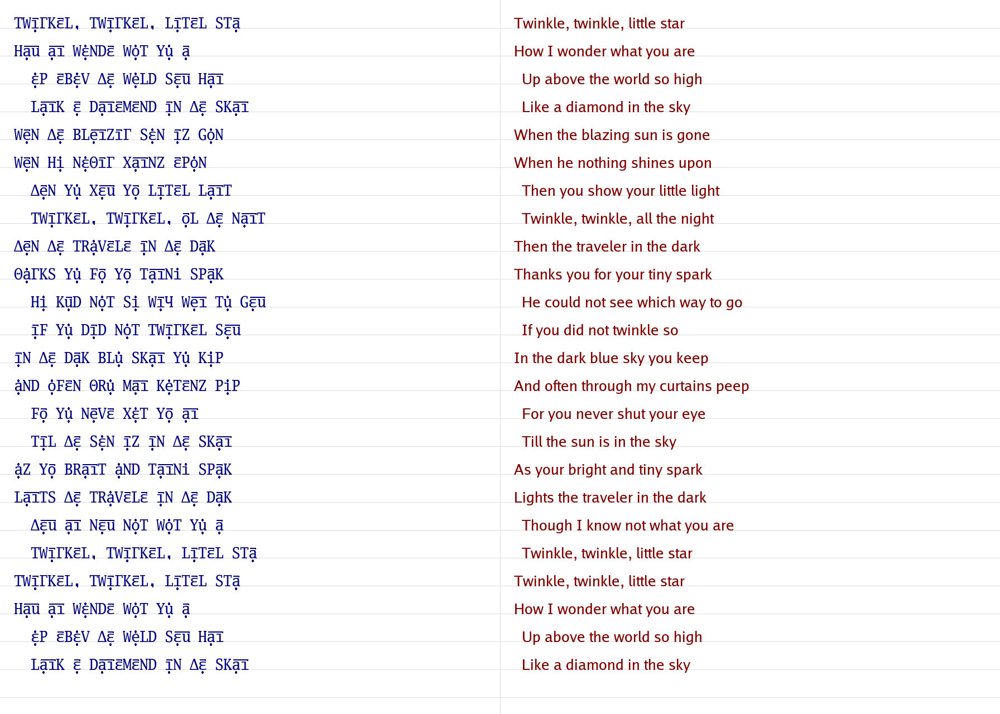
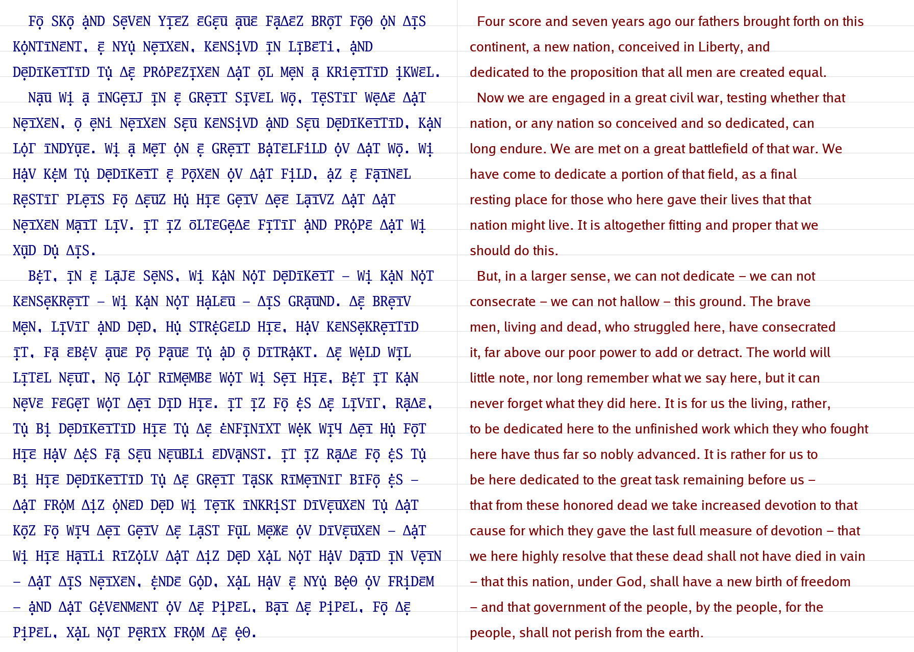
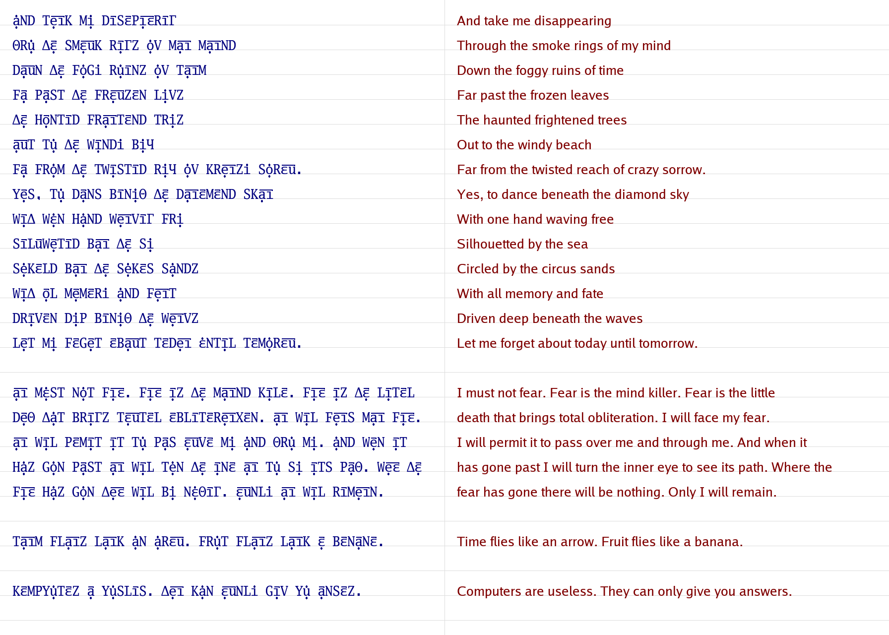
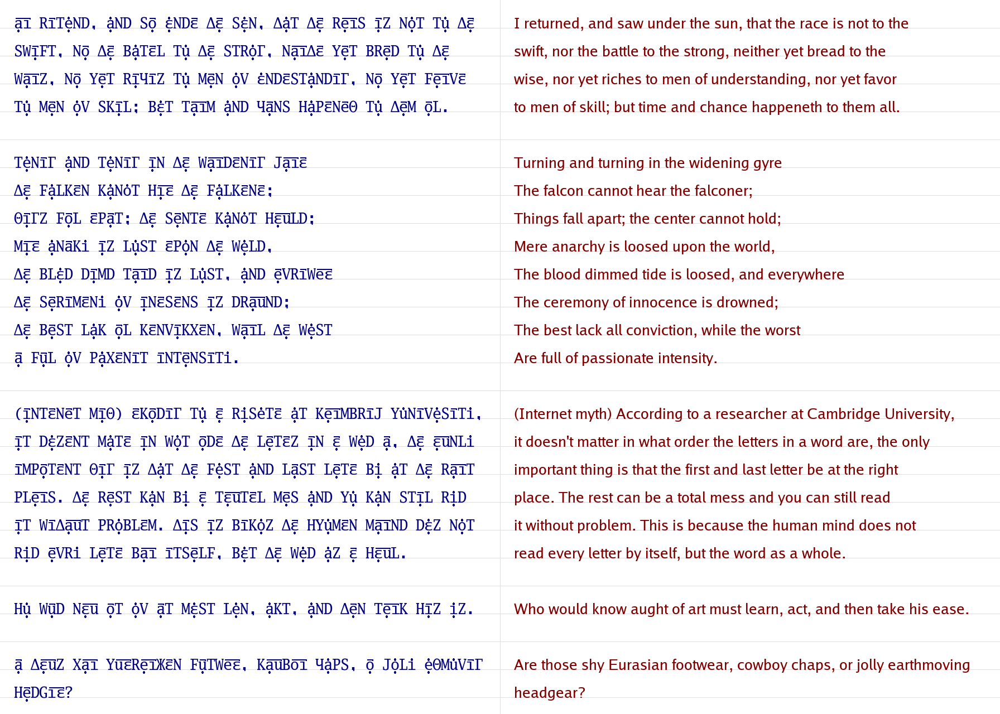
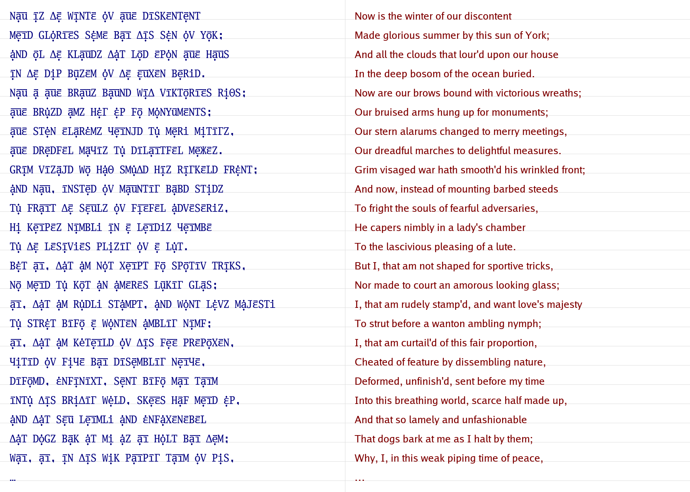
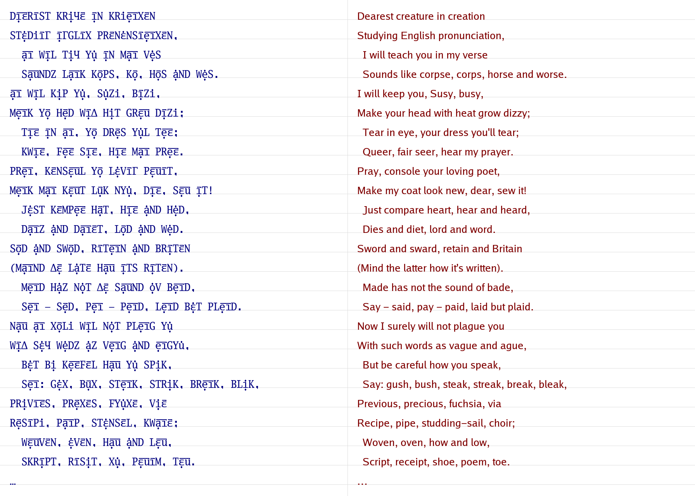
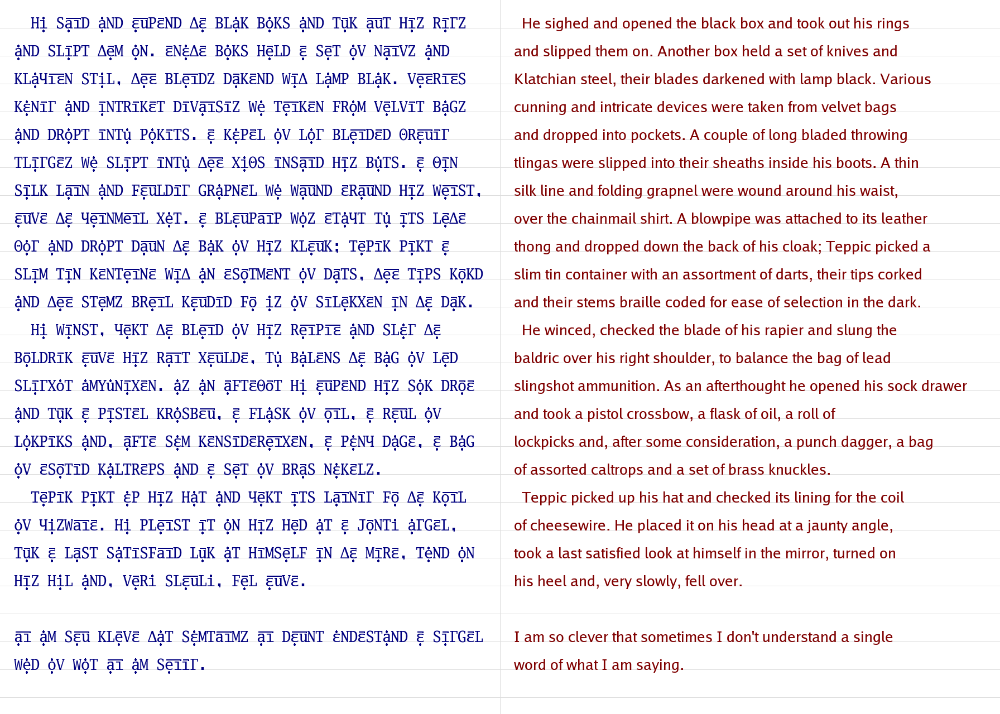

# `Mı~Le~Nıε~L`: an English Phonetic Alphabet

_Update on 2020-05-09: "phonetic alphabet" here is as in International Phonetic
Alphabet (spelling words æz ðeɪ saʊnd), not as in NATO Phonetic Alphabet (Alfa,
Bravo, Charlie, etc.)._

COVID-19 has meant that I'm unexpectedly home-schooling my young child to read
and write. In doing so, it's pretty obvious that English spelling has much room
for improvement. Wikipedia's [English-language spelling
reform](https://en.wikipedia.org/wiki/English-language_spelling_reform) page
opens with:

> For centuries, there has been a movement to reform the spelling of English.
> It seeks to change English spelling so that it is more consistent, matches
> pronunciation better, and follows the alphabetic principle. Common motives
> for spelling reform include quicker, cheaper learning, thus making English
> more useful for international communication.

My motivation was less worldwide reform (it ain't going to happen) and more an
intellectual exercise to keep my wandering mind engaged whilst reading
children's literature out loud. I've designed an English phonetic alphabet
called `Mı~Le~Nıε~L` (or, in ordinary English, "Millennial"). An alternative
Romanization (see below) is `miileeniol`.

Trying to capture both American and British pronunciations (e.g.
[rhoticity](https://en.wikipedia.org/wiki/Rhoticity_in_English)), let alone a
menagerie of regional dialects, with a single phonetic spelling is a lost
cause. This document uses [Received
Pronounciation](https://en.wikipedia.org/wiki/Received_Pronunciation) (RP),
generally associated with the south of England.

## Design

Many others have tried this before. To sample just a few, the International
Phonetic Alphabet
([IPA](https://en.wikipedia.org/wiki/International_Phonetic_Alphabet)) is the
most famous system, but by being universal (not just English) and precise (able
to discriminate American and British English), it's also complicated, with over
100 letters and 50 diacritics.
[Deseret](https://en.wikipedia.org/wiki/Deseret_alphabet) and
[Shavian](https://en.wikipedia.org/wiki/Shavian_alphabet) are more focused, but
to somebody who already and only knows English spelling, they look _alien_. You
need to explicitly learn the system before being able to even guess how to read
[this](https://en.wikipedia.org/wiki/File:Deseret_Alphabet.svg) or
[that](https://en.wikipedia.org/wiki/Shavian_alphabet#/media/File:Shavian_in_Shavian.png).
There are many other designs, each with their own trade-offs.

`Mı~Le~Nıε~L` re-uses most of the English alphabet, borrowing a little more
from the Greek and Cyrillic alphabets to complete a set of 30 letters (24
[consonants](https://en.wikipedia.org/wiki/Consonant) and 6 base
[vowels](https://en.wikipedia.org/wiki/Vowel)) and 2 diacritics (used only for
vowels). Every English consonant and vowel has a unique `Mı~Le~Nıε~L` letter
(or letter and diacritic). Only
[diphthongs](https://en.wikipedia.org/wiki/Diphthong) are
[digraphs](https://en.wikipedia.org/wiki/Digraph_%28orthography%29).

Today, billions of people already read English and millions of people already
read Greek and Cyrillic, so `Mı~Le~Nıε~L` uses `Γ` and `Ж` for the "ng" and
"zh" sounds instead of IPA's "ŋ" and "ʒ". Using a Greek delta "Δ" or theta "Θ"
may not be as faithful as using the Old English eth "ð" or thorn "þ", but the
trade-off is greater familiarity for many. The `Mı~Le~Nıε~L` vowel `ε~`, a
schwa, is more like the IPA "ə" than the IPA "ε", but "ə" is not part of the
Latin, Greek or Cyrillic alphabets.

**A key design goal is that many people who already know English should be able
to read `Mı~Le~Nıε~L` (perhaps slowly, with a bit of guesswork) without having
to study beforehand**.

That's partly because consonants are always tall (cap height) and vowels are
always short (x height), so it's possible to focus only on the consonants, most
of which are the same as in English. Ppl cn ftn stll rd nglsh txt whn th vwls r
rmvd. See also: [Abjads](https://en.wikipedia.org/wiki/Abjad).

Here are a couple of sample `Mı~Le~Nıε~L` texts. There are more further below.
Those of you who enjoy word puzzles might like to cover up the right hand side
(the red English text) and try to read the left hand side (the equivalent blue
`Mı~Le~Nıε~L` text). Remember that pronunciation is (non-rhotic, southern)
"British", where some "r" sounds are dropped (from an "American" perspective).

---

---

---

## 44 Phonemes

There are 24 consonants. There are 12 vowels, combining a base vowel (there are
6) and a [diacritic](https://en.wikipedia.org/wiki/Diacritic) mark (a dot or
vertical stroke `'` or a horizontal line `~`) over the base. There are 8
diphthongs, which always combine two overlined vowels and the line literally
joins the two letters as a
[ligature](https://en.wikipedia.org/wiki/Orthographic_ligature). An implication
is that two adjacent vowels that don't share an overline form separate
syllables. For an example, see "created" in the Lincoln text (the second
example above). An optional underdot denotes a stressed syllable.

In the following tables:

- The first column ("Mı~") is the canonical `Mı~Le~Nıε~L` spelling. The
  diacritics look better above the vowels (as in the sample images) than
  alongside the vowels (as in this document's text), but for technical reasons,
  the textual form can't assume that appropriate fonts are available.
- The second column ("Rom") shows a secondary transliteration system that's
  restricted to the 26 letters of the English alphabet. Digraphs are used for
  some consonants, every vowel and every diphthong. For example, `Mı~Le~Nıε~L`
  can be Romanized as "miileeniol".
- The third column ("IPA") is the International Phonetic Alphabet equivalent.
- The fourth column gives examples of complete words.

### 24 Consonants

    Mı~   Rom   IPA     Examples (Mı~Le~Nıε~L = English)
    ------------------------------------------------------------
    P     p     p       Pa'D     = pad       Ha'Pı'   = happy
    B     b     b       Ba'D     = bad       Beı~Bı'  = baby
    T     t     t       Taı~T    = tight     Mεu~T    = moat
    D     d     d       Daı~D    = died      Mεu~D    = mode
    K     k     k       Ba'K     = back      No'KT    = knocked
    G     g     g       Ba'G     = bag       Ga'Γ     = gang
    Ч     tx    tʃ      Bı'Ч     = beach     Чe'Ч     = church
    J     j     dʒ      Ba'J     = badge     Joı~     = joy
    F     f     f       Fa'T     = fat       Rε'F     = rough
    V     v     v       Va'T     = vat       He~Vı'   = heavy
    Θ     th    θ       θı'M     = theme     Tı'Θ     = teeth
    Δ     dh    ð       Δe~M     = them      Tı'Δ     = teethe
    S     s     s       Bε'S     = bus       Saı~Ze'Z = sizes
    Z     z     z       Bε'Z     = buzz      Zı~PS    = zips
    X     x     ʃ       Ba'X     = bash      Mı~Xε~N  = mission
    Ж     zh    ʒ       PLe~Жε~  = pleasure  Vı~Жε~N  = vision
    M     m     m       Bε'M     = bum       Ma'Mε~L  = mammal
    N     n     n       Bε'N     = bun       Na'Nı'   = nanny
    Γ     ng    ŋ       Ba'ΓK    = bank      Dı~Γı'   = dinghy
    H     h     h       Ho'T     = hot       Mı~SHa'P = mishap
    L     l     l       Lo'T     = lot       Fo'Lı'   = folly
    R     r     ɹ       Ro'T     = rot       So'Rı'   = sorry
    Y     y     j       Ye~S     = yes       BYu'Tı'  = beauty
    W     w     w       We~B     = web       SKWeε~   = square
    ------------------------------------------------------------

### 12 Vowels

    Mı~   Rom   IPA     Examples (Mı~Le~Nıε~L = English)
    ------------------------------------------------------------
    ı'    ia    i,iː    Bı'T     = beat      Sı'D     = seed
    ı~    ii    ɪ       Bı~T     = bit       Kı~T     = kit
    u'    ue    u,uː    Bu'T     = boot      Lu'P     = loop
    u~    uu    ʊ       Bu~K     = book      Pu~T     = put
    e'    ea    ɜː      Be'N     = burn      STe'     = stir
    e~    ee    e,ɛ     Be~T     = bet       Me~S     = mess
    ε'    ua    ɐ,ʌ     Bε'T     = but       Mε'D     = mud
    ε~    oo    ə,ɚ     Bı'Vε~   = beaver    ε~Lau~   = allow
    a'    ae    æ       Ba'T     = bat       Ta'P     = tap
    a~    aa    ɑː      Ba~N     = barn      Ta~T     = tart
    o'    oe    ɒ       Bo'T     = bot       Fo'G     = fog
    o~    oa    ɔː      Bo~L     = ball      No~Θ     = north
    ------------------------------------------------------------

### 8 Diphthongs

    Mı~   Rom   IPA     Examples (Mı~Le~Nıε~L = English)
    ------------------------------------------------------------
    ıε~   io    ɪə      Bıε~     = beer      Nıε~     = near
    uε~   uo    ʊə      KYuε~    = cure      Tuε~     = tour
    eı~   ei    eɪ      Beı~T    = bait      Feı~S    = face
    eε~   eo    eə,ɛə   Beε~     = bear      eε~      = air
    εu~   ou    əʊ,oʊ   Bεu~T    = boat      Xεu~     = show
    aı~   ai    aɪ      Baı~T    = bite      Haı~     = high
    au~   au    aʊ      Bau~T    = bout      Nau~     = now
    oı~   oi    ɔɪ      Boı~     = boy       Soı~L    = soil
    ------------------------------------------------------------

### Vowel Diphthong Grids

Vowels can be arranged like the [IPA vowel
chart](https://en.wikipedia.org/wiki/International_Phonetic_Alphabet_chart).

    :            Front           Central            Back
    :  Close     +------------------+------------------+
    :              \ ı'              \              u' |
    :                \    ı~          \        u~      |
    :                  \               \               |
    :  Close-mid         +--------------+--------------+
    :                      \             \             |
    :                        \ e~         \ ε~      ε' |
    :                          \        e' \        o' |
    :  Open-mid                  +----------+----------+
    :                              \         \         |
    :                                \ a'     \     a~ |
    :                                  \       \    o~ |
    :  Open                              +------+------+

Vowels and diphthongs can alternatively be arranged by their 2-letter
Romanization.

          ?a         ?e         ?i          ?o             ?u
        +----------+----------+-----------+--------------+----------+
        | a~  Ba~N | a'  Ba'T | aı~ Haı~  |              | au~ Nau~ |
    a?  |     barn |     bat  |     high  |              |     now  |
        | ɑː  bɑːn | æ   bæt  | aɪ  haɪ   |              | aʊ  naʊ  |
        +----------+----------+-----------+--------------+----------+
        | e'  Be'n | e~  Be~T | eı~ Feı~S | eε~ eε~      |          |
    e?  |     burn |     bet  |     face  |     air      |          |
        | ɜː  bɜːn | ɛ   bɛt  | eɪ  feɪs  | ɛə  ɛə(ɹ)    |          |
        +----------+----------+-----------+--------------+----------+
        | ı'  Bı'T |          | ı~  Bı~T  | ıε~ Nıε~     |          |
    i?  |     beat |          |     bit   |     near     |          |
        | iː  biːt |          | ɪ   bɪt   | ɪə  nɪə(ɹ)   |          |
        +----------+----------+-----------+--------------+----------+
        | o~  Bo~L | o'  Bo'T | oı~ Soı~L | ε~  Bı'Vε~   | εu~ Xεu~ |
    o?  |     ball |     bot  |     soil  |     beaver   |     show |
        | ɔː  bɔːl | ɒ   bɒt  | ɔɪ  sɔɪl  | ə   biːvə(ɹ) | əʊ  ʃəʊ  |
        +----------+----------+-----------+--------------+----------+
        | ε'  Bε'T | u'  Bu'T |           | uε~ Tuε~     | u~  Bu~K |
    u?  |     but  |     boot |           |     tour     |     book |
        | ʌ   bʌt  | uː  buːt |           | ʊə  tʊə(ɹ)   | ʊ   bʊk  |
        +----------+----------+-----------+--------------+----------+

## More Examples

---

---

---

---

---

---

---

---

## Romanization Examples

    twiingkool twiingkool liitool staa
    hau ai wuandoo woet yue aa
    uap oobuav dhoo weald seu hai
    laik oo daioomoond iin dhoo skai

    foa skoa aend seevoon yiez oogeu auoo faadhooz broat foath oen dhiis
    koentiinoont oo nyue neixoon koonsiavd iin liibootia aend
    deediikeitiid tue dhoo proepooziixoon dhaet oal meen aa kriaeitiid iakwool

Admittedly, this is reminiscent of [iorz
feixfuli](https://lettersofnote.com/2012/05/03/iorz-feixfuli-m-j-yilz/), which
isn't flattering.

## Software

There's not really a software product associated with all of this, but I've
uploaded to Github the [small program](https://github.com/nigeltao/miileeniol)
used to mash the [Go Mono font](https://blog.golang.org/go-fonts) with the
[Britfone](https://github.com/JoseLlarena/Britfone) pronouncing dictionary to
generate the images above.

## Further Reading

If you found this interesting, you might also enjoy these Wikipedia pages:

- [ARPABET](https://en.wikipedia.org/wiki/ARPABET)
- [Canadian Aboriginal
  syllabics](https://en.wikipedia.org/wiki/Canadian_Aboriginal_syllabics)
- [Cot-caught merger](https://en.wikipedia.org/wiki/Cot%E2%80%93caught_merger)
- [Dakuten and
  handakuten](https://en.wikipedia.org/wiki/Dakuten_and_handakuten)
- [English orthography](https://en.wikipedia.org/wiki/English_orthography)
- [English phonology](https://en.wikipedia.org/wiki/English_phonology)
- [English-language spelling
  reform](https://en.wikipedia.org/wiki/English-language_spelling_reform)
- [Māori
  language](https://en.wikipedia.org/wiki/M%C4%81ori_language#Orthography)
- [Hangul](https://en.wikipedia.org/wiki/Hangul)
- [Initial Teaching
  Alphabet](https://en.wikipedia.org/wiki/Initial_Teaching_Alphabet)
- [International Phonetic
  Alphabet](https://en.wikipedia.org/wiki/International_Phonetic_Alphabet)
- [Pronunciation respelling for
  English](https://en.wikipedia.org/wiki/Pronunciation_respelling_for_English)
- [Romic alphabet](https://en.wikipedia.org/wiki/Romic_alphabet)
- [Tengwar](https://en.wikipedia.org/wiki/Tengwar#Letters)
- [Unifon](https://en.wikipedia.org/wiki/Unifon)
- [Vowel shift](https://en.wikipedia.org/wiki/Vowel_shift)

---

Published: 2020-05-08
