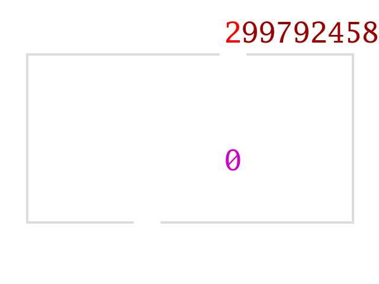

# ParseNumberF64 by Simple Decimal Conversion

_Summary: `ParseNumberF64`, `StringToDouble` and similarly named functions take
a string like `"12.5"` (one two dot five) and return a 64-bit double-precision
floating point number like `12.5` (twelve point five). Some numbers (like
`12.3`) aren't exactly representable as an `f64` but `ParseNumberF64` still has
to return the best approximation. This blog post describes a simple algorithm
to do just that._

## Background

The previous blog post discussed the [Eisel-Lemire ParseNumberF64
Algorithm](./eisel-lemire.md), which is fast but not comprehensive and needs a
fallback `ParseNumberF64` algorithm. This blog post discusses a fairly simple
algorithm, which I'll call Simple Decimal Conversion (SDC). SDC is the fallback
algorithm used by both
[Go](https://github.com/golang/go/blob/go1.15.3/src/strconv/atof.go#L314-L410)
and
[Wuffs](https://github.com/google/wuffs/blob/e80ab7b13ac1e58149a4ad2750b90a7b6a97c123/internal/cgen/base/floatconv-submodule-code.c#L1262-L1428).
It's not the fastest or cleverest algorithm, but a rarely-invoked fallback
doesn't have to be, and there is [value in
simplicity](/blog/2019/xyz-abc-problem.html).

SDC [landed in Go's standard
library](https://github.com/golang/go/commit/079c00a475d11f71a69fe848dd67e8fe34ac88a8)
in 2008 (and faster algorithms landed later). After adjusting for the names and
notation used in this blog post, a comment in that commit describes SDC as:

1. Store input in high precision decimal (hundreds of digits of precision)
2. Multiply/divide decimal by powers of 2 until in range `[½ .. 1]`
3. Multiply by `(2 ** precision)` and round to get mantissa

For example, when parsing the numerical portion of the speed of light
`"2.99792458e8"`, calculate that `29` is such that `(2.99792458e8 / (2 **
29))`, which is `0.5584069676697254180908203125` exactly, is in `[½ .. 1]`.
That fraction times `(2 ** 53)` is `5029682823036928` which is
`0x11DE78_4A000000`. The leading (53rd) bit is implicit and dropped for normal
`f64` numbers. `(1023 - 1 - -29)` is `1051` which is `0x41B`. Combining the two
fragments (and a `0` sign bit for non-negativeness) gives the `f64` bit pattern
[`AsF64(0x41B1DE78_4A000000)`](https://play.golang.org/p/-cg178TqCW4).

### Notation

As in the [previous blog post](./eisel-lemire.md), let `[I .. J]` and `[I ..=
J]` denote half-open and closed ranges and let `(X ** Y)` denote
exponentiation.

A leading zero like `012` is decimal, not octal. In this case, the number
twelve.

Let `A ~NR<< B` and `A ~NR>> B` denote Non-Rounding shifts (N-R shifts), i.e.
multiplying or dividing by powers of 2 without truncating to an integer. `A`
can be a fraction but `B` must be a non-negative integer. For example, `(31 >>
2)` is `7` but `(31 ~NR>> 2)` is the same as `(31 / 4)`, which is `7.75`.
Similarly, `(0.1 ~NR<< 4)` is `1.6`. If `A` is an integer and overflow doesn't
occur then `~NR<<` is equivalent to a regular left-shift `<<`.

## High Precision Non-Rounding Shifts

Mainstream programming languages give us 64-bit unsigned integer types, roughly
20 decimal digits, but SDC might process longer strings like
`"314159265358979323846264338327"`. Nonetheless, we can still perform N-R
shifts on these decimal numbers without needing a "big integer" math library or
even heap-allocated memory. Specifically, we can N-R shift by `S` using an
`(S+4)`-bit unsigned integer. With `u64` types, we can N-R shift for `S` up to
60 (inclusive).

We do this by rolling a sliding window across the input and output digit
streams. At each step, we track a mutable `(S+4)`-bit accumulator as one digit
rolls in ('expanding', increasing the accumulator) and one digit rolls out
('contracting', decreasing the accumulator). The `+4` is because 4 bits are
needed to hold one of ten possible decimal digits.

We'll hand-wave away the location of the decimal point for now, focusing on
just input and output digit streams. For example, if we know that `1234.0 / 4 =
0308.5` then we also know that:

- `.12340000 / 4 = .03085000`
- `1.2340000 / 4 = 0.3085000`
- `1.2340e56 / 4 = 0.3085e56`
- `0.0012340 / 4 = 0.0003085`

To simplify the following N-R shift examples, we'll place the decimal point on
the left of all the digits when right-shifting, and on the right of all the
digits when left-shifting.

### Right-Shift Example #1

Here's an example of N-R right-shifting `.299792458` by `3` (i.e. dividing by
`8`), using a `(3+4)`-bit accumulator. One could imagine a Babbage-esque
Shifting Engine that input and output streams of digits:

In table form:

    _CON'_10____IN_____EXP________EXP__________OUT___S___CON
    ((0 * 10) + 2)  =  02  =  0b_0000_010  =  ((0 << 3) + 2)
    ((2 * 10) + 9)  =  29  =  0b_0011_101  =  ((3 << 3) + 5)
    ((5 * 10) + 9)  =  59  =  0b_0111_011  =  ((7 << 3) + 3)
    ((3 * 10) + 7)  =  37  =  0b_0100_101  =  ((4 << 3) + 5)
    ((5 * 10) + 9)  =  59  =  0b_0111_011  =  ((7 << 3) + 3)
    ((3 * 10) + 2)  =  32  =  0b_0100_000  =  ((4 << 3) + 0)
    ((0 * 10) + 4)  =  04  =  0b_0000_100  =  ((0 << 3) + 4)
    ((4 * 10) + 5)  =  45  =  0b_0101_101  =  ((5 << 3) + 5)
    ((5 * 10) + 8)  =  58  =  0b_0111_010  =  ((7 << 3) + 2)
    ((2 * 10) + 0)  =  20  =  0b_0010_100  =  ((2 << 3) + 4)
    ((4 * 10) + 0)  =  40  =  0b_0101_000  =  ((5 << 3) + 0)

The first column `"0,2,5,3,…,4"` is the same as the last column
`"2,5,3,5,…,0"`, offset by one row - the previous row's contracted accumulator
value (initialized to zero). The second column is the constant `10`. The third
column `"2,9,9,7,…,0"` is the input digits, padded with trailing zeroes. The
fourth column `"02,29,59,37,…,40"` is the expanded accumulator `((first * 10) +
third)`, which is then repeated (as the fifth column) in binary (where the
`(S+4)`ness is more obvious) and again as `((sixth << S) + last)`. The sixth
column `"0,3,7,4,…,5"` is the output digits (in the range `[0 ..= 9]`). The
seventh column is the constant `S`.

Thus, reading the third (IN) and sixth (OUT) columns top-to-bottom, `.299792458
/ (2 ** 3) = .03747405725`.

Algorithmically, each row represents three steps:

1. Expand: set `acc = ((acc * 10) + nextInputDigit)`
2. Output: the digit `(acc >> S)`
3. Contract: set `acc &= mask(S)`, where `mask(S) = ((1 << S) - 1)`

The rows can also be grouped into three periods: early, middle and late. Early
rows produce zeroes until the expanded accumulator 'warms up' to at least `(1
<< S)`. Late rows consume implicit zeroes when the input is exhausted but the
expanded accumulator 'cools down' to zero. Middle rows are what happens in
between: a sufficient but not necessary condition of middle rows is that the
input and output digits are both non-zero. Implementations might write that
expand-output-contract loop three times, once for each period.

Most of the rows in the "Right-Shift Example #1", above, is in the middle
period. For other inputs, the early and late periods can actually touch or
overlap, in which case the middle period is non-existent.

### Right-Shift Example #2

Here's a longer example (eliding the fourth column) of N-R right-shifting the
same number `.299792458`, but this time by `29`. The early and late periods are
more obvious (as the top-left and bottom-right triangles of zeroes in the fifth
`0b_etc` column) and, in this particular example, the early and late periods
touch:

    _____CON'_____10____IN__EXP___________________EXP_____________________OUT___S________CON___
    ((000000000 * 10) + 2) = … = 0b_0000_00000000000000000000000000010 = ((0 << 29) + 000000002)
    ((000000002 * 10) + 9) = … = 0b_0000_00000000000000000000000011101 = ((0 << 29) + 000000029)
    ((000000029 * 10) + 9) = … = 0b_0000_00000000000000000000100101011 = ((0 << 29) + 000000299)
    ((000000299 * 10) + 7) = … = 0b_0000_00000000000000000101110110101 = ((0 << 29) + 000002997)
    ((000002997 * 10) + 9) = … = 0b_0000_00000000000000111010100011011 = ((0 << 29) + 000029979)
    ((000029979 * 10) + 2) = … = 0b_0000_00000000001001001001100010000 = ((0 << 29) + 000299792)
    ((000299792 * 10) + 4) = … = 0b_0000_00000001011011011111010100100 = ((0 << 29) + 002997924)
    ((002997924 * 10) + 5) = … = 0b_0000_00001110010010111001001101101 = ((0 << 29) + 029979245)
    ((029979245 * 10) + 8) = … = 0b_0000_10001110111100111100001001010 = ((0 << 29) + 299792458)
    ((299792458 * 10) + 0) = … = 0b_0101_10010101100001011001011100100 = ((5 << 29) + 313570020)
    ((313570020 * 10) + 0) = … = 0b_0101_11010111001101111110011101000 = ((5 << 29) + 451345640)
    ((451345640 * 10) + 0) = … = 0b_1000_01101000001011110000100010000 = ((8 << 29) + 218489104)
    ((218489104 * 10) + 0) = … = 0b_0100_00010001110101100101010100000 = ((4 << 29) + 037407392)
    ((037407392 * 10) + 0) = … = 0b_0000_10110010010111110101001000000 = ((0 << 29) + 374073920)
    ((374073920 * 10) + 0) = … = 0b_0110_11110111101110010011010000000 = ((6 << 29) + 519513728)
    ((519513728 * 10) + 0) = … = 0b_1001_10101101001111000000100000000 = ((9 << 29) + 363299072)
    ((363299072 * 10) + 0) = … = 0b_0110_11000100010110000101000000000 = ((6 << 29) + 411765248)
    ((411765248 * 10) + 0) = … = 0b_0111_10101011011100110010000000000 = ((7 << 29) + 359556096)
    ((359556096 * 10) + 0) = … = 0b_0110_10110010011111110100000000000 = ((6 << 29) + 374335488)
    ((374335488 * 10) + 0) = … = 0b_0110_11111000111110001000000000000 = ((6 << 29) + 522129408)
    ((522129408 * 10) + 0) = … = 0b_1001_10111001101101010000000000000 = ((9 << 29) + 389455872)
    ((389455872 * 10) + 0) = … = 0b_0111_01000001000100100000000000000 = ((7 << 29) + 136462336)
    ((136462336 * 10) + 0) = … = 0b_0010_10001010101101000000000000000 = ((2 << 29) + 290881536)
    ((290881536 * 10) + 0) = … = 0b_0101_01101011000010000000000000000 = ((5 << 29) + 224460800)
    ((224460800 * 10) + 0) = … = 0b_0100_00101110010100000000000000000 = ((4 << 29) + 097124352)
    ((097124352 * 10) + 0) = … = 0b_0001_11001111001000000000000000000 = ((1 << 29) + 434372608)
    ((434372608 * 10) + 0) = … = 0b_1000_00010111010000000000000000000 = ((8 << 29) + 048758784)
    ((048758784 * 10) + 0) = … = 0b_0000_11101000100000000000000000000 = ((0 << 29) + 487587840)
    ((487587840 * 10) + 0) = … = 0b_1001_00010101000000000000000000000 = ((9 << 29) + 044040192)
    ((044040192 * 10) + 0) = … = 0b_0000_11010010000000000000000000000 = ((0 << 29) + 440401920)
    ((440401920 * 10) + 0) = … = 0b_1000_00110100000000000000000000000 = ((8 << 29) + 109051904)
    ((109051904 * 10) + 0) = … = 0b_0010_00001000000000000000000000000 = ((2 << 29) + 016777216)
    ((016777216 * 10) + 0) = … = 0b_0000_01010000000000000000000000000 = ((0 << 29) + 167772160)
    ((167772160 * 10) + 0) = … = 0b_0011_00100000000000000000000000000 = ((3 << 29) + 067108864)
    ((067108864 * 10) + 0) = … = 0b_0001_01000000000000000000000000000 = ((1 << 29) + 134217728)
    ((134217728 * 10) + 0) = … = 0b_0010_10000000000000000000000000000 = ((2 << 29) + 268435456)
    ((268435456 * 10) + 0) = … = 0b_0101_00000000000000000000000000000 = ((5 << 29) + 000000000)

Again, reading the third (IN) and sixth (OUT) columns top-to-bottom,
`.299792458 / (2 ** 29) = .0000000005584069676697254180908203125`.

Hence, as mentioned above, `(2.99792458e8 / (2 ** 29))` is
`0.5584069676697254180908203125` exactly, which is in `[½ .. 1]`.

### Left-Shift Example #1

Similarly, N-R left-shifting an arbitrarily long digit stream can be done with
an `(S+4)`-bit accumulator, consuming and producing one digit at a time. The
computation is just the reverse of the N-R right-shift. Subtly, this means that
the digits are processed right-to-left instead of left-to-right.

Here's a reprisal of Example #1 above. The first column is the input digits
(right-to-left), padded with leading zeroes. The second column is the constant
`S`. The third column is the fifth column offset by one row - the previous
row's contracted accumulator value (initialized to zero). The fourth column is
the `(S+4)`-bit expanded accumulator variable. The sixth column is the constant
`10`. The last column is the output digits (in the range `[0 ..= 9]`).

    __IN___S___CON'____EXP_____CON__10___OUT
    ((5 << 3) + 0)  =  40  =  ((4 * 10) + 0)
    ((2 << 3) + 4)  =  20  =  ((2 * 10) + 0)
    ((7 << 3) + 2)  =  58  =  ((5 * 10) + 8)
    ((5 << 3) + 5)  =  45  =  ((4 * 10) + 5)
    ((0 << 3) + 4)  =  04  =  ((0 * 10) + 4)
    ((4 << 3) + 0)  =  32  =  ((3 * 10) + 2)
    ((7 << 3) + 3)  =  59  =  ((5 * 10) + 9)
    ((4 << 3) + 5)  =  37  =  ((3 * 10) + 7)
    ((7 << 3) + 3)  =  59  =  ((5 * 10) + 9)
    ((3 << 3) + 5)  =  29  =  ((2 * 10) + 9)
    ((0 << 3) + 2)  =  02  =  ((0 * 10) + 2)

Reading the first (IN) and last (OUT) columns bottom-to-top, `03747405725. *
(2 ** 3) = 29979245800.` Note that the bottom-to-top EXP column here,
`"02,29,59,…,58,20,40"` is the same as the Right-Shift Example #1 top-to-bottom
EXP column, and likewise for the CON/CON' columns.

Again, each row represents three steps. The calculations are reversed compared
to N-R right shifting:

1. Expand: set `acc = ((nextInputDigit << S) + acc)`
2. Output: the digit `(acc % 10)`
3. Contract: set `acc /= 10`, rounding down (`u64` division)

Again, running top-to-bottom, rows can be grouped into early, middle and late
periods, and implementations may specialize for each period.

## HPD Data Structure

Here's the C/C++ data structure for the SDC algorithm's High Precision
Decimal (HPD) numbers. "High precision" means that the mantissa holds 800
decimal digits. The 800 magic number is arbitrary but sufficiently large in
practice.

    typedef struct {
      uint32_t num_digits;
      int32_t  decimal_point;
      bool     negative;
      bool     truncated;
      uint8_t  digits[800];
    } HPD;

For example, the number `7.89` would be an HPD with:

- `num_digits = 3`,
- `decimal_point = +1`,
- `negative = false`,
- `truncated = false` and
- the first three elements of `digits` would be `7`, `8` and `9`. The remaining
  elements of `digits` would be undefined. In C/C++, HPD values are typically
  stack-allocated and the `digits` array does not need zero-initializing.

The number `78900` would be the same HPD, except that `decimal_point` would be
`+5` instead of `+1`. To elaborate, `decimal_point` may be negative or be
larger than `num_digits`, in which case the explicit `digits` are padded with
implicit zeroes. For example:

- Etc.
- A `decimal_point` of `-2` means `.00789`
- A `decimal_point` of `-1` means `.0789`
- A `decimal_point` of `+0` means `.789`
- A `decimal_point` of `+1` means `7.89`
- A `decimal_point` of `+2` means `78.9`
- A `decimal_point` of `+3` means `789.`
- A `decimal_point` of `+4` means `7890.`
- A `decimal_point` of `+5` means `78900.`
- Etc.

If `num_digits` is zero then the HPD value represents the number zero.
Otherwise, the canonical form has both `digits[0]` and `digits[num_digits-1]`
not equal to zero. For example, representing the number `7.89` as `{num_digits
= 4; decimal_point = +2; digits = {0, 7, 8, 9}}` is non-canonical, as is
`{num_digits = 4; decimal_point = +1; digits = {7, 8, 9, 0}}`.

In canonical form (and positive `num_digits`), a `decimal_point` higher than
+2047 means that the overall value is infinity, lower than -2047 means zero.
Again, the magic numbers here are arbitrary but sufficiently large in practice.

`negative` is a sign bit. An HPD can distinguish positive and negative zero.

The number `-7.890000___a_thousand_zeroes___001` would be `{num_digits = 800;
decimal_point = +1; negative = true; truncated = true}` and the `digits` array
being `7`, `8`, `9` and then `797` zeroes. `truncated` would be false if the
final digit was a `0` instead of a `1`. In the parlance of the [previous blog
post](./eisel-lemire.md), the `truncated` boolean is there to distinguish
between "a half exactly" and "a half and a little bit more".

### HPD Shifts

We can perform Non-Rounding left- and right-shifts of HPD numbers per the "High
Precision Non-Rounding Shifts" section above, with a few tweaks.

First, HPD numbers have a finite number (800) of explicit digits (and we don't
want to dynamically allocate memory). If a shift would lay down a digit beyond
that, we simply set the `truncated` boolean to true if it was a non-zero digit.

Second, the overall algorithm is simpler if shifting can maintain the invariant
that an HPD value is in canonical form. Specifically, the first `num_digits`
elements of its `digits` array should have no leading or trailing zeroes.

Trimming trailing zeroes is trivial and cheap: just decrement `num_digits` by
how many there are. Trimming leading zeroes is also trivial for right-shifting:
don't bump the pointer (or increment the index) until we've emitted a non-zero
digit. Emitting what would otherwise be a leading zero instead only adjusts an
HPD's `decimal_point` field without affecting the `digits` elements or
`num_digits`.

Handling left-shifts in general is more difficult, for two reasons. One is
leading zeroes and two is working right-to-left. A naive approach would first
write to an intermediate buffer and then `memcpy` the canonical digits from the
intermediate buffer back to the HPD `digits` array.

A cleverer solution is [credited to Ken
Thompson](https://github.com/golang/go/blob/go1.15.3/src/strconv/decimal.go#L171),
a Turing Awardee. The easy insight is that if you knew `M`, the number of
additional leading non-zero digits that a left-shift introduces, then you can
skip the intermediate buffer and write straight to an HPD's `digits` array. The
hard insight is figuring out that, given the shift `S`, `M` is one of two
consecutive integers. Which one it is depends on a *lexicographic* comparison
to powers of 5, due to the happy coincidence that decimal digits work in base
10, shifts work in base 2 and the ratio of those bases is exactly 5.
Lexicographic means that `"5678"` compares less than `"625"` because of their
leading digits: `"5"` compares less than `"6"`.

For example, shifting by 4 (i.e. multiplying by 16) can add 1 or 2 new
digits, depending on a lexicographic comparison to `(5 ** 4) = 625`:

- `(1      << 4) =       16`, which adds 1 new digit.
- `(5678   << 4) =    90848`, which adds 1 new digit.
- `(624    << 4) =     9984`, which adds 1 new digit.
- `(62498  << 4) =   999968`, which adds 1 new digit.
- `(625    << 4) =    10000`, which adds 2 new digits.
- `(625001 << 4) = 10000016`, which adds 2 new digits.
- `(7008   << 4) =   112128`, which adds 2 new digits.
- `(99     << 4) =     1584`, which adds 2 new digits.

Calculating `M` based on `S` involves a look-up table (for `S == 4`, the table
entries are "max 2 new digits" and `"625"`). The lexicographic comparison then
determines whether `M` is `max` or `(max - 1)`.

## Simple Decimal Conversion

As described at the top, SDC involves parsing the input string to fill out an
HPD data structure. If it represents the number zero than we're done.

Otherwise, repeatedly do Non-Rounding right-shifts (for a shift `S` no more
than 60) until the HPD represents a number less than 1 (i.e. its
`decimal_point` field is non-positive). Repeatedly do Non-Rounding left-shifts
(again for `S` no more than 60) until the HPD represents a number in the range
`[½ .. 1]` (i.e. its `decimal_point` field is zero and its `digits[0]` is at
least `5`). Getting to `[½ .. 1]` is slightly easier, computationally, than
getting to the `[1 .. 2]` range that a normal `f64` bit-pattern represents, and
we're usually about to multiply by a power of two anyway.

Shifting by `(S == 1)` on each repetition is simple, but it's faster (fewer
repetitions) to take larger shifts based on `decimal_point`, provided that each
shift still obeys `(S <= 60)`. The right-shifts can overshoot a little, because
the subsequent left-shifts will correct that, but the left-shifts start with
the HPD value below 1 and must keep it that way.

We use a small look-up table such that the `I`th entry (starting at `I = 0`) is
the largest power of 2 less than `(10 ** I)`. For example, the fifth entry is
13 because `((2 ** 13) = 8192 < 10000 = (10 ** 4))`. If our HPD's
`decimal_point` is `-4` (so that its value is less than `0.0001`) then
Non-Rounding left-shifting it by 13 will keep it less than `0.8192` and
therefore less than `1`). This small look-up table only has 19 entries, as `((2
** 59) < (10 ** 18))` and anything beyond that hits the `(S <= 60)` constraint.

    const uint8_t powers[19] = {
        0,  3,  6,  9,  13, 16, 19, 23, 26, 29,
        33, 36, 39, 43, 46, 49, 53, 56, 59,
    };

For example, starting with the numerical portion of Planck's constant
`"6.62607015e-34"`, which is `{decimal_point = -33; digits = {6, 6, 2, 6, 0, 7,
0, 1, 5}}`:

- `33` is outside the length of the `powers` array, so left-shifting by `60`
  gives `{decimal_point = -15; digits = {7, 6, 3, 9, 3, etc, 6, 6, 4}}`, which
  is `7.6393387669685162332913664e-16`.
- `15` is inside the length of the `powers` array, so left-shifting by `49`
  gives `{decimal_point = 0; digits = {4, 3, 0, 0, 5, etc, 1, 6, 8}}`, which is
  `4.3005654030345492606001512614662313607168e-1`.
- `decimal_point` is 0 but the leading digit is less than `5`. We don't use the
  `powers` look-up table here. Instead, left-shifting by `1` gives
  `{decimal_point = 0; digits = {8, 6, 0, 1, 1, etc, 3, 3, 6}}`, which is
  `8.6011308060690985212003025229324627214336e-1`. This is in the range `[½ ..
  1]` so we stop.

This took a total of `0` right-shifts and `(60 + 49 + 1 = 110)` left-shifts.
There's one more implicit left-shift to get from `[½ .. 1]` to `[1 .. 2]`, for
a net base-2 exponent of `-111`. Adding the `f64` base-2 exponent bias of
`1023` gives `912`, which is `0x390`.

If this exponent was too large then the parsed `f64` is infinite. If this
exponent was too small then we would N-R right-shift the mantissa (and adjust
the biased base-2 exponent) until the exponent was in range (positive). This
might end with the mantissa below ½, so that the parsed `f64` value is zero,
but otherwise we'd return a subnormal `f64`. This example is neither, so:

- Left-shifting by `53` gives `{decimal_point = 16; digits = {7, 7, 4, 7, 2,
  etc, 3, 1, 2}}`, which is
  `7747209898635537.19908586215205528506839523031474149261312` with `16` digits
  to the left of the decimal point. Rounding to the nearest integer (rounding
  ties to even) gives `7747209898635537` which is `0x001B860B_DE023111`.

Combining the 52 mantissa bits `0xB860B_DE023111` with the 11 exponent bits
`0x390` and the 1 sign bit `0x0` gives the `f64` bit pattern
[`AsF64(0x390B860B_DE023111)`](https://play.golang.org/p/DLI_cjT2955).

## Testing

This is the same as for
[The Eisel-Lemire ParseNumberF64 Algorithm](./eisel-lemire.md#testing) blog post.

## Source Code

Source code is available as
[C](https://github.com/google/wuffs/blob/e80ab7b13ac1e58149a4ad2750b90a7b6a97c123/internal/cgen/base/floatconv-submodule-code.c#L1262-L1428),
[C++](https://github.com/lemire/fast_float/blob/48c017aa963aa7d419c43261e83986ea71b9679f/include/fast_float/simple_decimal_conversion.h)
or
[Go](https://github.com/golang/go/blob/go1.15.3/src/strconv/atof.go#L314-L410).

## Conclusion

Russ Cox' ["Floating Point to Decimal Conversion is
Easy"](https://research.swtch.com/ftoa) blog post from 2011 is about the
reverse conversion (`ftoa` instead of `atof`) but his introduction and
conclusion applies equally well here:

> Floating point to decimal conversions have a reputation for being difficult.
> At heart, they're really very simple and straightforward... Just remember:
> The conversion is easy. The optimizations are hard.

This blog post covers an easy, 'unoptimized' algorithm. The previous blog post
covers the [Eisel-Lemire](./eisel-lemire.md) algorithm, first published in
2020, which is state-of-the-art fast but still relatively simple. Both
algorithms are easier to follow than e.g. the GNU C Library's
[`strtod_l`](https://sourceware.org/git/?p=glibc.git;a=blob;f=stdlib/strtod_l.c;h=64fc63e47f3e1de28819234cbe818241b83cea18;hb=HEAD)
implementation. The bottom of [Cox's blog
post](https://research.swtch.com/ftoa) has links to a number of other
approaches, including David Gay's 1990 classic ["Correctly Rounded
Binary-Decimal and Decimal-Binary
Conversions"](http://citeseer.ist.psu.edu/viewdoc/summary?doi=10.1.1.31.4049).

---

Published: 2020-11-02
