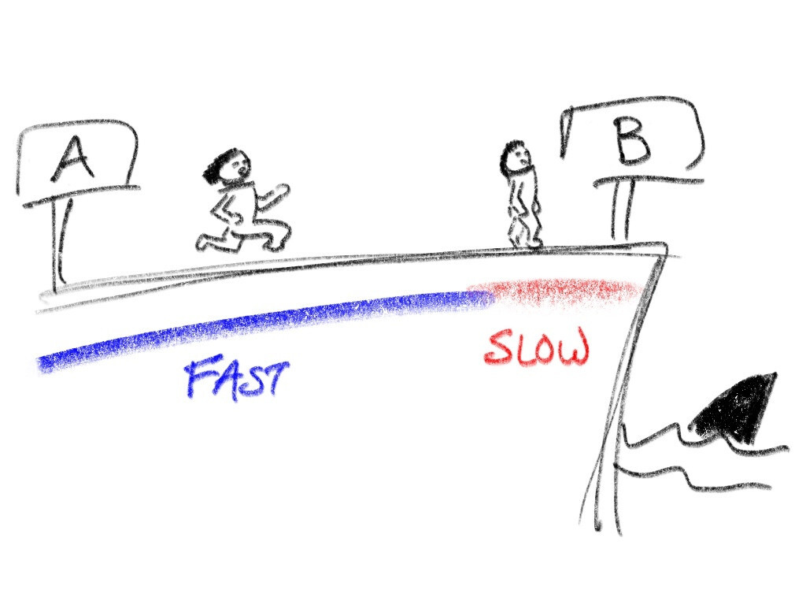
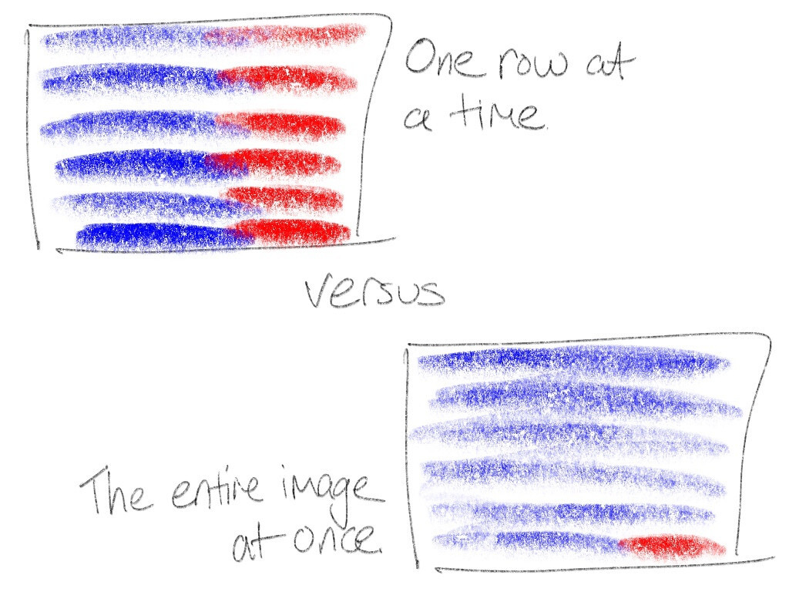

# The Fastest, Safest PNG Decoder in the World

_Summary: Wuffs' PNG image decoder is memory-safe but can also clock between
1.22x and 2.75x faster than `libpng`, the widely used open source C
implementation. It's also faster than the `libspng`, `lodepng` and `stb_image`
C libraries as well as the most popular Go and Rust PNG libraries. High
performance is achieved by SIMD-acceleration, 8-byte wide input and copies when
bit-twiddling and `zlib`-decompressing the entire image all-at-once (into one
large intermediate buffer) instead of one row at a time (into smaller,
re-usable buffers). All-at-once requires more intermediate memory but allows
substantially more of the image to be decoded in the `zlib`-decompressor's
fastest code paths._

_Update on 2021-04-09: Wuffs and its PNG decoder is discussed on [Hacker News
thread #1](https://news.ycombinator.com/item?id=26714831), [Hacker News
thread #2](https://news.ycombinator.com/item?id=26731305),
[/r/programming](https://www.reddit.com/r/programming/comments/mld1ob/the_fastest_safest_png_decoder_in_the_world/),
[/r/rust](https://www.reddit.com/r/rust/comments/mlfhlo/wuffs_png_decoder_faster_than_rust/)
and [lobste.rs](https://lobste.rs/s/48rqtn/fastest_safest_png_decoder_world)._

## Introduction

Portable Network Graphics, is a ubiquitous, lossless image file format, based
on the `zlib` compression format. It was [invented in the
1990s](https://stackoverflow.com/a/20765054) when 16-bit computers and 64 KiB
memory limits were still [an active
concern](https://github.com/madler/zlib/blob/v1.2.11/zlib.h#L151). Newer image
formats (like WebP) and newer compression formats (like Zstandard) can produce
smaller files at comparable decode speeds, but there's still a lot of inertia
in the zillions of existing PNG images. By [one
metric](https://w3techs.com/technologies/overview/image_format), PNG is still
the most frequently used image format on the web. Mozilla telemetry
`IMAGE_DECODE_SPEED_XXX` sample counts from 2021-04-03 (Firefox Desktop nightly
89) puts PNG second, after JPEG:

- JPEG: [63.15M](https://telemetry.mozilla.org/new-pipeline/evo.html#!aggregates=Median&cumulative=0&end_date=null&include_spill=0&keys=&max_channel_version=nightly%252F89&measure=IMAGE_DECODE_SPEED_JPEG&min_channel_version=nightly%252F86&processType=*&product=Firefox&sanitize=1&sort_keys=submissions&start_date=null&trim=1&use_submission_date=0)
- PNG: [49.03M](https://telemetry.mozilla.org/new-pipeline/evo.html#!aggregates=Median&cumulative=0&end_date=null&include_spill=0&keys=&max_channel_version=nightly%252F89&measure=IMAGE_DECODE_SPEED_PNG&min_channel_version=nightly%252F86&processType=*&product=Firefox&sanitize=1&sort_keys=submissions&start_date=null&trim=1&use_submission_date=0)
- WEBP: [19.23M](https://telemetry.mozilla.org/new-pipeline/evo.html#!aggregates=Median&cumulative=0&end_date=null&include_spill=0&keys=&max_channel_version=nightly%252F89&measure=IMAGE_DECODE_SPEED_WEBP&min_channel_version=nightly%252F86&processType=*&product=Firefox&sanitize=1&sort_keys=submissions&start_date=null&trim=1&use_submission_date=0)
- GIF: [3.79M](https://telemetry.mozilla.org/new-pipeline/evo.html#!aggregates=Median&cumulative=0&end_date=null&include_spill=0&keys=&max_channel_version=nightly%252F89&measure=IMAGE_DECODE_SPEED_GIF&min_channel_version=nightly%252F86&processType=*&product=Firefox&sanitize=1&sort_keys=submissions&start_date=null&trim=1&use_submission_date=0)

`libpng` is a widely used open source implementation of the PNG image format,
building on `zlib` (the library), a widely used open source implementation of
`zlib` (the format).

[Wuffs](https://github.com/google/wuffs) is a 21st century programming language
with a standard library written in that language. On a mid-range `x86_64`
laptop, albeit on an admittedly small sample set, Wuffs can decode PNG images
between 1.50x and 2.75x faster than `libpng` (which we define as the 1.00x
baseline speed):

    libpng_decode_19k_8bpp                            58.0MB/s ± 0%  1.00x
    libpng_decode_40k_24bpp                           73.1MB/s ± 0%  1.00x
    libpng_decode_77k_8bpp                             177MB/s ± 0%  1.00x
    libpng_decode_552k_32bpp_ignore_checksum           146MB/s ± 0%  (†)
    libpng_decode_552k_32bpp_verify_checksum           146MB/s ± 0%  1.00x
    libpng_decode_4002k_24bpp                          104MB/s ± 0%  1.00x
    
    libpng                                                  1.00x to 1.00x
    
    ----
    
    wuffs_decode_19k_8bpp/clang9                       131MB/s ± 0%  2.26x
    wuffs_decode_40k_24bpp/clang9                      153MB/s ± 0%  2.09x
    wuffs_decode_77k_8bpp/clang9                       472MB/s ± 0%  2.67x
    wuffs_decode_552k_32bpp_ignore_checksum/clang9     370MB/s ± 0%  2.53x
    wuffs_decode_552k_32bpp_verify_checksum/clang9     357MB/s ± 0%  2.45x
    wuffs_decode_4002k_24bpp/clang9                    156MB/s ± 0%  1.50x
    
    wuffs_decode_19k_8bpp/gcc10                        136MB/s ± 1%  2.34x
    wuffs_decode_40k_24bpp/gcc10                       162MB/s ± 0%  2.22x
    wuffs_decode_77k_8bpp/gcc10                        486MB/s ± 0%  2.75x
    wuffs_decode_552k_32bpp_ignore_checksum/gcc10      388MB/s ± 0%  2.66x
    wuffs_decode_552k_32bpp_verify_checksum/gcc10      373MB/s ± 0%  2.55x
    wuffs_decode_4002k_24bpp/gcc10                     164MB/s ± 0%  1.58x
    
    wuffs                                                   1.50x to 2.75x

(†): `libpng`'s "simplified API" doesn't provide a way to ignore the checksum.
We copy the `verify_checksum` numbers for a 1.00x baseline.

For example, the `77k_8bpp` source image is 160 pixels wide, 120 pixels high
and its color model is 8 bits (1 byte; a palette index) per pixel. Decoding
that to 32bpp BGRA produces 160 × 120 × 4 = 76800 bytes, abbreviated as `77k`.
The test images:

- [`19k_8bpp`](https://raw.githubusercontent.com/google/wuffs/v0.3.0-beta.1/test/data/bricks-gray.no-ancillary.png)
  dst: Indexed, src: Indexed
- [`40k_24bpp`](https://raw.githubusercontent.com/google/wuffs/v0.3.0-beta.1/test/data/hat.png)
  dst: BGRA, src: RGB
- [`77k_8bpp`](https://raw.githubusercontent.com/google/wuffs/v0.3.0-beta.1/test/data/bricks-dither.png)
  dst: BGRA, src: Indexed
- [`552k_32bpp`](https://raw.githubusercontent.com/google/wuffs/v0.3.0-beta.1/test/data/hibiscus.primitive.png)
  dst: BGRA, src: RGBA
- [`4002k_24bpp`](https://raw.githubusercontent.com/google/wuffs/v0.3.0-beta.1/test/data/harvesters.png)
  dst: BGRA, src: RGB

Producing `4002k` bytes at `104MB/s` or `164MB/s` means that it takes about
`38ms` or `24ms` for `libpng` or Wuffs to decode that 1165 × 859 image.

Other PNG implementations ([`libspng`](https://github.com/randy408/libspng),
[`lodepng`](https://github.com/lvandeve/lodepng),
[`stb_image`](https://github.com/nothings/stb), [Go's
`image/png`](https://golang.org/pkg/image/png/) and [Rust's
`png`](https://crates.io/crates/png)) are measured in the [Appendix (Benchmark
Numbers)](#appendix-benchmark-numbers).

### Wuffs Code

The command line examples further below refer to a `wuffs` directory. Get it by
cloning this repository:

    $ git clone https://github.com/google/wuffs.git

Some of the command line output, here and below, have been omitted or otherwise
edited for brevity.

## PNG File Format

The PNG image format builds on:

1. Two checksum algorithms, CRC-32 and Adler-32. Both produce 32-bit hashes but
   they are different algorithms.
2. The `DEFLATE` compression format.
3. 2-dimensional filtering. For a row of pixels, it's often better (smaller
   output) to compress the residuals (the difference between pixel values and a
   weighted sum of their neighbors above and left) than the raw values.

Each of these steps can be optimized.

## Checksums

### CRC-32

[Fast CRC Computation for Generic Polynomials Using PCLMULQDQ
Instruction](https://www.intel.com/content/dam/www/public/us/en/documents/white-papers/fast-crc-computation-generic-polynomials-pclmulqdq-paper.pdf)
by Gopal, Ozturk, Guilford, Wolrich, Feghali, Dixon and Karakoyunlu is a 2009
white paper on implementing CRC-32 using `x86_64` SIMD instructions. The actual
code [looks like
this](https://github.com/google/wuffs/blob/v0.3.0-beta.1/std/crc32/common_up_x86_sse42.wuffs).
The `ARM` SIMD code [is even
simpler](https://github.com/google/wuffs/blob/v0.3.0-beta.1/std/crc32/common_up_arm_crc32.wuffs),
as there are dedicated CRC-32 related intrinsics.

As for performance, Wuffs'
[example/crc32](https://github.com/google/wuffs/tree/v0.3.0-beta.1/example/crc32)
program is roughly equivalent to Debian's `/bin/crc32`, other than being 7.3x
faster (0.056s vs 0.410s) on this [178 MiB
file](https://cdn.kernel.org/pub/linux/kernel/v5.x/).

    $ ls -lh linux-5.11.3.tar.gz | awk '{print $5 " " $9}'
    178M linux-5.11.3.tar.gz
    $ g++ -O3 wuffs/example/crc32/crc32.cc -o wcrc32
    $ time ./wcrc32   /dev/stdin < linux-5.11.3.tar.gz
    05b309fb
    real    0m0.056s
    $ time /bin/crc32 /dev/stdin < linux-5.11.3.tar.gz
    05b309fb
    real    0m0.410s

### SMHasher

[SMHasher](https://github.com/aappleby/smhasher) is a test and benchmark suite
for a variety of hash function implementations. It can provide data for claims
like "our new Foo hash function is faster than the widely used Bar, Baz and Qux
hash functions". However, when comparing Foo to CRC-32, be aware that a
SIMD-accelerated CRC-32 implementation can be [47x
faster](https://github.com/nigeltao/smhasher/commit/9f561bb6ceed7f884aff59a028fbfaff13825b2e)
than SMHasher's simple CRC-32 implementation.

### Adler-32

There isn't a white paper about it, but the Adler-32 checksum can also be
SIMD-accelerated. Here's the [`ARM`
code](https://github.com/google/wuffs/blob/v0.3.0-beta.1/std/adler32/common_up_arm_neon.wuffs)
and the [`x86_64`
code](https://github.com/google/wuffs/blob/v0.3.0-beta.1/std/adler32/common_up_x86_sse42.wuffs).

Wuffs' Adler-32 implementation is around 6.4x faster (11.3GB/s vs 1.76GB/s)
than the one from `zlib`-the-library (called the 'mimic library' here), as
summarized by the
[`benchstat`](https://pkg.go.dev/golang.org/x/perf/cmd/benchstat) program:

    $ cd wuffs
    $ # ¿ is just an unusual character that's easy to search for. By
    $ # convention, in Wuffs' source, it marks build-related information.
    $ grep ¿ test/c/std/adler32.c
    // ¿ wuffs mimic cflags: -DWUFFS_MIMIC -lz
    $ gcc -O3 test/c/std/adler32.c -DWUFFS_MIMIC -lz
    $ # Run the benchmarks.
    $ ./a.out -bench | benchstat /dev/stdin
    name                      speed
    wuffs_adler32_10k/gcc10   11.3GB/s ± 0%
    wuffs_adler32_100k/gcc10  11.6GB/s ± 0%
    mimic_adler32_10k/gcc10   1.76GB/s ± 0%
    mimic_adler32_100k/gcc10  1.72GB/s ± 0%

### Ignoring Checksums

Taken to an extreme, the fastest checksum implementation is just not doing the
checksum calculations at all (and skipping over the 4-byte expected checksum
values in the PNG file).

The `ignore_checksum` versus `verify_checksum` benchmark numbers at the top of
this post suggest a 1.04x performance difference. For Wuffs, this is [a
one-line
change](https://github.com/google/wuffs/blob/v0.3.0-beta.1/internal/cgen/auxiliary/image.cc#L84).
Even if you don't use Wuffs' decoder, turning off PNG checksum verification
could still speed up your decodes, possibly by more than 1.04x if your PNG
decoder does not use a SIMD-accelerated checksum implementation.

If doing so, be aware that turning off checksum verification is a trade-off:
being less able to detect data corruption and to deviate from a strict reading
of the relevant file format specifications.

## DEFLATE Compression

The bulk of DEFLATE compressed data consists of a sequence of *codes*, either
*literal codes* or *copy codes*. There are 256 possible literal codes, one for
each possible decompressed byte. Each copy code consists of a length (how many
bytes to copy, between 3 and 258 inclusive) and a distance (how far earlier in
the 'history' or previously-decompressed output to copy from, between 1 and
32768 inclusive).

For example, "banana" could be compressed as this sequence:

- Literal 'b'.
- Literal 'a'.
- Literal 'n'.
- Copy 3 bytes starting from 2 bytes ago: "ana". Yes, the last 'a' of the copy
  input is also the first 'a' of the copy output and wasn't known until the
  copy started.

Codes are Huffman encoded, which means that they take a variable (but integral)
number of bits (between 1 and 48 inclusive) and do not necessarily start or end
on byte boundaries.

Literal codes emit a single byte. Copy codes emit up to 258 bytes. The maximum
number of output bytes from any one code is therefore 258. We'll re-visit this
number later.

Wuffs version 0.2 had a similar implementation to `zlib`-the-library's, and
[performed
similarly](https://github.com/google/wuffs/blob/v0.2.0/doc/benchmarks.md#deflate),
at least on `x86_64`. Wuffs version 0.3 adds two significant optimizations for
modern CPUs (with 64-bit unaligned loads and stores): 8-byte-chunk input and
8-byte-chunk output.

### 8-Byte-Chunk Input

As noted above, DEFLATE codes occupy between 1 and 48 bits.
`zlib`-the-library's "decode 1 DEFLATE code" implementation reads input bits at
multiple places in the loop. There are 7 instances of `hold += (unsigned
long)(*in++) << bits; bits += 8;` in
[`inffast.c`](https://github.com/madler/zlib/blob/v1.2.11/inffast.c#L105),
loading the input bits 1 byte (8 bits) at a time.

We can instead issue a single 64-bit load once per loop. Some of those loaded
bits will be dropped on the floor, if there already are unprocessed bits in the
bit buffer, but that's OK. Consuming those bits will shift in zeroes, bit-wise
OR with zeroes is a no-op and bit-wise OR with input bits is idempotent. Fabian
"ryg" Giesen's 2018 blog post [discusses reading bits in much more
detail](https://fgiesen.wordpress.com/2018/02/20/reading-bits-in-far-too-many-ways-part-2/).

For Wuffs, reading 64 bits once per inner loop sped up its DEFLATE
micro-benchmarks by [up to
1.30x](https://github.com/google/wuffs/commit/1a63b53e138bb6099321edd52a4010ffe31700a6).

### 8-Byte-Chunk Output

Consider a DEFLATE code sequence for compressing `TO BE OR NOT TO BE. THAT IS
ETC`. The second `TO BE` could be represented by a copy code of length 5 and
distance 13. A simple implementation of a 5 byte copy is a loop. If your CPU
allows unaligned loads and stores, a five instruction sequence (4-byte load;
4-byte store; 1-byte load; 1-byte store; `out_ptr += 5`) may or may not be
faster, but still correct (given a sufficiently large distance). Even better
(in that it's fewer instructions) is to *copy too much* (8-byte load; 8-byte
store; `out_ptr += 5`).

    : TO_BE_OR_NOT_??????????????????????
    : ^            ^
    : out_ptr-13   out_ptr
    :
    :
    :              [1234567) copy 8 bytes
    :              v       v
    : TO_BE_OR_NOT_TO_BE_OR??????????????
    :              ^    ^
    :                   out_ptr += 5
    :
    :
    :                   [) write 1 byte
    :                   vv
    : TO_BE_OR_NOT_TO_BE.OR??????????????
    :                   ^^
    :                    out_ptr += 1

The output of subsequent codes (e.g. a literal `'.'` byte) will overwrite and
fix the excess. Or, if there are no subsequent codes, have the decompression
API post-condition be that *any* bytes in the output buffer may be modified,
even past the "number of decompressed bytes" returned.

Note that `zlib`-the-library's API doesn't allow this optimization
unconditionally. Its `inflateBack` function uses a [single buffer for both
history and output](https://github.com/madler/zlib/blob/v1.2.11/zlib.h#L1103),
so that 8-byte overwrites could incorrectly modify the history (what the
library calls the sliding window) and hence corrupt future output.

For Wuffs, rounding up the copy length to a multiple of 8 sped up its DEFLATE
micro-benchmarks by [up to
1.48x](https://github.com/google/wuffs/commit/b58a961acb3fd338896d9947d7f78d4f42c00890).

### gzip

The `gzip` file format is, roughly speaking, DEFLATE compression combined with
a CRC-32 checksum. Like `example/crc32`, Wuffs'
[example/zcat](https://github.com/google/wuffs/tree/v0.3.0-beta.1/example/zcat) program
is roughly equivalent to Debian's `/bin/zcat`, other than being 3.1x faster
(2.680s vs 8.389s) on the same 178 MiB file and also running in a self-imposed
[`SECCOMP_MODE_STRICT`
sandbox](https://github.com/google/wuffs/blob/v0.3.0-beta.1/example/zcat/zcat.c#L244).

    $ gcc -O3 wuffs/example/zcat/zcat.c -o wzcat
    $ time ./wzcat   < linux-5.11.3.tar.gz > /dev/null
    real    0m2.680s
    $ time /bin/zcat < linux-5.11.3.tar.gz > /dev/null
    real    0m8.389s

As a consistency check, the checksum of the both programs' output should be the
same (and that `0x750d1011` checksum value should be in the final bytes of the
`.gz` file). Note that we are now checksumming the *decompressed* contents. The
earlier `example/crc32` output checksummed the *compressed* file.

    $ ./wzcat   < linux-5.11.3.tar.gz | ./wcrc32   /dev/stdin
    750d1011
    $ /bin/zcat < linux-5.11.3.tar.gz | /bin/crc32 /dev/stdin
    750d1011
    $ tail --bytes=8 linux-5.11.3.tar.gz | hd
    00000000  11 10 0d 75 00 78 70 3f

## Running Off a Cliff

Racing from point A to point B on a flat track is simple: run as fast as you
can. Now suppose that point B is on the edge of a cliff so that overstepping is
fatal (if not from the fall, then from the sharks). Racing now involves an
initial section (let's color it blue) where you run as fast as you can and a
final section (let's color it red) where you go slower but with more control.

Decompressing DEFLATE involves writing to a destination buffer and writing past
the buffer bounds (the classic 'buffer overflow' security flaw) is analogous to
running off a cliff. To avoid this, `zlib`-the-library has two decompression
implementations: a fast 'blue' one ([when 258 or more bytes away from the
buffer end](https://github.com/madler/zlib/blob/v1.2.11/inflate.c#L1045-L1052),
amongst some other conditions) and a slow 'red' one
([otherwise](https://github.com/madler/zlib/blob/v1.2.11/inflate.c#L1053-L1196)).

Separately, `libpng` allocates two buffers (for the current and previous row of
pixels) and calls into `zlib`-the-library *H* times, where *H* is the image's
height in pixels. Each time, the destination buffer is exactly the size of one
row (the width in pixels times the bytes per pixel, plus a filter configuration
byte, roughly speaking) without any slack, which means that `zlib`-the-library
spends the last 258 or more bytes *of each row* in the slow 'red' zone. For
example, this can be about one quarter of the pixels of a 300 × 200 RGB (3
bytes per pixel) image, and a higher proportion in terms of CPU time.

Wuffs' `zlib`-the-format decompressor also uses this blue/red dual
implementation technique, but Wuffs' PNG decoder decompresses into a single
buffer all-at-once instead of one-row-at-a-time. Almost all (e.g. more than 99%
of the pixels of that 300 × 200 RGB image) of the `zlib`-the-format
decompression is now in the 'blue' zone. This is faster than the 'red' zone by
itself but it also avoids any instruction cache or branch prediction slow-downs
when alternating between blue code and red code.

### Memory Cost

All-at-once obviously requires `O(width × height)` intermediate memory (what
Wuffs calls a "work buffer") instead of `O(width)` memory, but if you're
decoding the whole image into RAM anyway, that already requires `O(width ×
height)` memory.

Also, Wuffs' image decoding API does give the caller some choice on memory use.
Wuffs doesn't say, "I need *M* bytes of memory to decode this image", it's "I
need between *M0* and *M1* (inclusive). The more you give me, the faster I'll
be".

Wuffs' PNG decoder currently sets *M0* equal to *M1* (there's no choice;
all-at-once is mandatory) but a future version could give a one-row-at-a-time
option by offering a lower *M0*. The extra `O(width × height)` memory cost
could be avoided (at a performance cost) for those callers that care.

## PNG Filtering

Both Wuffs-the-library and `libpng` (but not all of other PNG decoders measured
here) have SIMD implementations of PNG's 2-dimensional filters. For example,
here's [Wuffs' x86
filters](https://github.com/google/wuffs/blob/v0.3.0-beta.1/std/png/decode_filter_x86_sse42.wuffs).

`libpng` can actually be a little faster at this step, since it can ensure that
any self-allocated pixel-row buffers are aligned to the SIMD-friendliest
boundaries. Alignment can impact SIMD instruction selection and performance.
`ARM` and `x86_64` are generally more and less fussy about this respectively.

Wuffs-the-library makes fewer promises about buffer alignment, partly because
Wuffs-the-language [doesn't have the capability to allocate
memory](https://github.com/google/wuffs/blob/v0.3.0-beta.1/doc/note/memory-safety.md),
but mainly because `zlib`-decompressing all-at-once requires giving up being
able to e.g. 4-byte-align the start of each row. This is especially true, even
if RGBA pixels at 8 bits per channel are 4 bytes per pixel, because the PNG
file format prepends one byte (for filter configuration) to each row. The
`zlib`-decompression layer sees an odd number of bytes per row.

Nonetheless, profiling suggests that more time is spent in `zlib`-decompression
than in PNG filtering, so that the benefits of all-at-once `zlib`-decompression
outweigh the costs of unaligned PNG filtering. Wuffs' Raspberry Pi 4 (32-bit
armv7l) compared-to-`libpng` benchmark ratios aren't quite as impressive as its
`x86_64` ratios (see [Hardware](#hardware) below), but Wuffs still comes out
ahead.

Tangentially, that one filter-configuration byte per row, *interleaved between
the rows of filtered pixel data*, also makes it impossible to `zlib`-decompress
all-at-once directly into the destination pixel buffer. Instead, we have to
decompress to an intermediate work buffer (which has a memory cost) and then
`memcpy` (and filter) 99% of that to the destination buffer. In hindsight, a
different file format design wouldn't need a separate work buffer, but it's far
too late to change PNG now.

## Upstream Patches

The optimization techniques described above were applied to new code:
Wuffs-the-library written in Wuffs-the-language. They could also apply to
existing code too, but there are reasons to prefer new code.

### Patching `libpng`

`libpng` is written in C, whose lack of memory safety is well documented.
Furthermore, its error-handling API is built around `setjmp` and `longjmp`.
Non-local `goto`s make static or formal analysis more complicated.

Despite the file format being largely unchanged since 1999 (version 1.2 was
formalized [in 2003](https://www.w3.org/TR/2003/REC-PNG-20031110/); APNG is an
unofficial extension), the `libpng` C implementation has collected [74 CVE
records from 2002 through to
2021](http://cve.mitre.org/cgi-bin/cvekey.cgi?keyword=libpng), 9 of those since
2018.

Its source code has a one-line comment that literally says ["TODO: WARNING:
TRUNCATION ERROR: DANGER WILL
ROBINSON"](https://github.com/glennrp/libpng/blob/a37d4836519517bdce6cb9d956092321eca3e73b/pngpread.c#L639)
but doesn't say anything else. The comment was [added in
2013](https://github.com/glennrp/libpng/commit/871b1d0fabee7995383cd6941362b68a03f86e25)
and is still there in 2021, but the code itself is older.

`libpng` is also just complicated. As a very rough metric, running `wc -l *.c
arm/*.c intel/*.c` in `libpng`'s repository counts 35182 lines of code
(excluding `*.h` header files). Running `wc -l std/png/*.wuffs` in Wuffs'
repository counts 2110 lines. The former library admittedly implements an
encoder, not just a decoder, but even after halving the first number, it's
still an 8x ratio.

### Patching `zlib`

I tried patching `zlib`-the-library [a few years
ago](https://github.com/madler/zlib/pull/292) but it's trickier than I first
thought, because of the `inflateBack` API issue mentioned above.

In any case, other people have already done this. Both
[`zlib-ng/zlib-ng`](https://github.com/zlib-ng/zlib-ng) and
[`cloudflare/zlib`](https://github.com/cloudflare/zlib) are `zlib`-the-library
forks with performance patches. Those patches (as well as those in [Chromium's
copy of
`zlib`-the-library](https://source.chromium.org/chromium/chromium/src/+/master:third_party/zlib/;drc=739ccc21289257112c667e04a40d9a5a2db466bf))
include optimization ideas similar to those presented here, as well as other
techniques for the encoder side.

Building `zlib-ng` from source is straightforward:

    $ git clone https://github.com/zlib-ng/zlib-ng.git
    $ mkdir zlib-ng/build
    $ cd zlib-ng/build
    $ cmake -DCMAKE_BUILD_TYPE=Release -DZLIB_COMPAT=On ..
    $ make

With the `test/c/std/png.c` program (see [Reproduction](#reproduction) below),
running `LD_LIBRARY_PATH=/the/path/to/zlib-ng/build ./a.out -bench` shows that
`libpng` with `zlib-ng` (the second set of numbers below) is a little faster
but not a lot faster than with vanilla `zlib` (the first set of numbers below).

    libpng_decode_19k_8bpp                            58.0MB/s ± 0%  1.00x
    libpng_decode_40k_24bpp                           73.1MB/s ± 0%  1.00x
    libpng_decode_77k_8bpp                             177MB/s ± 0%  1.00x
    libpng_decode_552k_32bpp_ignore_checksum           146MB/s ± 0%  (†)
    libpng_decode_552k_32bpp_verify_checksum           146MB/s ± 0%  1.00x
    libpng_decode_4002k_24bpp                          104MB/s ± 0%  1.00x
    
    libpng                                                  1.00x to 1.00x
    
    ----
    
    zlibng_decode_19k_8bpp/gcc10                      63.8MB/s ± 0%  1.10x
    zlibng_decode_40k_24bpp/gcc10                     74.1MB/s ± 0%  1.01x
    zlibng_decode_77k_8bpp/gcc10                       189MB/s ± 0%  1.07x
    zlibng_decode_552k_32bpp_ignore_checksum/gcc10                 skipped
    zlibng_decode_552k_32bpp_verify_checksum/gcc10     177MB/s ± 0%  1.21x
    zlibng_decode_4002k_24bpp/gcc10                    113MB/s ± 0%  1.09x

    zlibng                                                  1.01x to 1.21x

`cloudflare/zlib` was forked from `zlib`-the-library version 1.2.8. Pointing
`LD_LIBRARY_PATH` to its `libz.so.1` makes `./a.out` fail with `version
'ZLIB_1.2.9' not found (required by /lib/x86_64-linux-gnu/libpng16.so.16)`.

### Patching Go or Rust

Both Go and Rust are successful, modern and memory-safe programming languages
with significant adoption. However, for existing C/C++ projects, it is easier
to incorporate Wuffs-the-library, which is transpiled to C (and its C form is
checked into the repository). It'd be like using any other third-party C/C++
library, it's just not hand-written C/C++. In comparison, integrating Go or
Rust code into a C/C++ project involves, at a minimum, setting up additional
compilers and other build tools. _Update on 2021-04-09: Adding Rust to the
Android Platform is literally [a multi-year
project](https://security.googleblog.com/2021/04/rust-in-android-platform.html)._

Still, there may very well be some worthwhile follow-up performance work for Go
or Rust's PNG implementations, based on techniques discussed in this post. For
example, neither Go or Rust's Adler-32 implementations are SIMD-accelerated. It
may also be worth trying the 8-Byte-Chunk Input and 8-Byte-Chunk Output
techniques. Go's DEFLATE implementation [reads only one byte at a
time](https://github.com/golang/go/blob/9baddd3f21230c55f0ad2a10f5f20579dcf0a0bb/src/compress/flate/inflate.go#L719).
Rust's `miniz_oxide` [reads four bytes at a
time](https://github.com/Frommi/miniz_oxide/blob/master/miniz_oxide/src/inflate/core.rs#L369)
and four is bigger than one, but eight is even bigger still. As far as I can
tell, neither Go or Rust's PNG decoder `zlib`-decompress all-at-once.

### Memory Safety

Also, unlike Go or Rust, Wuffs' [memory
safety](https://github.com/google/wuffs/blob/v0.3.0-beta.1/doc/note/memory-safety.md)
is enforced at compile time, not by inserting runtime checks that e.g. the `i`
in `a[i]` is within bounds or that `(x + y)` doesn't overflow a `u32`. Go and
Rust compilers can elide some of these checks, especially when iterating with a
uniform access pattern, but e.g. decoding DEFLATE codes consume a variable
number of bytes per iteration.

Runtime safety checks can affect performance. I like Zig's ["Performance and
Safety: Choose
Two"](https://ziglang.org/learn/overview/#performance-and-safety-choose-two)
motto but, unlike Zig, Wuffs doesn't have separate "Release Fast" and "Release
Safe" [build modes](https://ziglang.org/documentation/master/#Build-Mode).
There's just one Wuffs "Release" configuration (pass `-O3` to your C compiler)
and it's both fast and safe at the same time.

Even so, when handling untrusted (third party) PNG images, sandboxing and a
multi-process architecture can provide additional defence in depth. Wuffs'
`example/convert-to-nia` program converts from image formats like PNG to an
easily-parsed [Naïve Image
Format](https://github.com/google/wuffs/blob/v0.3.0-beta.1/doc/spec/nie-spec.md)
and, on Linux, runs in a self-imposed [`SECCOMP_MODE_STRICT`
sandbox](https://github.com/google/wuffs/blob/v0.3.0-beta.1/example/convert-to-nia/convert-to-nia.c#L625).

## Conclusion

[Wuffs version
0.3.0-beta.1](https://github.com/google/wuffs/tree/v0.3.0-beta.1/release/c) has
just been cut and it contains the fastest, safest PNG decoder in the world. See
the [Wuffs example
programs](https://github.com/google/wuffs/tree/v0.3.0-beta.1/example) for how
to hold it. Its PNG decoder does not support color spaces or gamma correction
yet (follow [Wuffs issue 39](https://github.com/google/wuffs/issues/39) if you
care), but some of you might still find it useful at this early stage.

---

## Appendix (Benchmark Numbers)

`libpng` means the `/usr/lib/x86_64-linux-gnu/libpng16.so` form that comes on
my Debian Bullseye system.

    libpng_decode_19k_8bpp                            58.0MB/s ± 0%  1.00x
    libpng_decode_40k_24bpp                           73.1MB/s ± 0%  1.00x
    libpng_decode_77k_8bpp                             177MB/s ± 0%  1.00x
    libpng_decode_552k_32bpp_ignore_checksum           146MB/s ± 0%  (†)
    libpng_decode_552k_32bpp_verify_checksum           146MB/s ± 0%  1.00x
    libpng_decode_4002k_24bpp                          104MB/s ± 0%  1.00x
    
    libpng                                                  1.00x to 1.00x
    
    ----
    
    wuffs_decode_19k_8bpp/clang9                       131MB/s ± 0%  2.26x
    wuffs_decode_40k_24bpp/clang9                      153MB/s ± 0%  2.09x
    wuffs_decode_77k_8bpp/clang9                       472MB/s ± 0%  2.67x
    wuffs_decode_552k_32bpp_ignore_checksum/clang9     370MB/s ± 0%  2.53x
    wuffs_decode_552k_32bpp_verify_checksum/clang9     357MB/s ± 0%  2.45x
    wuffs_decode_4002k_24bpp/clang9                    156MB/s ± 0%  1.50x
    
    wuffs_decode_19k_8bpp/gcc10                        136MB/s ± 1%  2.34x
    wuffs_decode_40k_24bpp/gcc10                       162MB/s ± 0%  2.22x
    wuffs_decode_77k_8bpp/gcc10                        486MB/s ± 0%  2.75x
    wuffs_decode_552k_32bpp_ignore_checksum/gcc10      388MB/s ± 0%  2.66x
    wuffs_decode_552k_32bpp_verify_checksum/gcc10      373MB/s ± 0%  2.55x
    wuffs_decode_4002k_24bpp/gcc10                     164MB/s ± 0%  1.58x
    
    wuffs                                                   1.50x to 2.75x
    
    ----
    
    libspng_decode_19k_8bpp/clang9                    59.3MB/s ± 0%  1.02x
    libspng_decode_40k_24bpp/clang9                   78.4MB/s ± 0%  1.07x
    libspng_decode_77k_8bpp/clang9                     189MB/s ± 0%  1.07x
    libspng_decode_552k_32bpp_ignore_checksum/clang9   236MB/s ± 0%  1.62x
    libspng_decode_552k_32bpp_verify_checksum/clang9   203MB/s ± 0%  1.39x
    libspng_decode_4002k_24bpp/clang9                  110MB/s ± 0%  1.06x
    
    libspng_decode_19k_8bpp/gcc10                     59.6MB/s ± 0%  1.03x
    libspng_decode_40k_24bpp/gcc10                    77.5MB/s ± 0%  1.06x
    libspng_decode_77k_8bpp/gcc10                      189MB/s ± 0%  1.07x
    libspng_decode_552k_32bpp_ignore_checksum/gcc10    223MB/s ± 0%  1.53x
    libspng_decode_552k_32bpp_verify_checksum/gcc10    194MB/s ± 0%  1.33x
    libspng_decode_4002k_24bpp/gcc10                   109MB/s ± 0%  1.05x
    
    libspng                                                 1.02x to 1.62x
    
    ----
    
    lodepng_decode_19k_8bpp/clang9                    65.1MB/s ± 0%  1.12x
    lodepng_decode_40k_24bpp/clang9                   72.1MB/s ± 0%  0.99x
    lodepng_decode_77k_8bpp/clang9                     222MB/s ± 0%  1.25x
    lodepng_decode_552k_32bpp_ignore_checksum/clang9               skipped
    lodepng_decode_552k_32bpp_verify_checksum/clang9   162MB/s ± 0%  1.11x
    lodepng_decode_4002k_24bpp/clang9                 70.5MB/s ± 0%  0.68x
    
    lodepng_decode_19k_8bpp/gcc10                     61.1MB/s ± 0%  1.05x
    lodepng_decode_40k_24bpp/gcc10                    62.5MB/s ± 1%  0.85x
    lodepng_decode_77k_8bpp/gcc10                      176MB/s ± 0%  0.99x
    lodepng_decode_552k_32bpp_ignore_checksum/gcc10                skipped
    lodepng_decode_552k_32bpp_verify_checksum/gcc10    139MB/s ± 0%  0.95x
    lodepng_decode_4002k_24bpp/gcc10                  62.3MB/s ± 0%  0.60x
    
    lodepng                                                 0.60x to 1.25x
    
    ----
    
    stbimage_decode_19k_8bpp/clang9                   75.1MB/s ± 1%  1.29x
    stbimage_decode_40k_24bpp/clang9                  84.6MB/s ± 0%  1.16x
    stbimage_decode_77k_8bpp/clang9                    234MB/s ± 0%  1.32x
    stbimage_decode_552k_32bpp_ignore_checksum/clang9  162MB/s ± 0%  1.11x
    stbimage_decode_552k_32bpp_verify_checksum/clang9              skipped
    stbimage_decode_4002k_24bpp/clang9                80.7MB/s ± 0%  0.78x
    
    stbimage_decode_19k_8bpp/gcc10                    73.3MB/s ± 0%  1.26x
    stbimage_decode_40k_24bpp/gcc10                   81.8MB/s ± 0%  1.12x
    stbimage_decode_77k_8bpp/gcc10                     214MB/s ± 0%  1.21x
    stbimage_decode_552k_32bpp_ignore_checksum/gcc10   145MB/s ± 0%  0.99x
    stbimage_decode_552k_32bpp_verify_checksum/gcc10               skipped
    stbimage_decode_4002k_24bpp/gcc10                 79.7MB/s ± 0%  0.77x
    
    stbimage                                                0.77x to 1.32x

    ----
    
    go_decode_19k_8bpp/go1.16                         39.4MB/s ± 1%  0.68x
    go_decode_40k_24bpp/go1.16                        46.7MB/s ± 1%  0.64x
    go_decode_77k_8bpp/go1.16                         78.3MB/s ± 0%  0.44x
    go_decode_552k_32bpp_ignore_checksum/go1.16                    skipped
    go_decode_552k_32bpp_verify_checksum/go1.16        118MB/s ± 0%  0.81x
    go_decode_4002k_24bpp/go1.16                      50.5MB/s ± 0%  0.49x
    
    go                                                      0.44x to 0.81x

    ----
    
    rust_decode_19k_8bpp/rust1.48                     89.8MB/s ± 0%  1.55x
    rust_decode_40k_24bpp/rust1.48                     122MB/s ± 0%  1.67x
    rust_decode_77k_8bpp/rust1.48                      158MB/s ± 0%  0.89x
    rust_decode_552k_32bpp_ignore_checksum/rust1.48                skipped
    rust_decode_552k_32bpp_verify_checksum/rust1.48    136MB/s ± 0%  0.93x
    rust_decode_4002k_24bpp/rust1.48                   122MB/s ± 0%  1.17x
    
    rust                                                    0.89x to 1.67x

### Reproduction

Wuffs compiles (transpiles) to C code and that C code (a "single file C
library" that doesn't need `configure`, `make install` or similar incantations)
is also checked into the Wuffs repository. If you're just *using*
Wuffs-the-library (as opposed to *modifying* it), you don't need to install any
Wuffs tools. You just need a C compiler.

    $ cd wuffs
    $ # ¿ is just an unusual character that's easy to search for. By
    $ # convention, in Wuffs' source, it marks build-related information.
    $ grep ¿ test/c/std/png.c
    // ¿ wuffs mimic cflags: -DWUFFS_MIMIC -lm -lpng -lz
    $ gcc -O3 test/c/std/png.c -DWUFFS_MIMIC -lm -lpng -lz
    $ # Run the tests.
    $ ./a.out
    $ # Run the benchmarks.
    $ ./a.out -bench

The tests check that Wuffs 'mimics' (has the same output as) another C library.
For the PNG file format, the 'mimic library' is `libpng`, although editing
Wuffs'
[`test/c/mimiclib/png.c`](https://github.com/google/wuffs/blob/v0.3.0-beta.1/test/c/mimiclib/png.c)
file can configure other mimic libraries like `libspng`, `lodepng` and
`stb_image`.

Note that `gcc10` performs slightly faster than `clang9` in Wuffs' benchmark
numbers at the top of this post (as well as in an earlier [non-SIMD
Adler-32](https://bugs.llvm.org/show_bug.cgi?id=35567) implementation),
although `clang9` sometimes performs better for the other C mimic libraries.
This is something I would never have discovered if Wuffs' tools generated
object code directly (e.g. via LLVM).

[Go
PNG](https://github.com/google/wuffs/tree/v0.3.0-beta.1/script/bench-go-png)
and [Rust
PNG](https://github.com/google/wuffs/tree/v0.3.0-beta.1/script/bench-rust-png)
benchmarks are separate programs.

### Hardware

All of the numbers above were measured on a mid-range `x86_64` laptop (2016;
Skylake):

    $ cat /proc/cpuinfo | grep model.name | uniq
    model name: Intel(R) Core(TM) m3-6Y30 CPU @ 0.90GHz

The numbers below, relative to `libpng` on a Raspberry Pi 4 (32-bit armv7l)
with `-march=native` and `-mfpu=neon`, aren't quite as dramatic as on `x86_64`
but Wuffs still comes out ahead. Most of Wuffs' optimization work so far has
focused on `x86_64`, so future work may bring further gains on `ARM` hardware
in 32-bit mode. Also, for `ARM`, it looks like the proverbial hockey puck is
going to be [64-bit
only](https://www.arm.com/company/news/2020/10/pushing-the-boundaries-of-performance-and-security-to-unleash-the-power-of-64-bit-computing).

    libpng_decode_19k_8bpp                            44.1MB/s ± 0%  1.00x
    libpng_decode_40k_24bpp                           54.6MB/s ± 0%  1.00x
    libpng_decode_77k_8bpp                             123MB/s ± 0%  1.00x
    libpng_decode_552k_32bpp_ignore_checksum           101MB/s ± 0%  (†)
    libpng_decode_552k_32bpp_verify_checksum           101MB/s ± 0%  1.00x
    libpng_decode_4002k_24bpp                         82.1MB/s ± 0%  1.00x

    libpng                                                  1.00x to 1.00x
    
    ----
    
    wuffs_decode_19k_8bpp/clang9                      82.5MB/s ± 0%  1.87x
    wuffs_decode_40k_24bpp/clang9                      105MB/s ± 0%  1.92x
    wuffs_decode_77k_8bpp/clang9                       303MB/s ± 0%  2.46x
    wuffs_decode_552k_32bpp_ignore_checksum/clang9     180MB/s ± 0%  1.78x
    wuffs_decode_552k_32bpp_verify_checksum/clang9     174MB/s ± 0%  1.72x
    wuffs_decode_4002k_24bpp/clang9                    100MB/s ± 0%  1.22x
    
    wuffs_decode_19k_8bpp/gcc8                        79.8MB/s ± 0%  1.81x
    wuffs_decode_40k_24bpp/gcc8                        106MB/s ± 0%  1.94x
    wuffs_decode_77k_8bpp/gcc8                         271MB/s ± 0%  2.20x
    wuffs_decode_552k_32bpp_ignore_checksum/gcc8       177MB/s ± 0%  1.75x
    wuffs_decode_552k_32bpp_verify_checksum/gcc8       170MB/s ± 0%  1.68x
    wuffs_decode_4002k_24bpp/gcc8                      100MB/s ± 0%  1.22x
    
    wuffs                                                   1.22x to 2.46x

---

Published: 2021-04-06
