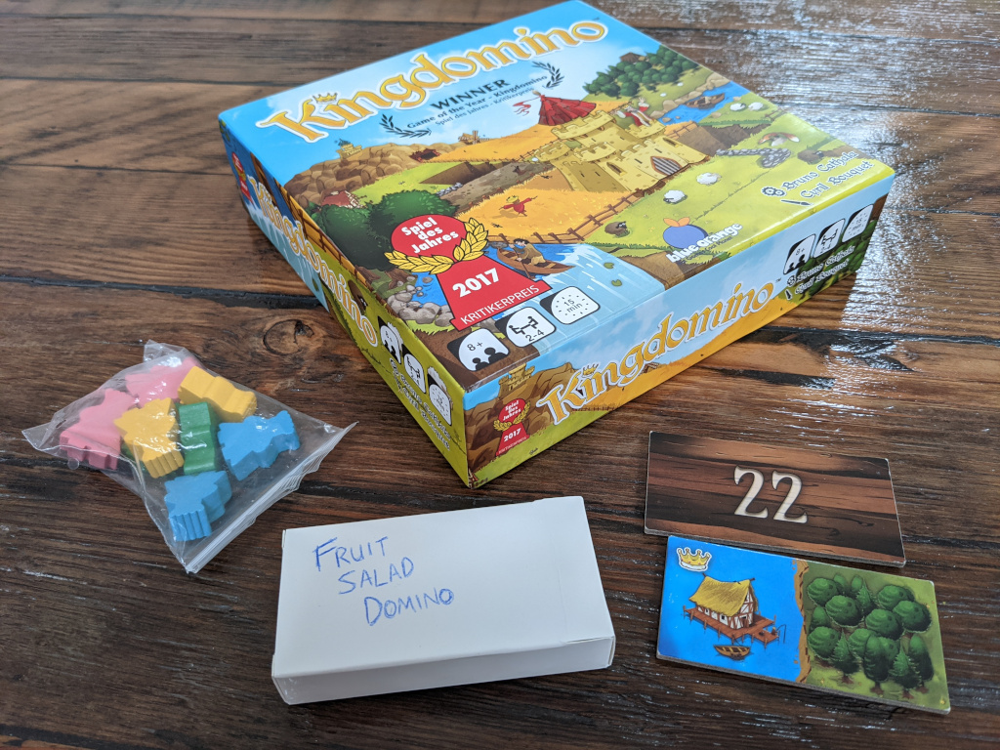
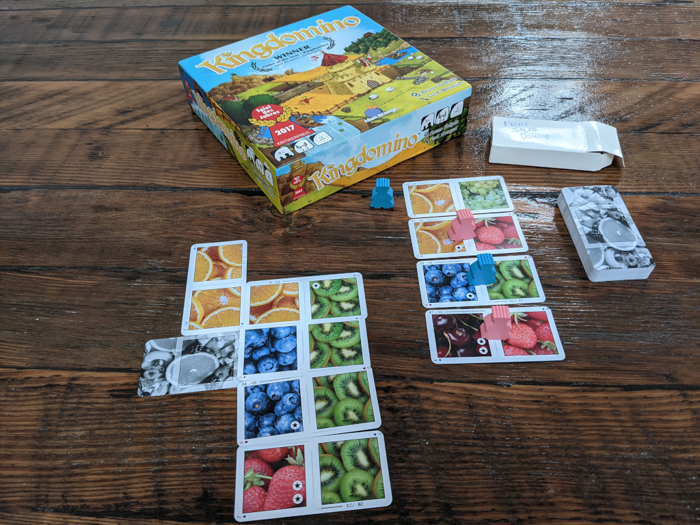
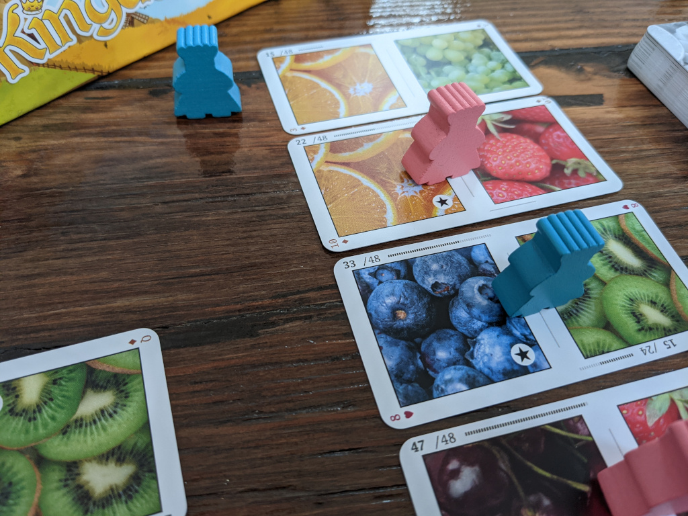
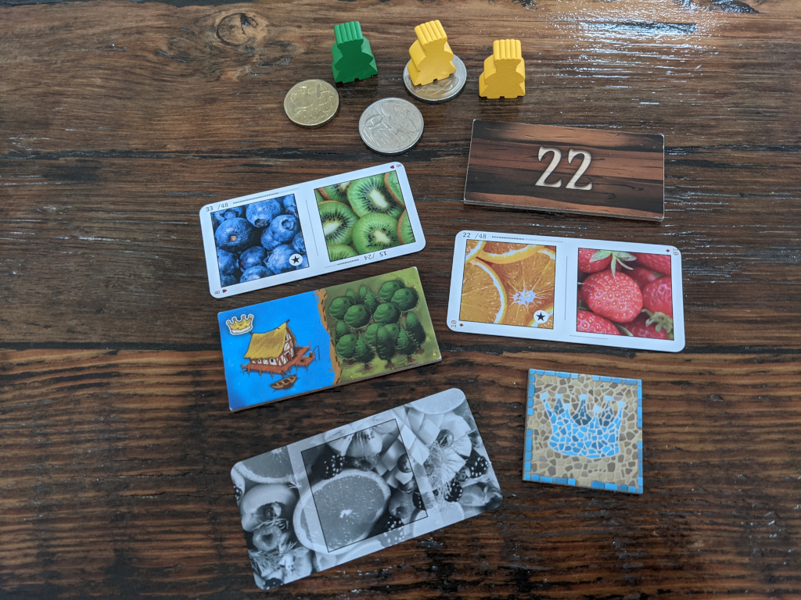

# Fruit Salad Domino

[Kingdomino](https://www.blueorangegames.com/index.php/games/king-domino) is
one of my favorite board games. There's 48 custom dominoes (all 48 are used for
a 3 or 4 player game, 24 are randomly selected for a 2 player game), 4 starting
tiles and a bag of meeples. Its box is a pretty common size for tabletop board
games, but that size is annoyingly bulky when traveling and backpack space is
limited.

[Blue Orange Games](https://www.blueorangegames.com/), the publisher, have
released a [2 player print-and-play Kingdomino
variant](https://blueorangegames.eu/wp-content/uploads/2020/04/Kingdomino-Free-Sample-EN.pdf),
using 24 dominoes: a little more tactical and a little less luck-of-the-draw.
It rebalances the tile distribution slightly, re-using 20 of the original 48
but it also has 4 new dominoes.

In a happy coincidence, 48 + 4 = 52, the number of cards in a standard deck.
[Make Playing Cards](https://www.makeplayingcards.com/) are one of a number of
companies that will let you upload 52 (or 54) images and print you a set of
cards and they provide the 2:1 aspect ratio for domino cards. The resultant
deck is about 1/16th the volume of the original Kingdomino box, or 1/8th if you
also carry the bag of meeples instead of using coins, keys, bottle tops, etc.
The backs of the unused cards are re-purposed as starting tiles.

If you'd like to print your own copy, you can download the ["Fruit Salad
Domino"
images](https://drive.google.com/file/d/1YXNguUF6hNihgxUOvUuyq4C4lG3X1beV/view?usp=sharing)
that I made. They don't have Cyril Bouquet's luscious artwork from the original
Kingdomino game, but some generously licensed photos-of-fruit (from
[pexels.com](https://www.pexels.com/)) does the job.

The printed cards also have classic suit-and-value marks in the corner, such as
8♥ and K♠. They aren't used by the Kingdomino game, but it means you can also
use these cards as a regular deck of playing cards. Again, this is more useful
when you're traveling than when you're at home.

Buy the original Kingdomino too (and discuss it on [Board Game
Geek](https://boardgamegeek.com/boardgame/204583/kingdomino)). It's beautiful
(and a great game)!

---

Published: 2021-01-03
