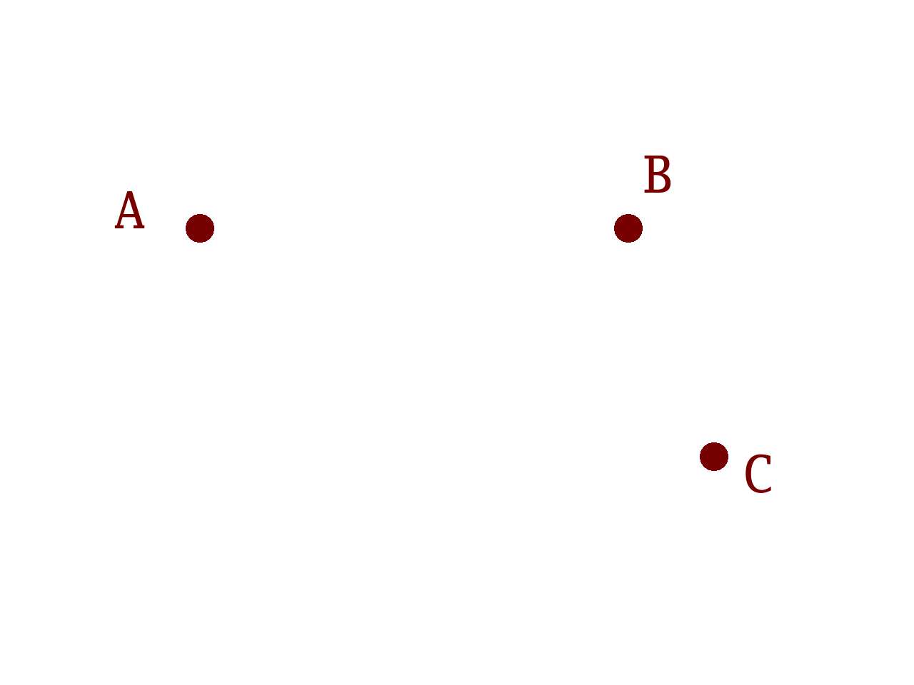

# Three Points Define an Ellipse

In 2-Dimensional geometry, a sequence of three points `A`, `B` and `C` define a
fourth point `D = A - B + C` of a parallelogram.

It also defines a center point `X = (A + C) / 2`, equivalent to `X = (B + D) /
2`. `X` is the center of an ellipse that passes through all of `A`, `B`, `C`
and `D`. Define two axis vectors `r = B - X` and `s = C - X`. These aren't
necessarily the major (longest) and minor (shortest) axes of the ellipse.
They're just two axes, derived only from `A`, `B` and `C`.

For 2-D graphics libraries based on Bézier curves, we can approximate this
ellipse by four cubic Bézier curves:

- The 1st curve's control points are `A`, `A+`, `B-` and `B`.
- The 2nd curve's control points are `B`, `B+`, `C-` and `C`.
- The 3rd curve's control points are `C`, `C+`, `D-` and `D`.
- The 4th curve's control points are `D`, `D+`, `A-` and `A`.

The 8 off-curve control points are defined by a scalar number `k ≈ 0.552`:

- `A- = A - k.(B-X) = A - k.r`
- `A+ = A + k.(B-X) = A + k.r`
- `B- = B - k.(C-X) = B - k.s`
- `B+ = B + k.(C-X) = B + k.s`
- `C- = C - k.(D-X) = C + k.r`
- `C+ = C + k.(D-X) = C - k.r`
- `D- = D - k.(A-X) = D + k.s`
- `D+ = D + k.(A-X) = D - k.s`

Many expositions of "the cubic Bézier approximation to the quarter circle" use
`k = (((√2 - 1) * 4) / 3) ≈ 0.552284749830793`, and an ellipse is an affine
transformed circle the same way that a parallelogram is an affine transformed
square. "A Primer on Bézier Curves", and specifically its ["TL;DR: just tell me
which value I should be using [for quarter
circles]"](https://pomax.github.io/bezierinfo/#circles_cubic) section, argues
that the slightly smaller `0.551784777779014` minimizes the average error term.
The trade-off, compared to `(((√2 - 1) * 4) / 3)`, being that the midpoint of
the cubic Bézier curve is no longer on the circle (or ellipse).



If you want to linger on individual animation frames:

- [Start with A, B and C](three-points-define-ellipse-0.png)
- [Add D, completing the parallelogram](three-points-define-ellipse-1.png)
- [Add X and the axes r and s](three-points-define-ellipse-2.png)
- [Add the off-curve control points](three-points-define-ellipse-3.png)
- [Draw the 1st cubic Bézier curve](three-points-define-ellipse-4.png)
- [Draw the 2nd cubic Bézier curve](three-points-define-ellipse-5.png)
- [Draw the 3rd cubic Bézier curve](three-points-define-ellipse-6.png)
- [Draw the 4th cubic Bézier curve](three-points-define-ellipse-7.png)
- [Remove the scaffolding](three-points-define-ellipse-8.png)

The point (haha) of all of this is that, for 2-D graphics APIs, [a "CubeTo"
function](https://www.cairographics.org/manual/cairo-Paths.html#cairo-curve-to)
usually requires 6 arguments: three explicit coordinate pairs e.g. `A+`, `B-`
and `B`. The starting point `A` (also known as the "current point" or "pen
location") is implicitly part of the canvas state. Four cubics therefore
generally require 24 explicit coordinates. In comparison, if you also know that
the four cubics approximate a circle or an ellipse, this compresses to 4
explicit coordinates (just the `B` and `C` coordinate pairs).

Encoding a quarter-, half- or three-quarter-ellipse also only takes 4 explicit
coordinates. Quarter here means, when starting from `A`, stopping at `B`
instead of going all the way around: `A` to `B` to `C` to `D` to `A`. Quarter
doesn't necessarily mean sweeping out 90 degrees. It will do so if the `r` and
`s` vectors are perpendicular, but they don't have to be.

We could compress this further to just 2 explicit coordinates (e.g. the `X`
coordinate pair) if we're restricted to just full circles passing through `A`.
However, it can be useful to be able to affine transform (e.g. rotate, scale,
shear, translate, etc) a whole path just by transforming each node
individually, without changing the type or number of component curves. While
the affine transform of an ellipse remains an ellipse, the affine transform of
a circle isn't always a circle. For a [vector graphics
format](https://github.com/google/iconvg/issues/4#issuecomment-860649783),
there's no perfect representation, only different trade-offs.


## No Trigonometry Required

While less general than [an "ArcTo"
function](https://www.cairographics.org/manual/cairo-Paths.html#cairo-arc),
calculating the 8 off-curve control points only requires basic arithmetic
(addition, subtraction and multiplication). Rasterizing the (approximation to
the) ellipse does not require trigonometry or other angular math.

To repeat, *calculating an affine transformation of the "three points define an
ellipse" form is trivial* - just transform the three points individually. In
comparison, with something like Cairo's API:

```
void
cairo_arc (cairo_t *cr,
           double xc,
           double yc,
           double radius,
           double angle1,
           double angle2);
```

Calculating the new radius and angles after a general affine transformation is
not so easy. Especially as the [`cairo_arc`
documentation](https://www.cairographics.org/manual/cairo-Paths.html#cairo-arc)
goes on to say that "the arc is circular in user space. To achieve an
elliptical arc... scale the current transformation matrix".

Skia's API similarly offers [an `addArc`
function](https://github.com/google/skia/blob/efe9df37e08d3a4f89c9c4f84ef5a95f952442b0/include/core/SkPath.h#L1144)
that works in angles. There's also [an `addOval`
function](https://github.com/google/skia/blob/efe9df37e08d3a4f89c9c4f84ef5a95f952442b0/include/core/SkPath.h#L1097)
but that is for 'upright ellipses' whose major and minor axes are axis-aligned.
In general, an affine transform (such as a rotation) of an 'upgright ellipse'
preserves 'ellipseness' but not 'uprightness'.

To repeat, the "three points" form (expressing quarter-, half-, three-quarter-
or full-ellipses) is less general than an angle-based arc form. As always, it's
different trade-offs.


---

Published: 2021-06-20
