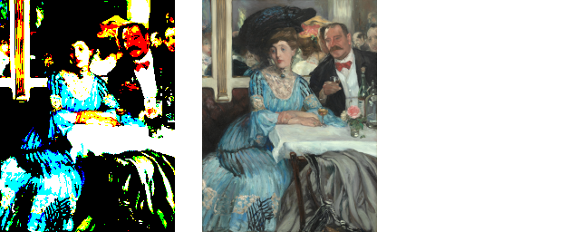
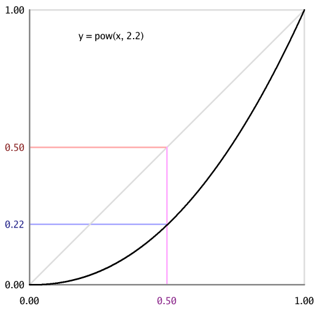
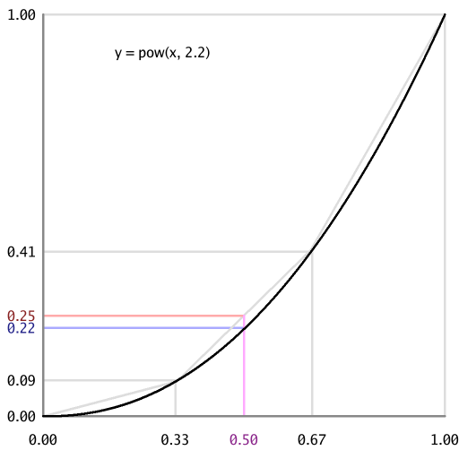
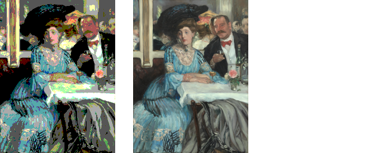
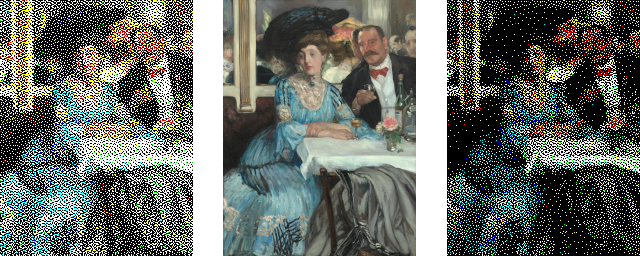
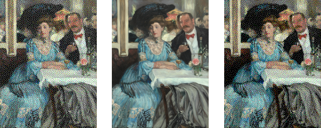

# Gamma-Aware Ordered Dithering

I've been playing around with taking regular "8 bits per RGB (Red, Green, Blue)
channel" images and reducing their bit depth. In the extreme case, 1 bit per
channel gives us only 8 choices for each pixel: black, red, green, blue, cyan,
magenta, yellow and white, all fully saturated.

The simplest way to do the conversion is to just take the high bit of each
8-bit value and quantize to either 0x00 or 0xFF. Here's an example with the
original image (re-scaled from the Art Institute of Chicago's CC0 Public Domain
Designation licensed photo of [William Glackens' "At
Mouquin's"](https://www.artic.edu/artworks/15401/at-mouquin-s")) in the middle
and the converted image on the left. This pairing is also Figure 2a in the
[appendix](./gamma-aware-pixelated-images.html).

The left hand image is a poor approximation of the original image. Amongst its
other deficiencies, it's also noticably *brighter*. This is because of gamma
correction (or the lack of it). As the ["Gamma-aware image
dithering"](https://www.nayuki.io/page/gamma-aware-image-dithering) nayuki.io
blog post says:

> On the 8-bit scale that ranges from 0 to 255, on typical displays designed
> for gamma 2.2 or sRGB, the midpoint value 127.5 is not 50% the brightness of
> 255 – it’s actually about 22% of the brightness. The implication is that if
> we approximate the gray value 127.5 by alternating between white and black
> pixels, then we need 22% of the pixels to be white, not 50% of them.

In visual terms:

With the default gamma of 2.2, an area that alternates equally between
`#000000` black and `#FFFFFF` white pixels appears much brighter than an area
that is uniformly `#808080` medium gray. This is demonstrated by the
Checkerboard images in the [appendix](./gamma-aware-pixelated-images.html).

One way to reduce the gap between "the average of the exponential transform"
and "the exponential transform of the average" is to quantize to more bits.
When approximating `pow(0.5, 2.2)`, the average of `pow(0.33, 2.2)` and
`pow(0.67, 2.2)` is much closer than the average of `pow(0.00, 2.2)` and
`pow(1.00, 2.2)`. Visually, a "2 bits per channel" quantization is much closer
to the original image, in terms of brightness, than the "1 bit per channel"
version above.

That doesn't necessarily mean that it's a *better* image. There's now some
weird green artifact on the tablecloth. It turns out that colors like `#BAC6BB`
(i.e. light gray) in the original image gets quantized to `#AAFFAA` (i.e. light
green) or, equivalently, `rgb(0.67, 1.00, 0.67)`. When taking the high N bits
(N=2 here), 0xBF versus 0xC0 is a hard cut-off.

Dithering is the classic approach to avoiding these hard cut-off artifacts. The
nayuki.io blog post linked to earlier discusses a simple dithering algorithm
(in a gamma-aware manner):

> The simple algorithm presented above [in the nayuki.io blog post] merely
> dumps the approximation error to the next pixel to the right... It’s also
> possible to implement gamma-aware ordered dithering with some careful
> thought.

Having done some careful thought (and also having read the more recent
["Ditherpunk — The article I wish I had about monochrome image
dithering"](https://surma.dev/things/ditherpunk/) surma.dev blog post which
*does* do ordered dithering, but only for 1 bit per channel and only for 1
channel: black/white), I now have some code to share (a [command line
tool](https://github.com/nigeltao/qoir/tree/main/extra/cmd/gammaawaredither)
and [Go
library](https://github.com/nigeltao/qoir/tree/main/extra/lib/gammaawaredither))
to perform gamma-aware, blue-noise (ordered) dithering.

Here's the reduction to 1 (top) and 2 (bottom) bits per channel, with naive
(left) and gamma-aware (right) dithering. The top-left image is still brighter
than the middle (original). The bottom-left image is also brighter, but it's
not as obvious (focus on the woman's dark hat and the man's dark jacket). The
difference between naive and gamma-aware quantization isn't really noticable at
3, 4 or higher bits per channel. But it certainly stands out at a bit depth
of 1. For technical reasons (the MarkDown that this blog post was written in
doesn't allow explicit CSS styling of HTML images), these "At Mouquin's" images
are best viewed in the [appendix](./gamma-aware-pixelated-images.html).

---

Published: 2022-09-25
