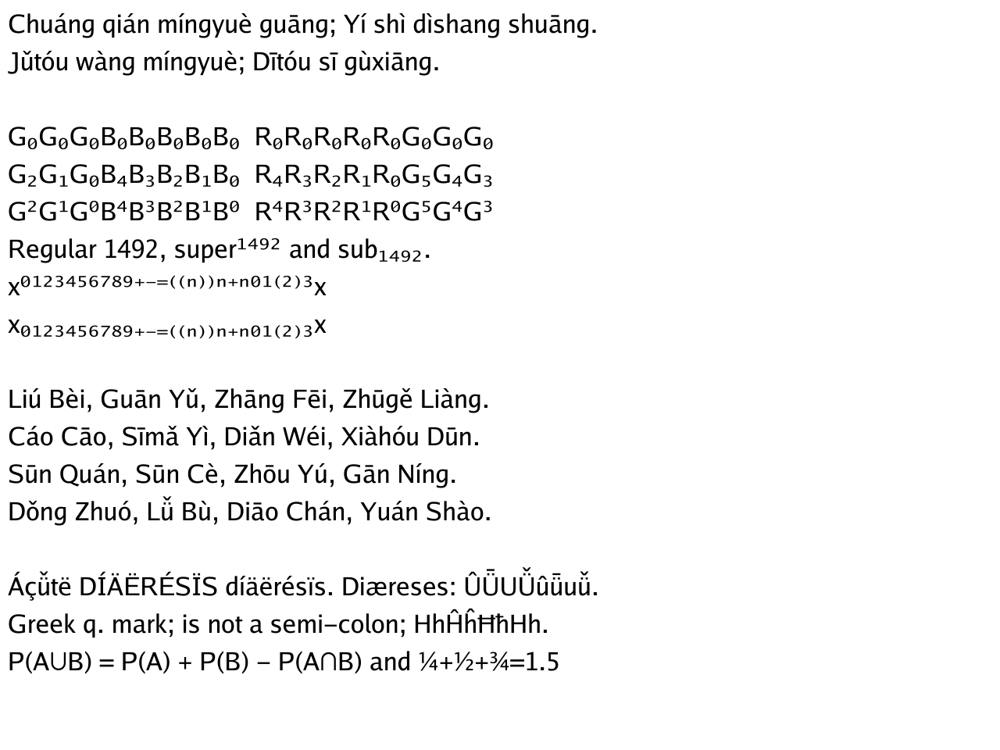
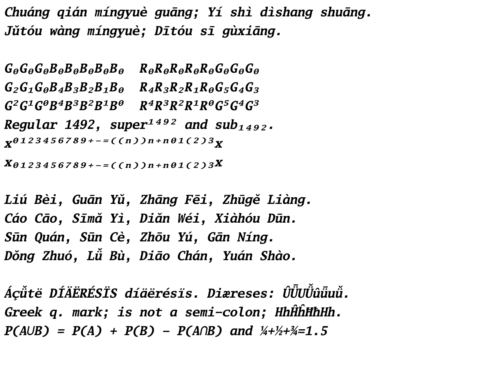
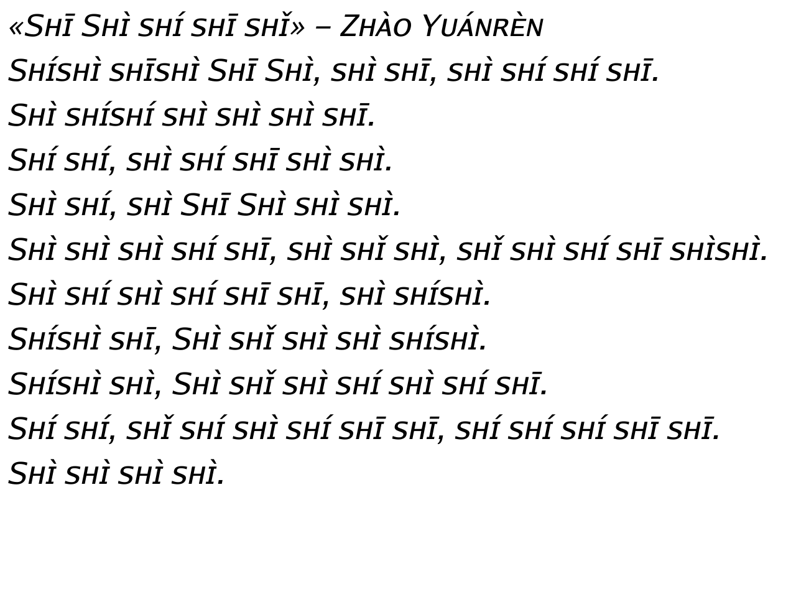

# Go Fonts v2.010

The Go Fonts were [originally released](https://go.dev/blog/go-fonts) in 2016
and [version
2.008](https://groups.google.com/g/golang-nuts/c/hGCuDJcQ9ZM/m/tvx5OPzBBwAJ)
came out in 2017. It's taken longer that we'd have liked, but we have just
released version 2.010 as of [commit
41969df7](https://github.com/golang/image/commit/41969df76e82aeec85fa3821b1e24955ea993001):

- Fix the ["knobbly l"](https://github.com/golang/go/issues/23497) in Go Medium
  and Go Medium Italic.
- Fix the unintentional swap of u-acute and u-circumflex in Go Smallcaps
  and Go Smallcaps Italic.
- Add U+01CD ..= U+01DC Pinyin diacritic-vowel combinations.
- Add U+2070 ..= U+208E superscript and subscript numerals. The existing
  superscript 1, 2, 3 and n were adjusted for consistency (e.g.
  superscript '1' now has a baseline if regular '1' does).
- Add U+037E GREEK QUESTION MARK.
- Add U+222A UNION.
- ttfautohint upgraded to the latest version, from 1.6 to 1.8.

Unlike the v2.008 changes, the v2.010 changes were largely [algorithmically
generated](https://github.com/nigeltao/fontscripts/tree/master/cmd/upgrade-go-fonts-to-v2010).
Algorithmic means that e.g. the new "a-caron" glyph is made by copy/pasting
parts of the existing "a" and "s-caron" glyphs. Similarly, "superscript 4" is a
scaled and translated "regular 4" and "union" is roughly an upside-down
"intersection", after accounting for any italic 'lean'.

That program is mostly one-off textual grunt-work before and after the `ttx`
tool converts fonts between binary and textual formats. It's probably not very
interesting, but I've linked it anyway for reproducibility.


## Download

[How to get or use these fonts](https://go.dev/blog/go-fonts#how-to-use-them)
hasn't changed. If you just want the TTF files, run

```
git clone https://go.googlesource.com/image
```

and copy them from the subsequent `image/font/gofont/ttfs` directory.
Alternatively, they are also mirrored at
[https://github.com/golang/image/tree/master/font/gofont/ttfs](https://github.com/golang/image/tree/master/font/gofont/ttfs)


## Samples

Go Regular, Go Mono Bold Italic and Go Smallcaps Italic.






---

Published: 2022-06-17
