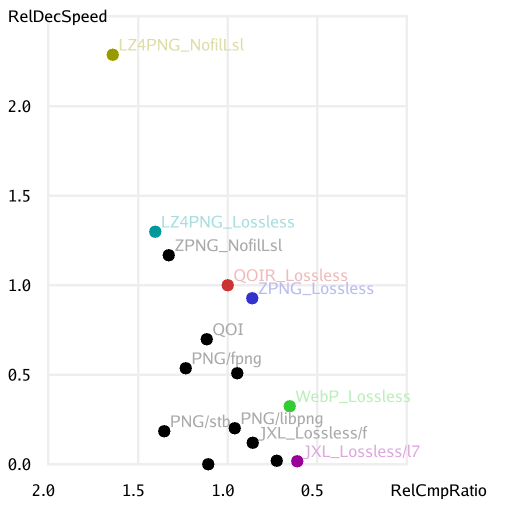

# QOIR: a Fast, Simple, Lossless Image File Format based on QOI

The [QOI lossless image file format](http://qoiformat.org/) was [announced
about a year
ago](https://phoboslab.org/log/2021/11/qoi-fast-lossless-image-compression).
It's remarkably competitive with the ubiquitous PNG lossless image file format,
in terms of compression ratio, given that the QOI prototype was only *300 lines
of C code with no dependencies* (except for really basic stdlib things like
`malloc` and `memset`). That's since blown out to [650 lines of
code](https://github.com/phoboslab/qoi/blob/660839cb/qoi.h), although the first
200 of those are comments.

I've [previously mentioned](../2021/json-with-commas-comments.md) the Morris
Principle of software comprehensibility:

> Software has a Peter Principle. If a piece of code is comprehensible, someone
> will extend it, so they can apply it to their own problem. If it's
> incomprehensible, they'll write their own code instead. Code tends to be
> extended to its level of incomprehensibility.

The QOI code was comprehensible, so I played around with extending it (in an
file format incompatible way) to produce the **QOIR lossless image file
format**.

(I'm [not the only one](https://github.com/nigeltao/qoi2-bikeshed/issues) to
extend QOI like this, although e.g.
[MarcioPais/SIF](https://github.com/MarcioPais/SIF) does not support images
with an alpha channel. Being limited to fully opaque images is a valid game to
play, but it's a different game from the one that QOIR is playing.)

Getting back to QOIR, it compresses smaller, encodes faster and decodes faster
than QOI (and, like QOI, decodes much faster than PNG), but it's also more
complicated than QOI (around 3000 lines of C plus 4000 lines of data tables).

Focusing just on (single-threaded) relative decode speed versus relative
compression ratio, here's a chart showing a variety of image codecs. See the
[QOIR GitHub page](https://github.com/nigeltao/qoir) for more details,
including raw benchmark numbers and reproduction instructions.

Having done that experiment, though, I learned a couple of things.

One is that, for "maximum 8 bits per channel" *lossless*, WebP is at a pretty
good place on the "decode speed versus compression ratio" Pareto frontier. It
also has the benefit that caniuse.com reports more than [97% browser
support](https://caniuse.com/webp) *today*. [VP8L is not a complicated
codec](https://github.com/golang/image/tree/master/vp8l). It shouldn't be that
hard to write a single file C library for decoding WebP lossless. But that
would be another story, for another time.

[catid/ZPNG](https://github.com/catid/Zpng) is also very simple (around 700
lines of C++ code plus a zstd dependency), and hence extensible, but also on
the Pareto frontier and close to QOIR. It might be interesting to combine it
with other ideas from QOI/QOIR, WebP lossless and elsewhere, and see how far we
can push the frontier out. But that would be another story, for another time.

## Roll Your Own Format

A meta-lesson from QOI (300 lines of code) and ZPNG (700 lines of code plus a
zstd dependency which you can substitute an LZ4 dependency instead) is that
it's not actually that hard to roll your own image file format, if you care
more about codec speed than compression ratio, or if you have a CPU budget or
code size budget. And you don't care about interoperability or wider adoption.

For example, if you have a relatively wimpy camera that streams out a 160×120
grayscale image, it might be fun to see how far you can push something like
combining:

1. Truncating from 8 or more bits per pixel to 6,
2. Delta encoding, where `encoded(x, y) = original(x, y) - original(x-1, y)`,
   roughly speaking, and
3. LZ4 compression, as an upgrade on basic [run-length
   encoding](https://en.wikipedia.org/wiki/Run-length_encoding).

That sort of thing might not beat WebP or JPEG-XL *in general*, but it might be
small enough (in terms of compression), fast enough (encode and decode) and
small enough (in terms of code size) to be useful in some niche circumstances.
Or it could just be a fun and educational afternoon.

---

Published: 2022-12-05
