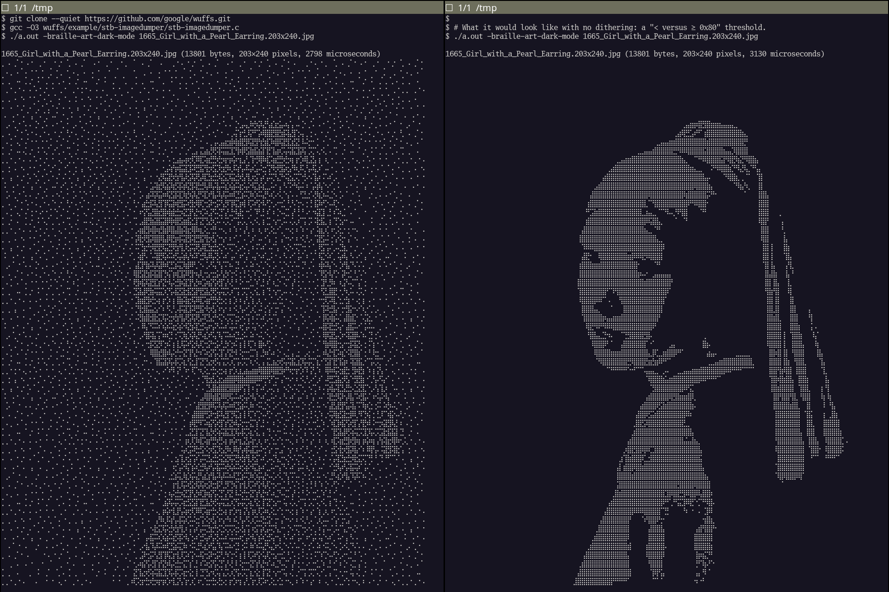
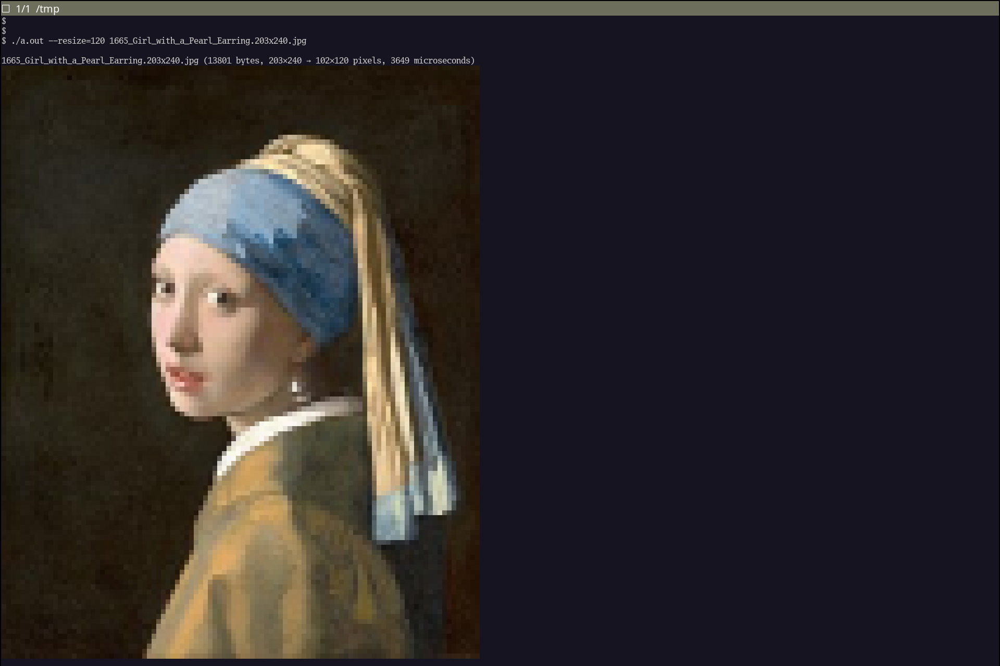

# Blue Noise Braille Art

Speaking of Braille art yesterday, Wuffs' suite of example programs recently
gained one demonstrating Wuffs being a drop-in replacement for part of the [STB
Image](https://github.com/nothings/stb/blob/31707d14fdb75da66b3eed52a2236a70af0d0960/stb_image.h)
library - providing the same API functions but with a different (and
memory-safe) implementation. Thanks to Rich Geldreich [for the
suggestion](https://github.com/google/wuffs/issues/153).

Wuffs' `example/stb-imagedumper` program [exercises the `stbi_load`
function](https://github.com/google/wuffs/blob/56ee4b5e7f4758c27c66001553fa38eb99549dfd/example/stb-imagedumper/stb-imagedumper.c#L835C18-L835C27)
but, coincidentally, it can also output Braille art to the terminal - using
Unicode [Braille Pattern](https://en.wikipedia.org/wiki/Braille_Patterns)
characters (like ⠣ and ⣳) as a 2×4 matrix of off-or-on monochrome pixels.

With the `-braille-art-dark-mode` flag, the program converts to 8-bit grayscale
and, from there, it uses [blue noise
dithering](https://surma.dev/things/ditherpunk/). Here's what that looks like,
compared to simply taking the most significant bit of that 8-bit grayscale as
1-bit monochrome (as done in
[yesterday's blog post's](./go-embedding-back-compat.md) `package bug` code).



The output on the right has exactly the same command line arguments and flags.
It's just recompiled after this patch:

```diff
index 59c9cce2..c239e50b 100644
--- a/example/stb-imagedumper/stb-imagedumper.c
+++ b/example/stb-imagedumper/stb-imagedumper.c
@@ -923,7 +923,7 @@ handle(const char* filename,
           for (int dx = 0; (dx < 2) && ((x + dx) < w); dx++) {
             size_t tx = x + dx;
             uint8_t pixel = pixels[(ty * (size_t)w) + tx];
-            uint8_t threshold = g_noise[ty & 31][tx & 31];
+            uint8_t threshold = 0x7F;
             if ((xor^pixel) > (xor^threshold)) {
               uint8_t b = g_braille[dy][dx];
               dst[1] |= b >> 6;
```

---

The `example/stb-imagedumper` program can also output ANSI-colored blocks: RGB
instead of grayscale.



---

The public domain [203×240 source
image](./1665_Girl_with_a_Pearl_Earring.203x240.jpg) comes from the [*Girl with
a Pearl
Earring*](https://commons.wikimedia.org/wiki/File:1665_Girl_with_a_Pearl_Earring.jpg)
Wikipedia page. The original 17th century painting was by Vermeer.


---

Published: 2024-10-07
