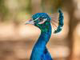

# JPEG Chroma Upsampling

JPEG images are lossy. Part of the JPEG mechanics is a transformation from RGB
(Red, Green, Blue) values to YCbCr (Luma, Chroma-blue, Chroma-red) values. That
by itself is only slightly lossy (it's a linear transformation, which is
theoretically reversible but practically subject to rounding errors). A bigger
source of loss (and hence compression) is that, since human eyes are more
sensitive to luma and less sensitive to chroma, JPEG images typically subsample
the chroma. "4:2:0"
[chroma subsampling](https://en.wikipedia.org/wiki/Chroma_subsampling) is very
common, where e.g. an 800×600 pixel image (which would be 800×600 values for R,
G and B each, totalling (800×600 + 800×600 + 800×600) = 1,440,000 values) would
have 800×600 Y values but only 400×300 for Cb and Cr, totalling (800×600 +
400×300 + 400×300) = 720,000 values. 4:2:0 YCbCr only needs half the number of
bytes as 4:4:4 RGB, before you apply all of the other compression techniques in
JPEG's toolbox.

When decoding a JPEG image, there is some flexibility in what constitutes a
"correct" decoding. The libjpeg-turbo library has three different IDCT (Inverse
Discrete Cosine Transform) implementations (`jidctflt.c`, `jidctfst.c` and
`jidctint.c`) and they're all specification-compliant, trading off speed,
quality or "no floating point hardware needed".

Similarly, when reconstructing 800×600 chroma values (for the YCbCr to RGB
reverse linear transformation) from the 400×300 values encoded in the lower
levels of a JPEG file, there is some flexibility in how a decoder
implementation can upsample. Libjpeg-turbo has a boolean
[`do_fancy_upsampling`](https://github.com/libjpeg-turbo/libjpeg-turbo/blob/8db0312668f986891f65af9dbcc94e7e92ede099/jpeglib.h#L548)
configuration field (defaulting to true) that chooses different upsampling
algorithms: "fancy" means to use a triangle filter and "not fancy" means to use
a box filter. The wuffs library (without further configuration) exactly matches
libjpeg-turbo's output (it implements the same triangle filter) but you can
likewise activate a
[`WUFFS_BASE__QUIRK_QUALITY__VALUE__LOWER_QUALITY`](https://github.com/google/wuffs/blob/870cfd18a7fe77a97a2258f564e9806d3474d56b/test/c/std/jpeg.c#L106-L108)
configuration switch for (lower quality) box filtering.

One reason you'd want to opt into lower quality is that it needs less temporary
memory. More on that later. But when considering that trade-off, you might also
want to visualize what the quality difference actually is. This blog post shows
three examples of that.

## Bricks Example

The first example is a photo I took of some toy bricks. My photo was scaled and
then re-encoded to JPEG using `cjpeg`'s default quality setting. Unlike viewing
a lossless PNG (which has only one correct decoding), if you're viewing this
lossy JPEG in a web browser, what pixels you see exactly depends on whatever
chroma upsampling algorithm your browser was configured with. Here's three
images:

- A 160×120 4:2:0 JPEG image, encoded with `cjpeg -quality 75`.
- That JPEG converted to PNG with box-filtered (not fancy) chroma upsampling.
- That JPEG converted to PNG with triangle-filtered (fancy) chroma upsampling.

If the difference in the last two isn't obvious, here's a 16× magnification
comparing box (left) vs triangle (right) for two excerpts. For chroma (red vs
blue vs yellow vs green) and ignoring luma (brightness, roughly), note how the
left-hand images are blockier and clump tighter to the 2×2 subsampling
boundaries (cornered by the white dots on the black grid lines).

Here's complete 16× magnifications for
[bricks (box)](./bricks-color.box-filter.magnified16x.png) and
[bricks (triangle)](./bricks-color.triangle-filter.magnified16x.png). You can
open those links in two separate browser tabs and toggle between them. The
brightness appears to change at the chroma transition edges because upsampling
doesn't do
[gamma-aware interpolation](../2022/gamma-aware-ordered-dithering.md).

## Box vs Triangle Filtering

Consider upsampling 8 inputs (equally spaced along an x-axis: 0, 1, 2, ..., 7;
the y-axis height is the input value) to create 16 outputs (again, equally
spaced horizontally: 0L, 0R, 1L, ..., 7R). A simple solution is to duplicate
every input value, going from black circles to red squares in the animation
below.

A complex solution is to linearly interpolate between the black circles, again
subject to "equally spaced horizontally", producing the blue diamonds. A 1:2
ratio of input samples and output samples means that, other than the edge
cases, each blue diamond's height is a 3:1 weighted average of the 1st-closest
and 2nd-closest (closest horizontally) black circle's height. For one
dimensional upsampling, as shown in the animation, it's 3:1. For two
dimensional, as used for a two dimensional JPEG image, it's a 9:3:3:1 weighted
average of four input samples.

(If you're studying the libjpeg-turbo 4:2:0 (also known as h2v2)
["fancy upsampling"](https://github.com/libjpeg-turbo/libjpeg-turbo/blob/8db0312668f986891f65af9dbcc94e7e92ede099/jdsample.c#L397-L398)
implementation, using 9:3:3:1 for a total weight of 16, one subtlety is that it
alternates between rounding one half up and down, adding 8/16 or 7/16,
presumably to minimize overall bias.)

These two techniques (red square, blue diamond) are known as using a box filter
or triangle filter, because they are equivalent to convolving with a
[box function](https://en.wikipedia.org/wiki/Rectangular_function) or
[triangle function](https://en.wikipedia.org/wiki/Triangular_function)
respectively. But you might also recognize them as "nearest neighbor" or
"linear (or bi-linear, for two dimensions)" upsampling.

Note how the vertical difference between two horizontally adjacent red squares
is either zero or relatively large (blockier), but the vertical difference
between blue diamonds is smaller (smoother). Going back to the 16× magnified
brick photo, above, this matches how the 2×2 subsampling boundaries are more
prominent for the box filtered version.

That's not to say that box filtering is always worse than triangle filtering.
One counterpoint is that the red (box) values preserve the highest highs and
lowest lows, while the blue (triangle) values have regressed to the middle:
smoother but also milder.

## Memory Usage

As a decoder produces the black circle samples left-to-right, box filtering is
easy. Generating twice as many red square samples is just emitting each black
value twice.

Generating twice as many blue diamond samples is more complicated. For one
thing, when you have a black value (0, 1, ...), you can't produce the
right-side (0R, 1R, ...) until you've seen the next black value. On the left
side, producing the 1L, 2L, ... samples requires the current black value (1, 2,
...) but also remembering the previous black value (0, 1, ...). In computing
terms, "remembering" means that you need to allocate some memory.

In the pedagogical one dimensional illustration, you only need memory for one
value (the previous black). But when decoding a two dimensional JPEG
(left-to-right, top-to-bottom), you're going to need at least O(width) to
remember the previous row. You can do O(width) with some more tricky buffer
management (interleaving decoding blacks and upsampling blues) or O(width ×
height) with less tricky buffer management (decode all the blacks and only then
upsample all the blues). Either way, triangle filtering is going to need some
temporary memory and the amount needed depends on the JPEG image dimensions.
And if you want to support decoding progressive (not just sequential) JPEGs
then you're going to need O(width × height) temporary memory anyway, regardless
of your upsampling's fanciness.

(If you're studying libjpeg-turbo again, O(width) with tricky buffer management
is trickier because JPEG doesn't actually just go left-to-right top-to-bottom
in terms of samples. It goes LTR TTB in terms of MCUs (Minimum Coded Units) and
for 4:2:0, MCUs are 16×16 pixel blocks. But that's another story, for another
time.)

Anyway, back to eyeballing a couple more 16× magnified images...

## Peacock Example

The second example image is derived from a CC0 / public domain photo of
[a peacock](https://commons.wikimedia.org/wiki/File:Pavo_Real_Venezolano.jpg).
Again:

- A 100×75 4:2:0 JPEG image, encoded with `cjpeg -quality 75`.
- That JPEG converted to PNG with box-filtered (not fancy) chroma upsampling.
- That JPEG converted to PNG with triangle-filtered (fancy) chroma upsampling.

Once again, the differences are hard to pick up at 1× on a high-resolution
display, but if you zoom in 16×, the top edge of the bird's head is sharper and
more abrupt for the box filter (left side images) than the triangle filter
(right side images). Similarly, the 2×2 block boundaries are more noticable, in
the background behind the peacock, for box filtering.

Here's complete 16× magnifications for
[peacock (box)](./peacock.default.box-filter.magnified16x.png) and
[peacock (triangle)](./peacock.default.triangle-filter.magnified16x.png).

<h2>At Mouquin's Example</h2>

The last example image is derived from a CC0 / public domain photo of
[William Glackens' "At Mouquin's"](https://www.artic.edu/artworks/15401/at-mouquin-s).
Again:

- A 128×128 4:2:0 JPEG image, encoded with `cjpeg -quality 90`.
- That JPEG converted to PNG with box-filtered (not fancy) chroma upsampling.
- That JPEG converted to PNG with triangle-filtered (fancy) chroma upsampling.

If you look at the bottom excerpt, you can see 2×2 block artifacts near the
cup. But even after zooming in 16×, it's really hard to spot the difference in
the top excerpt, of the woman's head. Remember that both decodings start from
exactly the same JPEG image with exactly the same downsampled chroma data. The
left and right sides only differ in the chroma upsampling algorithm.

Here's complete 16× magnifications for
[At Mouquin's (box)](./at-mouquins.128x128.q90.box-filter.magnified16x.png) and
[At Mouquin's (triangle)](./at-mouquins.128x128.q90.triangle-filter.magnified16x.png).

## Summary

Three images is a very small test suite, but my subjective opinion is that, on
modern, high-resolution displays (instead of 1990s 640×480 CRT monitors), *the
difference between fancy (triangle) and not fancy (box) filtering is really
hard to notice*, because a single pixel (or even a 2×2 pixel block) is just
very small. Even on low-resolution displays, the difference can still be
negligible.

---

Published: 2024-08-11
