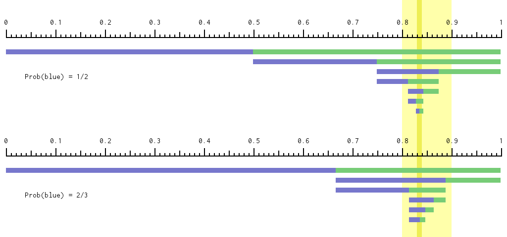
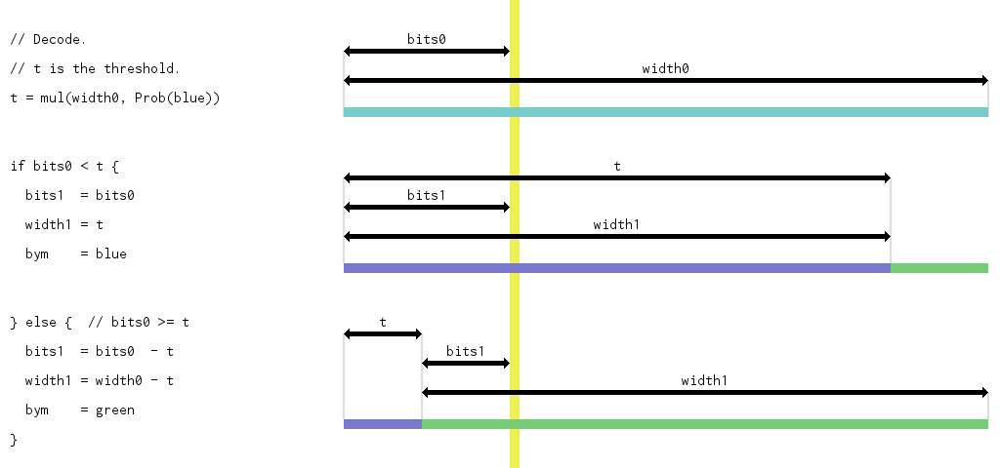
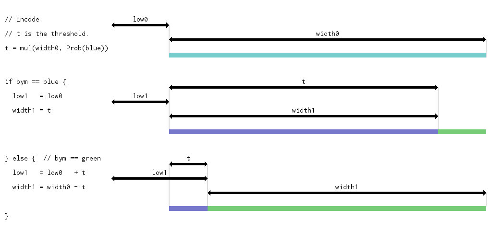

# XZ/LZMA Worked Example Part 1: Range Coding

This blog post is one of a five part series.

- [Part 1: Range Coding](./xz-lzma-part-1-range-coding.md)
- [Part 2: A Complete Toy Range Coder](./xz-lzma-part-2-complete-toy-range-coder.md)
- [Part 3: Literal-Only LZMA](./xz-lzma-part-3-literal-only-lzma.md)
- [Part 4: Lempel-Ziv, Markov-chain](./xz-lzma-part-4-lempel-ziv-markov-chain.md)
- [Part 5: XZ](./xz-lzma-part-5-xz.md)


## Background

XZ is a general purpose compression file format, achieving very good
compression ratios (smaller compressed file sizes). Almost always better than
gzip/deflate and usually better than bzip2. Newer formats like brotli and zstd
are now pretty competitive (and also offer better compression or decompression
speeds), depending on your test corpus, but XZ is still widely used.

To be pedantic, XZ is a container format and LZMA is the compression algorithm.
The 7z and LZIP file formats aren't XZ but can also use LZMA.

For further pedantry, XZ is the name of the file format (such files are
conventionally named `foobar.xz`) but also the name of [a git
repository](https://github.com/tukaani-project/xz) of software that implements
that file format. `liblzma` and `/usr/bin/xz` are example artifacts built from
that project.

A few weeks ago, [a backdoor was
discovered](https://openwall.com/lists/oss-security/2024/03/29/4) in
`xz/liblzma`, targeting SSH servers since `sshd` can depend on `libsystemd` can
depend on `liblzma`. Planting that backdoor exploited the build process, rather
than a weakness in the file format or its C code implementation. Still, xz is
having its 15 minutes of infamy and some of you might be curious about how LZMA
compression actually works. How does it achieve such a good compression ratio?

This blog post series answers that question. We'll start with range coding.


## Notation

Let `[lb, ub)` denote a half-open numerical range, defined by lower and upper
bounds. It is the set of all numbers `x` such that `(lb ≤ x)` and `(x < ub)`.
For example, `[0.5, 0.625)` are those numbers that are at least ½ and less than
⅝. This example (and most of this blog post) uses base-10 decimal digits (the
digits 0, 1, 2, ..., 9), which humans are most familiar with. Computers work
better with powers of two, especially base-2 (binary, bit-based) or base-256
(byte-based). The same `[½, ⅝)` range could also be written as `[0b0.1,
0b0.101)` or `[0b0.100, 0b0.101)` or `[0x0.80, 0x0.A0)`.

Let's also introduce some "no-op underscores", so that `0.834626841674073` is
the same as `0.83462_68416_74073`. These underscores will be most helpful (for
humans) with our base-256 numbers, where each base-256 digit combines two
base-16 (hexadecimal) digits.

The `[lb, ub)` pair representation is equivalent to a `(lb ++ width)` pair
representation, where `width = (ub - lb)`. Many discussions of *range* coding
use the term *range* instead of *width*, but *range* is a [reserved keyword in
the Go programming language](https://go.dev/ref/spec#Keywords), so I'm going to
use *width* in my runnable code snippets.

The width can be implicit. Let `«834626841»` (which you can think of as a
"digit string" with length 9) denote a lowerBound of 0.834626841 and an upper
bound of 1e-9, where 9 is that string length. That range is equivalent to
`[0.834626841, 0.834626842)`, where the two bounds differ in their last digit.

Note that trailing zeroes matter. `«123»` and `«1230»` are different ranges,
even though 0.123 and 0.1230 are the same numbers. Those two ranges have larger
and smaller  widths: `(0.123 ++ 1e-3)` and `(0.1230 ++ 1e-4)`.

Note also that `«123»` being a "prefix" of `«123456»` means that the first
range completely contains the second range. The less precise `«123»` is a
"conservative estimate" of the more precise `«123456»`.

This `«123»` example range uses decimal digits. Summarizing this blog post
series: the essence of LZMA compression is recording one very precise range
just like this (precise means a large number of digits, so a narrow width), but
using base-256 digits. This very precise range forms the vast majority of the
compressed file's bytes.


## Byms (Binary Symbols)

LZMA is a compression technique combining two steps: (1) "Lempel-Ziv
back-references" (I'll get to those
[later](./xz-lzma-part-4-lempel-ziv-markov-chain.md)) with some bureaucratic
overhead and (2) range coding. Decoding LZMA involves decoding both steps, in
reverse order. Range decoding consumes the compressed bytes (a digit stream,
base-256 digits for LZMA) and produces a symbol stream.

Wikipedia's [range coding](https://en.wikipedia.org/wiki/Range_coding) article
discusses a 3-symbol example ('A', 'B', EOF) but LZMA uses a simpler 2-symbol
stream (and "End Of File" is often implicit, as the byte length of the
uncompressed text (after decoding step 1) is transmitted separately.

A 2-symbol stream is a bit stream but, in order to disambiguate compressed
bits-and-bytes from uncompressed bits-and-bytes, I'm going to use "byte stream"
for LZMA range coding's compressed form and "bym stream" for its uncompressed
form. Bym is short for "binary symbol" the way that "bit" is short for "binary
digit". There are two bym values. Let's call them blue (0) and green (1).

LZMA gets good compression ratios because the blues and greens don't have to be
equally weighted in the byte stream. If blues are more common than greens then
they can have a shorter representation. For those familiar with Huffman coding,
a further advantage of range coding is that the symbol (or symbol-cluster)
probabilities don't have to be a power-of-a-half: 50%, 25%, 12.5%, 6.25%, etc.
If blues are roughly twice as common as greens then range coding can still
represent a 2:1 split (a 67% probability, roughly) fairly accurately.


## Treasure Hunting

When decoding LZMA, how does a very narrow range convert into a bym stream?
I'll use a "treasure hunting" analogy. Suppose that you're looking for buried
treasure on a 1-dimensional island, aligned west to east. The island is
`0.9999` units long, so you can identify any location by a number in the range
`(0 ++ 0.9999)`. You also have a cryptic *treasure map*: that previously
mentioned, very precise list of digits that locates that treasure. That
location (call it the *actual treasure range*) is a narrow range.

You can't keep more-than-four-digit numbers in your head and four is less than
the length of the treasure map, so you can't just head straight to the precise
treasure location. Instead, you keep a *treasure-prefix range* that's
equivalent to a prefix of the treasure map's digit string. The treasure-prefix
range always contains the actual treasure range. You'll iterate, making
progress, and on some iterations you'll ["zoom
in"](https://www.youtube.com/watch?v=LhF_56SxrGk), reading more digits from
your treasure map, narrowing the treasure-prefix range's width by a factor of
10.

You'll also keep a *coverage range* that always that always contains (covers)
the *entire* treasure-prefix range (a range has a width; it's not a single
number) and therefore always contains the actual treasure range.

Each iteration, your coverage range gets narrower. Some arithmetic will tell
you how to split your coverage range into two parts, maybe of unequal size, but
only one part will contain the treasure-prefix range. Those two parts, west and
east, are also labeled blue and green. Each iteration, note whether you're
taking the blue or green branch.

Eventually, you'll get to the end of the treasure map, but the analogy's buried
treasure chest only held a MacGuffin. The real treasure was the sequence of
blue and green byms we made along the way.

Here's an illustration of `«8»` and `«83»` in light yellow and dark yellow. The
coverage range starts at full width and, at each iteration (row), that range is
split into blue and green parts, at either a 1:1 (top) or 2:1 (bottom) ratio.
At each iteration, whichever 'b' or 'g' (blue or green) split contained the
yellow treasure range becomes the next iteration's coverage range. Note that
the bym sequence for `«83...»` (top: "ggbgbg..." or bottom: "gbgbb...") depends
on the blue-green ratio (or, equivalently, the "probability" or prediction of
the next bym being blue), not just the `«83...»` treasure map itself.



In this illustration, the bym stream decoding stops when it becomes ambiguous:
when the `«83»` dark yellow column crosses a blue-green boundary. In practice,
with LZMA, it'd never get to that ambiguous stage. The coverage, blue and green
widths are always an integer multiple of the treasure-prefix width. We'd zoom
in (making the treasure-prefix width smaller, the yellow column narrower)
whenever the coverage width got too small (as a multiple of that
treasure-prefix width granularity).


## Zooming In

At first glance, you'll need to track four numbers (two pairs of two), since
both the coverage range and the treasure-prefix range have a lower bound and a
width. But also, if you're limited to four-digit numbers, you can't just drop
the '1' when you load the '5' from `«123456»`. There's a transformation that
addresses both concerns.

You conceptually track two lower bounds (coverage and treasure-prefix) but, in
practice, only track the difference between them. Remember that the
treasure-prefix range is always completely within the coverage range, and the
treasure-prefix has non-zero range, so an invariant is that this difference is
strictly less than the coverage width.

We can also set the treasure-prefix width implicitly to always be 1 ZLU (Zoom
Level Unit), the granularity that our current iteration is working at. We then
only have to track two state variables: a lower-bound difference (which I'll
call `bits`, since it derives from the compressed-data bit stream - the
treasure map; some other range coding implementations call this variable
`code`) and a `width` (the coverage width). Both `bits` and `width` are integer
multiples of ZLUs.

To start with, set `bits` the first four digits of the treasure map (actually,
the first five, since the first digit is always zero to simplify the encoder,
see "five digits" below), `width` to `9999` and the ZLU to `1e-5`.

On each iteration, you'll pick blue or green, then `width` (the coverage width)
will get smaller. Whenever it gets too small (less than 1000 ZLUs), zoom in
(which makes the ZLU smaller by 10x). Conceptually, zooming in leaves the
coverage range unchanged (it's 10x as many ZLUs but each ZLU is now 10x
smaller) but narrows the treasure-prefix range by 10x (because we load another
digit from the treasure map; the treasure-prefix width stays at 1 ZLU but a ZLU
is now smaller). It also nudges (by that loaded digit) the `bits` lower-bound
difference (as measured in ZLUs). In terms of code, zooming in is:

```
if width < 1000 {
    // An invariant is that (bits < width) and so, when limited to
    // four-digit numbers, the high (thousands) digit of both bits and
    // width must be zero. Multiplying by 10 (and adding up to 9) will
    // not overflow.
    bits  = (10 * bits)  + loadNextDigit()
    width = (10 * width)
}
```

The ZLU isn't explicitly tracked. It's a useful concept for visualizing and
understanding the iterative process but isn't actually needed in the code.


## Decoder

Here's the decoder inner loop's code (and a visualization).



```
// t is the threshold.
t = mul(width, prob)

// Decode the bym.
if bits < t {
    width  = t
    bym    = blue
    // ¶ TODO: adaptive probabilities.

} else {
    bits  -= t
    width -= t
    bym    = green
    // ¶ TODO: adaptive probabilities.
}

// Zoom in if necessary.
if width < 1000 {
    bits  = (10 * bits)  + loadNextDigit()
    width = (10 * width)
}
```

The `mul(width, prob)` expression basically multiplies `width` and `prob`, but
the `mul` abstraction glosses away whether `prob` uses a fixed-point or
floating-point representation.

So far, that probability has been constant and previously agreed on between
encoder and decoder. I've stuck a couple of "¶" pins in that code for now.
We'll come back to that [later](./xz-lzma-part-2-complete-toy-range-coder.md).


## Encoder

As always, encoding is the opposite to decoding. Decoding starts with the
treasure map and produces a bym stream. Encoding starts with the bym stream and
needs to produce a treasure map.

Visually, recalling the first image above, playing a sequence of blue and green
byms defines a successively narrower range. Setting the treasure range's lower
bound to the final, narrowest row will lead the decoder down the same path (and
hence recover the same bym stream).

The decoder basically had two state variables (`bits` and `width`) plus the
treasure map itself. The encoder also has two state variables (plus a couple
others; see "N+1 pending digits" below), that are very similar, but slightly
different, so I'm going to call them `low` and `width`. In both cases, the
`width` is the coverage width, which the encoder tracks step-for-step with each
encoded bym the way the decoder updates its coverage width with each decoded
bym.

The encoder's `low` is a range's lower bound, compared to the decoder's `bits`
being a difference of two ranges' lower bounds. The encoder needs to know the
coverage's lower bound (in ZLUs, modulo 10000) in absolute terms. Its digits
are the ones written out as the treasure map. Here's the encoder core loop's
code (and a visualization).



The encoder code is similar to the decoder code. Note especially that both
encoder and decoder zoom in at the same time, after the same number of
iterations. Zooming in happens when the `width` is small enough, and updating
the `width` only depends on the threshold (i.e. on the `width` and `prob`) and
whether the bym is blue or green. The formula for updating the `width` does not
depend on the value of the decoder's `bits`, other than the decoder uses `bits`
and `t` to deduce blue versus green.

```
// t is the threshold.
t = mul(width, prob)

// Encode the bym.
if bym == blue {
    width  = t
    // ¶ TODO: adaptive probabilities.

} else {
    low   += t
    width -= t
    // ¶ TODO: adaptive probabilities.
}

// Zoom in if necessary.
if width < 1000 {
    low   = shiftLow(low)
    width = (10 * width)
}
```


## ShiftLow

The `shiftLow` function shifts the left-most digit out of the 4-digit `low`
number and shifts a zero digit into the right-most. For example, with base-10
digits, it turns 5678 into 6780, having "shifted out" the '5' and "shifted in"
a '0'. In code:

```
out =  low / 1000
low = (low * 10) % 10000
```

For base-256 digits and a 4 digit `uint32_t low` variable, this involves `<<`
and `>>` bit-shift operators, hence the "shift" in the function name.

```
out =  low >> 24
low =  low <<  8
```

The `out` digits basically form the treasure map digits. There's one detail,
though, since we can't undo writing a digit to the treasure map. Recall that,
at any given iteration, `(low ++ width)` is a conservative estimate of the
treasure range. If we've already written `«123»` to the treasure map and our
`low` value is `4996`, we don't want `shiftLow` to prematurely write out the
'4' digit before we're certain that the treasure range's lower bound is
`0.1234something` and not `0.1235something`. `shiftLow` therefore doesn't emit
the '4' immediately. Instead, it puts the '4' in the encoder's "pending
digits", also known as its "cache". Pending digits are only flushed to the
actual output byte stream when the encoder is certain there won't be any
overflow that would imply "carrying the 1". Some code for that is in the
complete range coding implementation in the
[next blog post](./xz-lzma-part-2-complete-toy-range-coder.md).

There can be more than one pending digit, but if so, all but the first digit
must be '9' (with base-10 digits, or '0xFF' with base-256 digits).

It simplifies the encoder if there's also always at least one pending digit.
It's therefore initialized with a pending digit of zero. That's why the
treasure map always starts with a zero digit (and the decoder starts by reading
five digits instead of four, discarding that initial always-zero).

We therefore always have N+1 pending digits, for some non-negative N that
counts the number of trailing '9's. The encoder can track this in two state
variables: one holds the first pending digit and the second holds N.


## Initial Zero Byte

Tangentially, there's some disagreement whether LZMA decoders should enforce
that the initial treasure map digit is zero.

Both
[xz](https://github.com/tukaani-project/xz/blob/6e8732c5a317a349986a4078718f1d95b67072c5/src/liblzma/rangecoder/range_decoder.h#L36-L40)
and
[lzma-sdk](https://github.com/jljusten/LZMA-SDK/blob/781863cdf592da3e97420f50de5dac056ad352a5/C/LzmaDec.c#L887-L888)
return an error if that initial byte is non-zero. However, LZIP has an
`ignore_marking` configuration option that allows for non-zero initial bytes.
Its `testsuite/fox6_mark.lz` file explicitly tests for this. LZIP files can be
concatenated and this one 'marked' the overall file with `{'\x00', '\x00', 'm',
'a', 'r', 'k'}` in the ignored bytes at positions 0x006, 0x056, 0x0A6, 0x0F6,
0x146 and 0x196. Each sixth of that lz file is otherwise identical.

```
$ wget https://download.savannah.gnu.org/releases/lzip/lzip-1.24.tar.gz

$ tar xvf lzip-1.24.tar.gz

$ grep -C 5 get_byte.*ignore_marking lzip-1.24/decoder.h
  bool load( const bool ignore_marking = true )
    {
    code = 0;
    range = 0xFFFFFFFFU;
    // check and discard first byte of the LZMA stream
    if( get_byte() != 0 && !ignore_marking ) return false;
    for( int i = 0; i < 4; ++i ) code = ( code << 8 ) | get_byte();
    return true;
    }

  void normalize()

$ lzip --decompress --stdout lzip-1.24/testsuite/fox6_mark.lz
The quick brown fox jumps over the lazy dog.
The quick brown fox jumps over the lazy dog.
The quick brown fox jumps over the lazy dog.
The quick brown fox jumps over the lazy dog.
The quick brown fox jumps over the lazy dog.
The quick brown fox jumps over the lazy dog.

$ hd lzip-1.24/testsuite/fox6_mark.lz
00000000  4c 5a 49 50 01 0c 00 2a  1a 08 a2 03 25 66 f1 4b  |LZIP...*....%f.K|
00000010  78 c5 a2 05 ff 2e e6 d9  d2 20 1a ad 34 f8 e2 1d  |x........ ..4...|
00000020  e8 41 36 fa dc 06 69 bb  3c e4 10 34 27 09 eb b3  |.A6...i.<..4'...|
00000030  66 e3 ec 97 ea ae 23 ff  fe 8e a0 00 6a cc 50 eb  |f.....#.....j.P.|
00000040  2d 00 00 00 00 00 00 00  50 00 00 00 00 00 00 00  |-.......P.......|
00000050  4c 5a 49 50 01 0c 00 2a  1a 08 a2 03 25 66 f1 4b  |LZIP...*....%f.K|
00000060  78 c5 a2 05 ff 2e e6 d9  d2 20 1a ad 34 f8 e2 1d  |x........ ..4...|
00000070  e8 41 36 fa dc 06 69 bb  3c e4 10 34 27 09 eb b3  |.A6...i.<..4'...|
00000080  66 e3 ec 97 ea ae 23 ff  fe 8e a0 00 6a cc 50 eb  |f.....#.....j.P.|
00000090  2d 00 00 00 00 00 00 00  50 00 00 00 00 00 00 00  |-.......P.......|
000000a0  4c 5a 49 50 01 0c 6d 2a  1a 08 a2 03 25 66 f1 4b  |LZIP..m*....%f.K|
000000b0  78 c5 a2 05 ff 2e e6 d9  d2 20 1a ad 34 f8 e2 1d  |x........ ..4...|
000000c0  e8 41 36 fa dc 06 69 bb  3c e4 10 34 27 09 eb b3  |.A6...i.<..4'...|
000000d0  66 e3 ec 97 ea ae 23 ff  fe 8e a0 00 6a cc 50 eb  |f.....#.....j.P.|
000000e0  2d 00 00 00 00 00 00 00  50 00 00 00 00 00 00 00  |-.......P.......|
000000f0  4c 5a 49 50 01 0c 61 2a  1a 08 a2 03 25 66 f1 4b  |LZIP..a*....%f.K|
00000100  78 c5 a2 05 ff 2e e6 d9  d2 20 1a ad 34 f8 e2 1d  |x........ ..4...|
00000110  e8 41 36 fa dc 06 69 bb  3c e4 10 34 27 09 eb b3  |.A6...i.<..4'...|
00000120  66 e3 ec 97 ea ae 23 ff  fe 8e a0 00 6a cc 50 eb  |f.....#.....j.P.|
00000130  2d 00 00 00 00 00 00 00  50 00 00 00 00 00 00 00  |-.......P.......|
00000140  4c 5a 49 50 01 0c 72 2a  1a 08 a2 03 25 66 f1 4b  |LZIP..r*....%f.K|
00000150  78 c5 a2 05 ff 2e e6 d9  d2 20 1a ad 34 f8 e2 1d  |x........ ..4...|
00000160  e8 41 36 fa dc 06 69 bb  3c e4 10 34 27 09 eb b3  |.A6...i.<..4'...|
00000170  66 e3 ec 97 ea ae 23 ff  fe 8e a0 00 6a cc 50 eb  |f.....#.....j.P.|
00000180  2d 00 00 00 00 00 00 00  50 00 00 00 00 00 00 00  |-.......P.......|
00000190  4c 5a 49 50 01 0c 6b 2a  1a 08 a2 03 25 66 f1 4b  |LZIP..k*....%f.K|
000001a0  78 c5 a2 05 ff 2e e6 d9  d2 20 1a ad 34 f8 e2 1d  |x........ ..4...|
000001b0  e8 41 36 fa dc 06 69 bb  3c e4 10 34 27 09 eb b3  |.A6...i.<..4'...|
000001c0  66 e3 ec 97 ea ae 23 ff  fe 8e a0 00 6a cc 50 eb  |f.....#.....j.P.|
000001d0  2d 00 00 00 00 00 00 00  50 00 00 00 00 00 00 00  |-.......P.......|
000001e0
```

The Linux kernel's MicroLZMA variant, used by EROFS, also
[re-purposes](https://github.com/torvalds/linux/blob/586b5dfb51b962c1b6c06495715e4c4f76a7fc5a/include/linux/xz.h#L267-L269)
this always-zero initial byte.


---

Next: [Part 2: A Complete Toy Range Coder](./xz-lzma-part-2-complete-toy-range-coder.md).

---

Published: 2024-04-14
