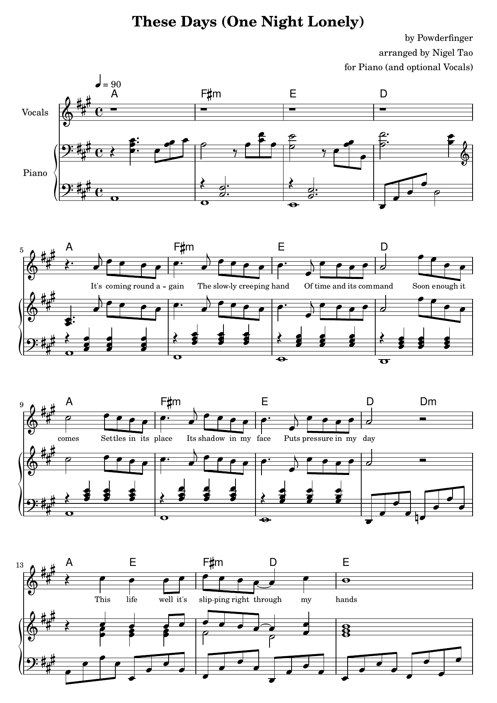

# These Days (One Night Lonely)

I haven't blogged much lately, since some medical drama has taken priority. But
the other day, I was listening to Australian rock band Powderfinger's *These
Days*, a song with the line "These days turned out nothing like I had planned".
(My 5 year old kid likes to mangle "These days" as "Tuesdays" when I make him
go to school.)

I listened to the song again, and again, and then felt like I had to learn how
to play that on piano and then, failing to find an arrangement that I liked,
got nerd-sniped into saying "fine, I'll do it myself".

Here's [*These Days (One Night Lonely)*](./these-days.pdf), arranged for Piano
(and optional Vocals), as a PDF. Page 1 (of 7) is previewed below, but if you
want to download the whole thing, take the PDF.

The original song came out in 1999 but [*One Night
Lonely*](https://en.wikipedia.org/wiki/One_Night_Lonely) was a one-off [YouTube
concert](https://www.youtube.com/playlist?list=OLAK5uy_k6kMTHj2OGupD1Elwpnwrm2uXysWnNQ8I)
that Powderfinger re-formed for in 2020, during COVID-19 lockdown, raising
money for [Beyond Blue](https://www.beyondblue.org.au/).

---

Published: 2025-05-27
