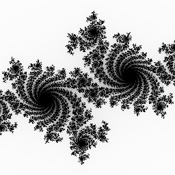

# Producing Uncompressed PNG Files

_Summary: `uncompng` is a small, single-file C library (or a Go port) for
producing uncompressed PNG files. Doing so can be simpler, easier and quicker
than producing a regular (well compressed) PNG file._


## Julia Set Example

Sometimes I'll have a program that produces a *temporary* 2-dimensional image
file (e.g. a PNG file). Temporary means something like:

- it will undergo further optimizing (such as running `pngcrush` on it) before
  e.g. checking it into source control, shipping it in an app binary, serving
  it (repeatedly) over the network, etc.
- it will undergo further processing, e.g. stitching multiple temporary images
  into a larger one.
- I just want to eyeball the thing and will probably delete it an hour later.

Producing a good quality PNG file - one that is compressed - requires some
moderately complex code and a moderate amount of CPU time (e.g. to calculate
the optimal Huffman codes). But if you're just producing a temporary file, you
don't always need to output a *good* PNG, just a *valid* one. It can be
simpler, easier and quicker to produce an uncompressed PNG file. You could
produce uncompressed BMP or PPM instead, but PNG is ubiquitous and widely
understood by many software tools.

[`uncompng.c`](https://github.com/google/wuffs/blob/1e2e58cea012ea4c7553f327b63fafe196b0f9e2/snippet/uncompng.c)
is a small (600-ish lines of code) single-file C library for producing
uncompressed PNG files. It has no dependencies, not even on `malloc`. There's
also an equivalent [`uncompng` Go
package](https://github.com/google/wuffs/blob/1e2e58cea012ea4c7553f327b63fafe196b0f9e2/lib/uncompng/uncompng.go),
which has more commentary (and its unit tests can easily use the `image/png`
decoder from Go's standard library).

_Update on 2026-07-05: Those links to C and Go code, above, are permalinks to
the 2025 versions. More recent versions, in the [Wuffs
repository](https://github.com/google/wuffs), have added features like allowing
16-bit PNG output._

For example, this tiny (50-ish line [`julia-gen.c`](./julia-gen.c) program)
produces an image of a Julia set.



```
#include <errno.h>
#include <unistd.h>

#define UNCOMPNG_CONFIG__STATIC_FUNCTIONS
#define UNCOMPNG_IMPLEMENTATION
#include "/the/path/to/uncompng.c"

#define CONFIG_CX -0.70000f
#define CONFIG_CY +0.27015f
#define CONFIG_IMAGE_WIDTH 256
#define CONFIG_IMAGE_HEIGHT 256

int my_write_func(void* context, const uint8_t* data_ptr, size_t data_len) {
  static const int stdout_fd = 1;
  return (write(stdout_fd, data_ptr, data_len) < 0) ? -errno : 0;
}

uint8_t my_pixel_func(float fx, float fy) {
  static const float escape_distance_squared = 100.0f;
  for (int i = 255; i > 0; i--) {
    float distance_squared = (fx * fx) + (fy * fy);
    if (distance_squared >= escape_distance_squared) {
      return i;
    }
    float gx = CONFIG_CX + (fx * fx) - (fy * fy);
    float gy = CONFIG_CY + (2 * fx * fy);
    fx = gx;
    fy = gy;
  }
  return 0;
}

int main(int argc, char** argv) {
  static const float w2 = CONFIG_IMAGE_WIDTH / 2;
  static const float h2 = CONFIG_IMAGE_HEIGHT / 2;
  static uint8_t pixels[CONFIG_IMAGE_HEIGHT][CONFIG_IMAGE_WIDTH];
  for (int iy = 0; iy < CONFIG_IMAGE_HEIGHT; iy++) {
    float fy = (iy - h2) / h2;
    for (int ix = 0; ix < CONFIG_IMAGE_WIDTH; ix++) {
      float fx = (ix - w2) / w2;
      pixels[iy][ix] = my_pixel_func(fx, fy);
    }
  }
  return uncompng__encode(&my_write_func, NULL, &pixels[0][0], sizeof(pixels),
                          CONFIG_IMAGE_WIDTH, CONFIG_IMAGE_HEIGHT,
                          CONFIG_IMAGE_WIDTH, UNCOMPNG__PIXEL_FORMAT__Y);
}
```

Run it like this:

```
gcc -O3         julia-gen.c -o julia-gen
./julia-gen   > julia-temp.png
pngcrush -brute julia-temp.png julia-final.png
```

This example's generated Julia Set image is grayscale (1 byte per pixel as an
array), although the library can also do RGBA (4 bytes per pixel). At 256 × 256
pixels, this is 65536 bytes of data. The actual `julia-temp.png` file size is
65877, which is a 0.5% overhead.

The pngcrush'ed `julia-final.png` file's size is 26155 bytes. In an amusing
coincidence, this roughly equals the sum of the C program (`julia-gen.c`) and C
library (`uncompng.c`): 1499 + 24830 = 26329 bytes.


## Uncompressed Chunks

Many compression formats (including the 2-dimensional PNG and the 1-dimensional
ZLIB) consist of a header, multiple chunks (chunks can also be called blocks or
frames or some other similar term) and a footer, all byte-aligned. In general,
a compressed chunks' length (in bytes) is hard to calculate a priori but, when
using the uncompressed subset of a compression format, each uncompressed chunk
is usually pretty trivial: a chunk-header, the literal (uncompressed)
chunk-payload and a (possibly empty) chunk-footer.

The chunk-header and chunk-footer lengths are usually predictable, so it's
pretty straightforward, when slicing and wrapping an arbitrarily large input
into uncompressed chunks, to select the input-slice lengths so that the
wrapped-slice lengths have a known upper bound. This lets us use fixed-sized
buffers and hence the C code doesn't depend on `malloc` and the Go code can
test that there are [no dynamic memory
allocations](https://github.com/google/wuffs/blob/1e2e58cea012ea4c7553f327b63fafe196b0f9e2/lib/uncompng/uncompng_test.go#L146)
(other than a re-usable `Encoder` struct that holds its own fixed-size buffer).

[`uncompng.go`](https://github.com/google/wuffs/blob/1e2e58cea012ea4c7553f327b63fafe196b0f9e2/lib/uncompng/uncompng.go)
has some commentary about the details of the PNG file format (for an
"uncompressed PNG" encoder): an IHDR chunk (containing width and height),
multiple IDAT chunks containing an "uncompressed ZLIB" encoding of the pixel
data (including a zero "filter byte" before each row; zero means a no-op) and
an IEND chunk. The rest of this blog post will walk through a simpler example,
of just producing "uncompressed" ZLIB.


## Uncompressed ZLIB

ZLIB (RFC 1950) just wraps DEFLATE (RFC 1951) with a header (almost always just
two bytes: `78 01`) and a 4-byte footer (an Adler-32 checksum).

A DEFLATE stream is just a series of blocks and an uncompressed block (wrapping
N bytes) is literally those N bytes (N can range up to 65535, inclusive) with a
5-byte block-header and 0-byte block-footer. Of those five bytes:

- The first one is either `0x00` or `0x01`, depending on whether this a
  non-final or final block. Byte values above `0x01` mean a compressed block,
  which is important if you're implementing the entirety of the DEFLATE file
  format but not part of the subset of DEFLATE that we are producing.
- The middle two are N as a little-endian `uint16`.
- The last two are the same as the middle two, xor'ed with `0xFF 0xFF`. These
  last two bytes are redundant but help detect data corruption.

For example, if N was 59 (which is 0x3B in hexadecimal) and the block wasn't
final, the five header bytes would be `00 3B 00 C4 FF`.

N can range up to 65535 but, to make the subsequent hex dump easier to follow
with the naked eye, we will always pick an N less than 64 so that each block
(plus ZLIB header and footer if applicable) is exactly 64 bytes long (although
the last one or two blocks can be shorter). We first insert placeholder bytes,
to be filled in later, to visualize this alignment. Starting with some *lorem
ipsum* nonsense as input data, here's the padded partition:

```
.......loremipsumdolorsitametconsecteturadipiscingelitseddoeiusm
.....odtemporincididuntutlaboreetdoloremagnaaliquautenimadminimv
.....eniamquisnostrudexercitationullamcolaborisnisiutaliquipexea
.....commodoconsequatduisauteiruredolorinreprehenderitinvoluptat
.....evelitessecillumdoloreeufugiatnullapariaturexcepteursintocc
.....aecatcupidatatnonproidentsuntinculpaquiofficiadeseruntmolli
.....tanimidestlaborum....
```

Here's a hex dump (16 bytes per row) of that ZLIB-encoded "loremipsum etc etc
laborum" text, after filling in those placeholders to produce a valid ZLIB
file. There's an additional annotation, on the right hand side, of the bytes
that aren't the literal, uncompressed text. Specifically: (A) the 2-byte ZLIB
header, (B) 5-byte DEFLATE block-headers and (C) the 4-byte ZLIB footer (an
Adler-32 checksum).

```
00000000  78 01 00 39 00 c6 ff 6c  6f 72 65 6d 69 70 73 75  |x..9...loremipsu|    AABBBBB---------
00000010  6d 64 6f 6c 6f 72 73 69  74 61 6d 65 74 63 6f 6e  |mdolorsitametcon|    ----------------
00000020  73 65 63 74 65 74 75 72  61 64 69 70 69 73 63 69  |secteturadipisci|    ----------------
00000030  6e 67 65 6c 69 74 73 65  64 64 6f 65 69 75 73 6d  |ngelitseddoeiusm|    ----------------
00000040  00 3b 00 c4 ff 6f 64 74  65 6d 70 6f 72 69 6e 63  |.;...odtemporinc|    BBBBB-----------
00000050  69 64 69 64 75 6e 74 75  74 6c 61 62 6f 72 65 65  |ididuntutlaboree|    ----------------
00000060  74 64 6f 6c 6f 72 65 6d  61 67 6e 61 61 6c 69 71  |tdoloremagnaaliq|    ----------------
00000070  75 61 75 74 65 6e 69 6d  61 64 6d 69 6e 69 6d 76  |uautenimadminimv|    ----------------
00000080  00 3b 00 c4 ff 65 6e 69  61 6d 71 75 69 73 6e 6f  |.;...eniamquisno|    BBBBB-----------
00000090  73 74 72 75 64 65 78 65  72 63 69 74 61 74 69 6f  |strudexercitatio|    ----------------
000000a0  6e 75 6c 6c 61 6d 63 6f  6c 61 62 6f 72 69 73 6e  |nullamcolaborisn|    ----------------
000000b0  69 73 69 75 74 61 6c 69  71 75 69 70 65 78 65 61  |isiutaliquipexea|    ----------------
000000c0  00 3b 00 c4 ff 63 6f 6d  6d 6f 64 6f 63 6f 6e 73  |.;...commodocons|    BBBBB-----------
000000d0  65 71 75 61 74 64 75 69  73 61 75 74 65 69 72 75  |equatduisauteiru|    ----------------
000000e0  72 65 64 6f 6c 6f 72 69  6e 72 65 70 72 65 68 65  |redolorinreprehe|    ----------------
000000f0  6e 64 65 72 69 74 69 6e  76 6f 6c 75 70 74 61 74  |nderitinvoluptat|    ----------------
00000100  00 3b 00 c4 ff 65 76 65  6c 69 74 65 73 73 65 63  |.;...evelitessec|    BBBBB-----------
00000110  69 6c 6c 75 6d 64 6f 6c  6f 72 65 65 75 66 75 67  |illumdoloreeufug|    ----------------
00000120  69 61 74 6e 75 6c 6c 61  70 61 72 69 61 74 75 72  |iatnullapariatur|    ----------------
00000130  65 78 63 65 70 74 65 75  72 73 69 6e 74 6f 63 63  |excepteursintocc|    ----------------
00000140  00 3b 00 c4 ff 61 65 63  61 74 63 75 70 69 64 61  |.;...aecatcupida|    BBBBB-----------
00000150  74 61 74 6e 6f 6e 70 72  6f 69 64 65 6e 74 73 75  |tatnonproidentsu|    ----------------
00000160  6e 74 69 6e 63 75 6c 70  61 71 75 69 6f 66 66 69  |ntinculpaquioffi|    ----------------
00000170  63 69 61 64 65 73 65 72  75 6e 74 6d 6f 6c 6c 69  |ciadeseruntmolli|    ----------------
00000180  01 11 00 ee ff 74 61 6e  69 6d 69 64 65 73 74 6c  |.....tanimidestl|    BBBBB-----------
00000190  61 62 6f 72 75 6d 7f 38  9b a1                    |aborum.8..|          ------CCCC
```

A [simple Go program](./uncomzlib.go) (runnable on [the Go
playground](https://go.dev/play/p/ttNgd2KXydZ)) demonstrates constructing that
ZLIB-formatted data and that ZLIB-decoding those 410 bytes recovers the
original text's 369 bytes.


---

Published: 2025-07-19
