# Handsum: An LQIP Image File Format

Low Quality Image Placeholders (LQIPs) are very small (both in terms of file
size and pixel dimensions) images that load very quickly, providing immediate
visual feedback while full-resolution images load slowly in the background.
They are small-in-file-size enough that it's feasible to base64-encode and
inline them into a web page, minimizing network round-trips and improving page
load times.

Existing LQIP techniques include the [Blurhash](https://blurha.sh/) and
[Thumbhash](https://evanw.github.io/thumbhash/) custom image file formats, as
well as just using low-quality JPEG or WebP and very small pixel dimensions.
This blog post introduces Handsum, another LQIP custom image file format.

Handsum files are also a fixed size-in-bytes: 48 bytes at the lowest quality
setting and 147 bytes at the highest. For a desktop, native or command-line
app, if you're storing your thumbnail images in a database, this lets you use
fixed-size columns, which can be [faster and simpler to iterate
over](https://www.joelonsoftware.com/2001/12/11/back-to-basics/).

Handsum is based on the Discrete Cosine Transform (DCT), also used by [the
Blurhash
algorithm](https://github.com/woltapp/blurhash/blob/master/Algorithm.md), [the
Thumbhash algorithm](https://evanw.github.io/thumbhash/#details) and JPEG
itself. Understanding how the relatively simple Handsum format works should
help you if you ever wanted to understand how the relatively complicated JPEG
format works ([the JPEG
specification](https://www.w3.org/Graphics/JPEG/itu-t81.pdf) is a 186-page PDF
file; Handsum is simpler).


## Web Page Example

Here's an annotated screenshot of a [Handsum web page
demo](./wasm-handsum-example/). It uses [a Handsum decoder written in
C](https://github.com/google/wuffs/blob/09b8cbb82f41638408ff66d024120a36b41c779e/snippet/basic-handsum-decode.c),
compiled to Wasm.

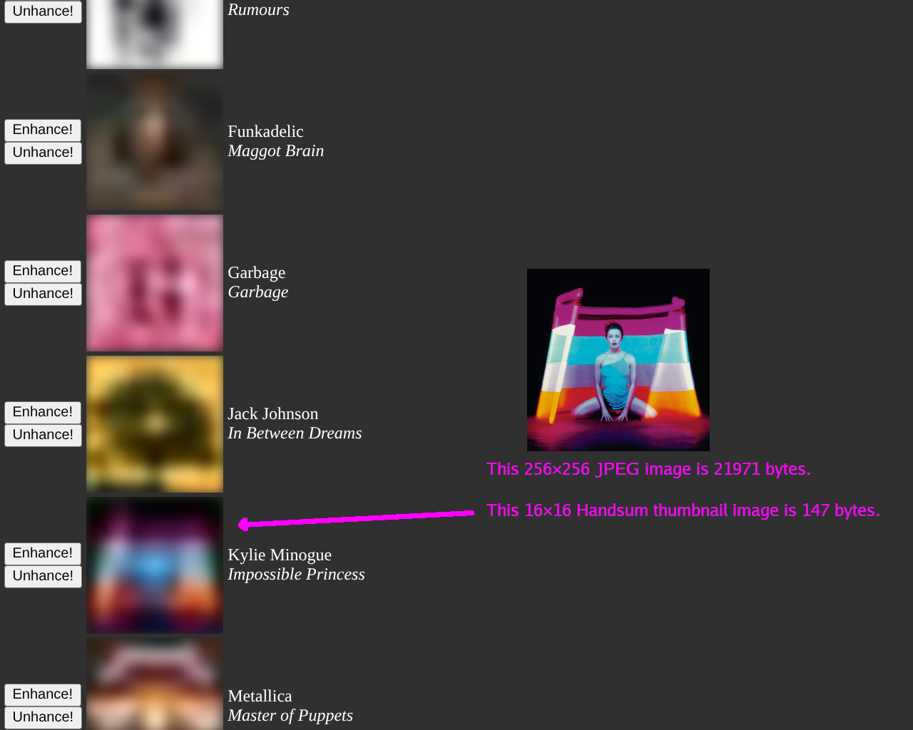


## Comparison

Here's Handsum compared to PNG, Thumbhash (which is pretty similar to
Blurhash), WebP, ETC2 and JPEG. You might want to open this image in its own
tab, zoom in and pan around.

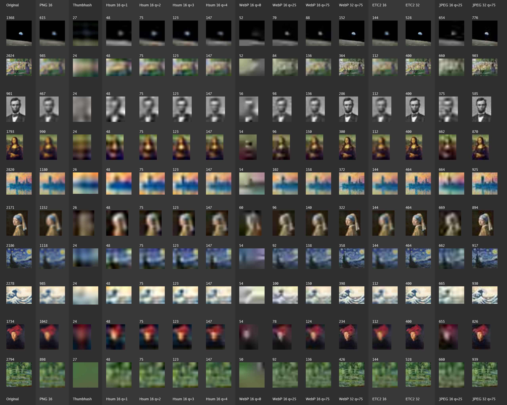

There's a lot going on here. Let's break it down.

Each row concerns a famous image, as seen on Wikipedia:
[earthrise](https://commons.wikimedia.org/wiki/File:NASA-Apollo8-Dec24-Earthrise.jpg),
[la-grande-jatte](https://commons.wikimedia.org/wiki/File:A_Sunday_on_La_Grande_Jatte,_Georges_Seurat,_1884.jpg),
[lincoln](https://commons.wikimedia.org/wiki/File:Abraham_Lincoln_1863_Portrait_%283x4_cropped%29.jpg),
[mona-lisa](https://commons.wikimedia.org/wiki/File:Mona_Lisa,_by_Leonardo_da_Vinci,_from_C2RMF_retouched.jpg),
[parliament](https://commons.wikimedia.org/wiki/File:Claude_Monet_-_The_Houses_of_Parliament,_Sunset.jpg),
[pearl-earring](https://commons.wikimedia.org/wiki/File:1665_Girl_with_a_Pearl_Earring.jpg),
[starry-night](https://commons.wikimedia.org/wiki/File:Van_Gogh_-_Starry_Night_-_Google_Art_Project.jpg),
[tsunami](https://commons.wikimedia.org/wiki/File:Tsunami_by_hokusai_19th_century.jpg),
[van-eyck](https://commons.wikimedia.org/wiki/File:Portrait_of_a_Man_by_Jan_van_Eyck.jpg),
[water-lillies](https://commons.wikimedia.org/wiki/File:Water-Lilies-and-Japanese-Bridge-%281897-1899%29-Monet.jpg).

The first column, "Original", is the image itself, scaled to fit inside a 32×32
pixel bounding box (while preserving the aspect ratio). For example, the
500×745 pixel _Mona Lisa_ image is resized to 21×32.

Every other column is that original image after round tripping: encoding in
some lossy fashion, then decoding.

The numbers (like 1368 or 615) above each cell is the encoded size-in-bytes.
More bytes are clearly correlated with more quality. The question is how small
(in terms of size-in-bytes) can you get while keeping acceptable quality.

The second column, "PNG 16", simply scales the image down to fit inside a 16×16
pixel bounding box, encoding it losslessly as a PNG. (Yeah, we could possibly
get a slightly smaller size-in-bytes if we `pngcrush`ed it, or used WebP
lossless, but it's probably not that big a difference). Decoding produces a
within-16×16 image (e.g. a 11×16 _Mona Lisa_) which we then upsample (with a
bi-linear filter) back to 32 pixels wide or high.

The third column uses the [Thumbhash](https://evanw.github.io/thumbhash/) LQIP
codec. This produces extremely small encodings, weighing only 24–27 bytes.

The next four columns use Handsum, at each of its four quality settings. The
"16" in "Hsum 16 q=1" means that, like "PNG 16", the codec per se produces
something that fits inside a 16×16 bounding box, so we upsample to 32 to get an
image that's better compared with the other cells.

The four columns after that use WebP lossy, based on VP8, at quality 0, 25
and 75. The "WebP 16" columns encode (and thus decode) within-16×16 (and,
again, we upsample). The "WebP 32" column encodes within-32×32 image (and no
upsampling is needed on decode).

The next two columns use ETC2 (wrapped in a PKM / PACKMAN container), the
Ericsson Texture Compression format, mandatory in [OpenGL ES
3.0](https://registry.khronos.org/OpenGL/specs/es/3.0/es_spec_3.0.pdf)
(Appendix C.1 of the linked spec) and similar to other texture formats like BCn
/ DXTn / S3TC. ETC2 is designed to be decoded on GPUs (with high
parallelization), but you can decode on CPUs too, like any other image format.
ETC2 is an interesting and under-appreciated image format, but diving into that
is out of scope of this blog post. Again, "16" means encoding the
lower-resolution source image and upsampling after decode, "32" means encoding
the higher-resolution source image.

The last two columns are JPEG, at quality 75 (which is roughly comparable to,
but not exactly the same as, WebP's "quality = 75"). Again, "16" vs "32" means
lower-res-and-upsample vs higher-res.

At Handsum's q=1 (lowest quality), it's roughly comparable to a bigger (higher
file size), better (better visual quality) Thumbhash. Bigger is in relative
terms. The absolute difference is barely 24 bytes. By "better visual quality" I
mean that, if you told me to guess the famous image based on the thumbnail,
then for _Mona Lisa_ or _Girl with a Pearl Earring_, I'd say that that's
plausible for Handsum (q=1) but implausible for Thumbhash. Still better than
the modern potato art that WebP 16 q=0 produces, though.

At Handsum's q=4 (highest quality), it's roughly comparable to WebP Lossy (VP8)
and ETC2, for a given size-in-bytes budget. One difference, though, is that at
a given quality setting (and at c=3, see below), every Handsum image file is
the same size-in-bytes: q=1 files are always 48 bytes, q=2 files are 75, q=3
files are 123 and q=4 files are 147.

If you wanted to make an embedded app for displaying a catalog of artworks (oil
paintings, audio records, etc.), you could budget 256 bytes per catalog entry,
for example. After assigning 50 bytes each to the artist name and the artwork
name (ellipsizing if necessary) and a few more bytes to other metadata (time
stamp, track length, etc.), that could leave you 150 bytes for the thumbnail.
If you were using WebP for encoding the 16×16 thumbnails, q=75 will fit at or
under 150 bytes most of the time, but not all of the time. WebP encoders also
typically have a quality setting but not a byte-budget setting, so generating a
small-enough (in terms of size-in-bytes) WebP takes a little dance. In
contrast, with Handsum q=4, you'll get 147 bytes every time, guaranteed.


## How Handsum Works

Handsum has three color settings (c=1 means Gray, c=3 means RGB or,
equivalently, YCbCr and c=4 adds an alpha channel). This blog post only
discusses c=3. The reference implementation's code comments has more details on
c=1 and c=4.

This blog post also focuses mostly on the q=4 (highest) quality setting, as it
has the simplest DCT implementation.

For any source image, such as a 500×745 pixel _Mona Lisa_, the encoding
algorithm reduces it to 144 bytes of pixel data (at q=4). This becomes 147
after prepending a a 3-byte header: a 15-bit magic signature, a 2-bit color, a
2-bit quality and a 5-bit aspect ratio.

Handsum encoding can be decomposed into a sequence of stages. Decoding is
simply reversing the stages in the opposite order, plus a post-processing "Loop
Filter" stage (see below). When decoding gets to Stage 0 (Resize), it's not a
full reversal. The decoded image's longest dimension (width or height) is 16
pixels and the 5-bit aspect ratio (in the header) gives the shorter dimension.
Handsum is not a general purpose image format, only a thumbnail image format.

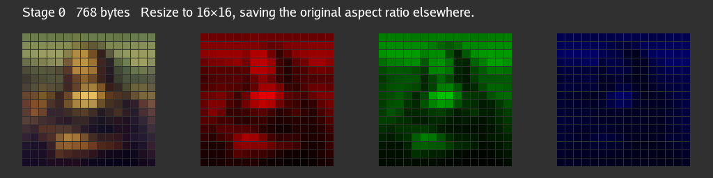


### Stage 0: Resize


Resizing to 16×16, at 3 bytes RGB (Red, Green, Blue) per pixel, starts us off
at 768 bytes of data. Encoding's later stages operate on this 16×16 workspace
regardless of the original source image's aspect ratio.


### Stage 1: YCbCr Conversion

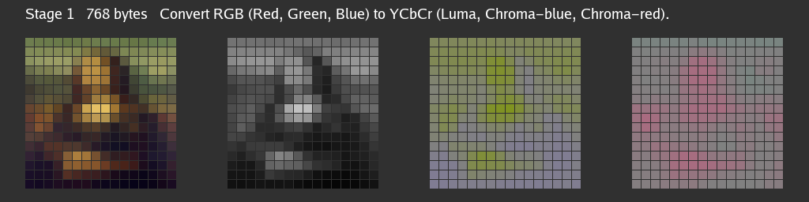

Converting from RGB to YCbCr uses the same formulae as JPEG / BT.601:

```
Y  = (+0.2990 * R) + (+0.5870 * G) + (+0.1140 * B)
Cb = (-0.1687 * R) + (-0.3313 * G) + (+0.5000 * B)
Cr = (+0.5000 * R) + (-0.4187 * G) + (-0.0813 * B)
```

This transformation from 3 bytes RGB per pixel to 3 bytes YCbCr per pixel is
lossless (and perfectly reversible) in infinite-precision real numbers, and
only slightly lossy in finite-precision computer numbers.

A (theoretically) lossless transformation doesn't save any bytes per se, as
we're still at 3×16×16 = 768. Linear algebra enthusiasts would recognize this
as a (lossless) change of basis. But this sets us up for later stages to better
compress the 16×16 image.

Compression means bringing that 768 number down. But, for a fixed-size-in-bytes
output (768 / 144 is a 5.333× compression ratio), lowering that number
necessitates discarding (or losing, in the "lossy compression" sense)
information. Switching to YCbCr gives us better opportunities to discard
information that people mostly don't notice.


### Stage 2: Chroma Downsampling

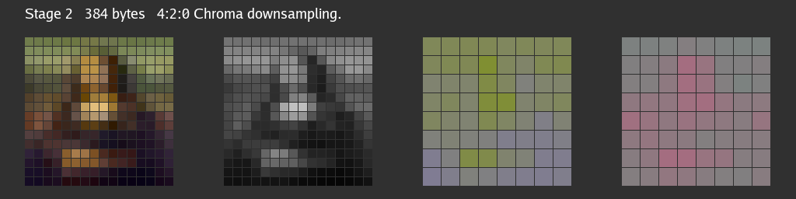

Human vision is more sensitive to luma and less sensitive to chroma, so we can
be more aggressive in discarding chroma channel information (to achieve better
compression ratios). This stage simply drops 75% of the two chroma channels'
data (which is 50% of the overall 768), downsampling Cb and Cr from 16×16 to
8×8. We're now at (16×16 + 8×8 + 8×8) = 384 total bytes, a 50% saving.

This is the classic [4:2:0 chroma
subsampling](https://en.wikipedia.org/wiki/Chroma_subsampling), as used by WebP
images and is also very popular for JPEG images. For those who already know how
JPEG works, Handsum's 16×16 pixel workspace is essentially one JPEG 4:2:0 MCU
(Minimum Coded Unit).


### Stage 3: DCT

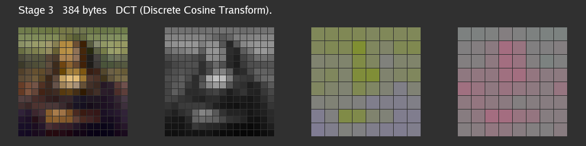

We slice up our 16×16 luma and 8×8 chroma grids into 2×2 blocks, 4 samples per
block, and apply the Discrete Cosine Transform to each block independently.
This transforms 4 samples to 4 samples, per block. Like Stage 1, this is just a
change of basis. Like Stage 1, this doesn't lower the byte count per se (and
would be a lossless transform, with infinite-precision real numbers), but
again, it unlocks later opportunities.

Handsum q=4 uses 2×2 blocks (and so 4 coefficients per block). Lower Handsum
quality settings use 4×4 or 8×8 blocks (and JPEG's DCT also uses 8×8). DCT is
applicable to any of those block sizes, but the DCT formulae are simplest for
2×2 and we'll go into more detail about that further below.


### Stage 4: Quantization

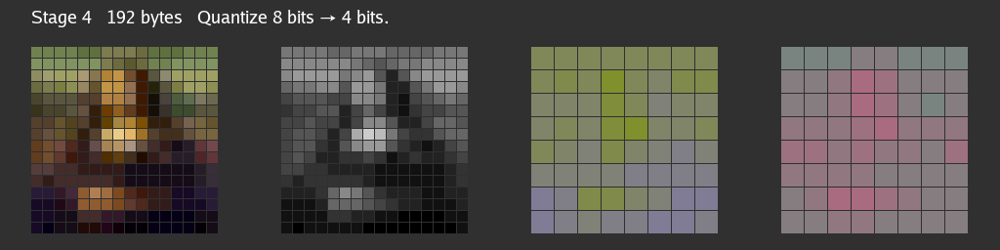

We started off using 8 bits (the half-open range `0 .. 256`) per RGB sample.
Quantization from 8 to 4 bits (the half-open range `0 .. 15`) is conceptually
as simple as doing `value >>= 4` on the encode side and `value *= 0x11` on the
decode side.

In practice, Handsum's quantization is a little more complicated:

- DC and AC components (see below) are de-quantized slightly differently. For
  samples in a `0 .. 256` range, we multiply DC by 0x11 so that we can hit pure
  black (0x00) and pure white (0xFF). For AC, we multiply only by 0x10, because
  we want to able to reproduce the half-way point (0x80 = 128) exactly. If all
  of the pre-DCT samples are equal then all of the AC components will be
  half-way and there are noticable artifacts if we cannot reproduce flat
  samples on decode. The concious trade-off is that we can't reproduce
  extremely high AC values.
- Similarly, but slightly differently, we bias Chroma (but not Luma) values
  positively on encode and negatively on decode so that, when encoding a
  grayscale image, the neutral chroma samples, after biasing, have a DC value
  (0x88 not 0x80) that is exactly round-trippable through quantization.
- Chroma values are also scaled, not just biased. Per my previous blog post on
  [Visualizing Y′CbCr Chroma Space](./visualizing-ycbcr.md), the majority of
  Chroma values in practice lie in `64 .. 192` instead of `0 .. 256`. Scaling
  means that our 4-bit values can capture more of the detail, trading off being
  able to distinguish the extremes.
- Those bullets above wave away the fact that, after a 2×2 DCT, the
  coefficients are 9-bit values (ranging in `0 .. 512` or `-256 .. +256`)
  instead of 8-bit values (ranging in `0 .. 256`). See the formulae below.
- Handsum's reference encoder (which uses _an_ encoding algorithm, not _the_
  encoding algorithm) actually uses smaller AC component "bucket widths" when
  encoding, compared to what the decoder uses, to compensate somewhat for Loop
  Filter regression to the mean (see below).

JPEG also quantizes its post-DCT coefficients, but JPEG's quantization factors
are configurable. When you pass a `-quality 25` or `-quality 90` setting to
libjpeg, what you're actually doing is adjusting the quantization factors (and
those factors are written into the JPEG file). Bigger quantization factors
discard more information but they also lead to smaller post-quantization
numbers, and longer runs of zero-valued numbers, which compress better.

Handsum's quality setting is different. Handsum's quantization factors are
hard-coded and, by design, its output is a fixed size-in-bytes, so it does not
use some of JPEG's entropy-compression techniques, like Run-Length Encoding or
Huffman Coding. Anyway, dropping half of the bits (the least significant half)
here gives us another 50% saving, going from 384 to 192 bytes.


### Stage 5: High-Frequency Elimination

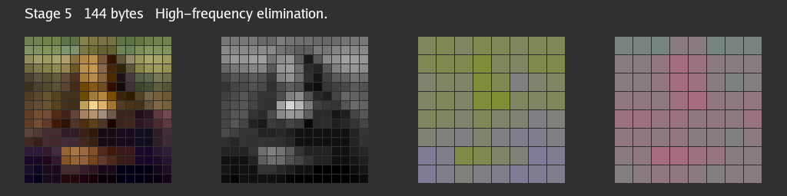

The final stage takes the 4 post-DCT coefficients in each 2×2 block and simply
drops one of them for another 25% saving, going from 192 to 144 bytes.

For Handsum q=3, we'd drop 6 out of 16 4×4 coefficients (38%). For q=2, 10 out
of 16 4×4 coefficients (63%). For q=1 (lowest quality), 49 out of 64 8×8
coefficients (77%). In all cases, Handsum retains low-frequency components and
discards high-frequency components. Those familiar with JPEG's "zig-zag
coefficient ordering" might find the prioritization familiar.

The point of doing the DCT earlier is that, for q=4, this fourth coefficient
controls a high-frequency "checkerboard" pattern (per 2×2 block) that is
usually not that noticable. In case you missed it (comparing the Stage 4 and
Stage 5 images), here's where to spot the difference.

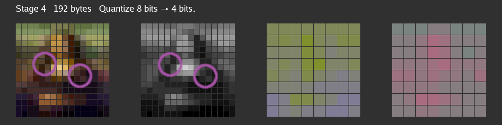

In contrast, if we didn't do the DCT stage, which transforms from the _(x, y)_
spatial domain to the _(u, v)_ frequency domain, and dropped one out of every
four pre-DCT (not post-DCT) samples, the visual impact would be very obvious
(and bad).

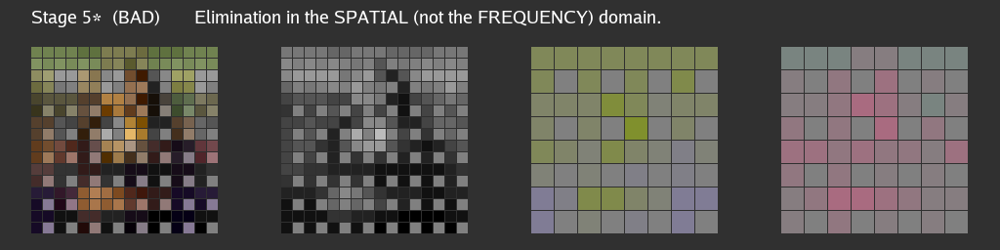


## Discrete Cosine Transform

DCT is the trickiest concept of the Handsum codec. It is a change of basis,
which means transforming some values (in our case, 4 values), as measured along
some axes, into the same number of different values along different axes. For
example, in an 2-D strategy game with hexagonal tiles, you could transform
coordinates from the classic _(x, y)_ axes, 90 degress apart, to more
counting-hexes-friendly coordinates whose axes are 120 degrees apart. Both
coordinate pairs represent the same tile but use different numbers.

For 2×2 DCT, the axes being measured are more abstract. The
[DCT](https://en.wikipedia.org/wiki/JPEG#Discrete_cosine_transform) section of
Wikipedia's JPEG page gives this daunting formula for the 8×8 DCT, which
transforms _gxy_ values in the spatial domain to _Guv_ values in the frequency
domain (whose _u_ and _v_ axes Wikipedia correctly but confusingly calls the
horizontal and vertical spatial frequency).

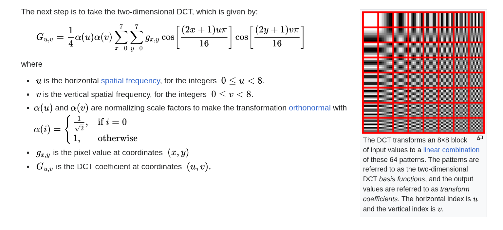

Let's keep that weird-looking red-bordered table to the side for now. We'll get
back to it later.

"The spatial domain" just means that our four input values, which we can label
_g00_, _g01_, _g10_ and _g11_, correspond to the top-left, top-right,
bottom-left and bottom-right samples in our 2×2 block.

Going from _gxy_ to _Guv_ is the Forward DCT (the FDCT), used on encoding.
Other encoding stages can be lossy, so on decode, we start with _Fuv_ values
that approximate _Guv_, and further down on the same Wikipedia page is an
equally daunting formula for the Inverse DCT (the IDCT), used on decoding, to
recover the _fxy_ values that approximate the original image's _gxy_ values.

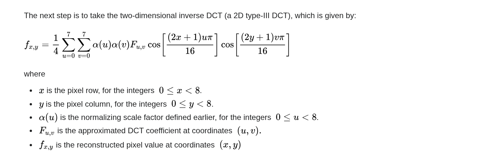

The cosine expressions in the two formulae are the same, but the FDCT loops
over _x_ and _y_ (for a given _u_ and _v_) and the IDCT loops over _u_ and _v_
(for a given _x_ and _y_).


### 2×2 Discrete Cosine Transform

For a 2×2 DCT, _x_, _y_, _u_ and _v_ are all either 0 or 1. Furthermore,
`cos(0)` equals 1 and the other cosine terms are all (±1/√2). The FDCT formulae
simplify dramatically.

```
G00 = (+g00 + g01 + g10 + g11) / 2
G01 = (+g00 - g01 + g10 - g11) / 2
G10 = (+g00 + g01 - g10 - g11) / 2
G11 = (+g00 - g01 - g10 + g11) / 2
```

In the _gxy_ (or _fxy_) spatial domain, it's easy to picture 00, 01, 10, 11 as
top-vs-bottom and left-vs-right. In the _Guv_ (or _Fuv_) frequency domain, it's
less obvious how to think of these 00, 01, 10, 11 subscripts.

One thing to note is that _G00_ is simply the average (scaled by two) of the
four pre-DCT values. If you had to pick only one value that could summarize all
four inputs, _G00_ is pretty good. _G00_ is also known as the DC (Direct
Current) DCT component and all other _Guv_ values are AC (Alternating Current)
components. As for how to visualize the AC components, let's first also
simplify the IDCT formulae:

```
f00 = (+F00 + F01 + F10 + F11) / 2
f01 = (+F00 - F01 + F10 - F11) / 2
f10 = (+F00 + F01 - F10 - F11) / 2
f11 = (+F00 - F01 - F10 + F11) / 2
```

In a beautiful symmetry, the IDCT formulae are exactly the same as the FDCT
formulae (with different variable names). This coincidence is special to the
2×2 DCT and is not true in general, for the 4×4 DCT, 8×8 DCT or other block
sizes.

But also, it's now apparent that the larger that the _F01_ AC component is, the
larger _f00_ and _f10_ are (which are the two left-most samples of the block)
and the smaller _f01_ and _f11_ are (the two right-most samples of the block).
_F01_ is like a "horizontal gradient" controller. Similar, _F10_ is a "vertical
gradient" and _F11_ is a "checkerboard pattern" (exactly like what's
highlighted in the Stage 5 discussion, above).

You could imagine an "audio mixer" with "faders" for the _F00_, _F01_, _F10_
and _F11_ inputs, where moving these _Fuv_ sliders around affects the _fxy_
sample output.

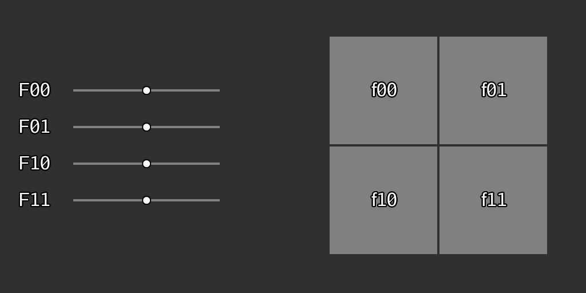

Each _Fuv_ component has a 2×2 impulse response function, which is how the
_fxy_ samples react to a _Fuv_ change (an impulse). That 2×2 grid is a basis
function, and you can plot a 2×2 grid of these basis functions:


For 2×2, this visualization is pretty trivial, but for the 8×8 DCT used by
JPEG, this is the red-bordered table on the previously-mentioned [JPEG/DCT
Wikipedia page](https://en.wikipedia.org/wiki/JPEG#Discrete_cosine_transform),
with "low frequency" components (basis functions) in the top-left-in-u-v-space
of the visualization and "high frequency" components in the other corner.

Alex Dowad has [an interactive 8×8
DCT](https://alexdowad.github.io/visualizing-the-idct/) page, where you can
toggle on and off individual _Fuv_ components and see how it impacts the
reconstructed _fxy_ values.

You could make the same red-bordered visualization of basis-functions for 4×4
or 16×16 DCT, as Ekrem Fidan did in his [DCT and DFT for 1D and 2D
Signals](https://ekrem-7-fidan.medium.com/dct-and-dft-for-1d-and-2d-signals-discrete-cosine-transform-and-discrete-fourier-transform-59feb837441d)
blog post.

Coming back to Handsum, the 2×2 DCT transforms four values (top-left,
top-right, bottom-left, bottom-right) into four different but equivalent values
(average, horizontal, vertical, checkerboard). While people would definitely
notice missing bottom-right pixels, they don't notice missing checkerboard
overlays as much.


## Loop Filter

One consequence of cutting a larger image into smaller blocks and encoding each
block independently, more or less, is that the block seams are often visible on
decode. Low quality JPEGs often show their 8×8 block boundaries, and similarly
for ETC2 and its 4×4 block boundaries, magnified and highlighted below:

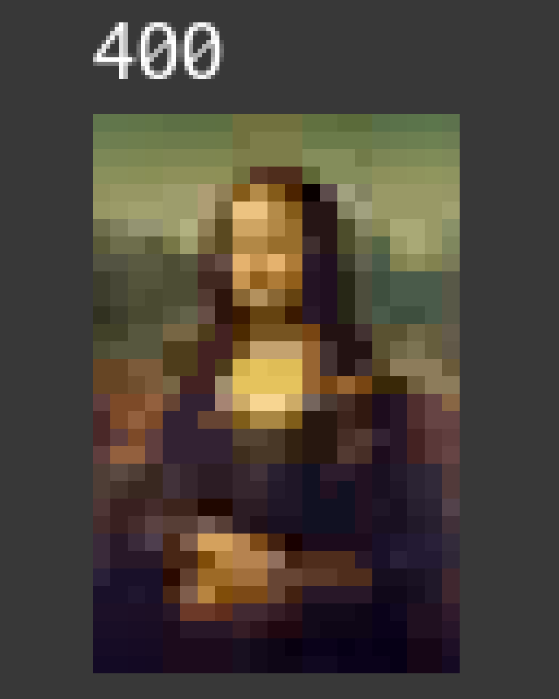

WebP also cuts into blocks, but mitigates these visual seams by a
post-processing step, after decoding reverses every encoding stage, that blurs
the pixels that are adjacent to block boundaries. WebP calls this the [VP8 Loop
Filter](https://www.rfc-editor.org/rfc/rfc6386.html#section-15). Handsum does
something similar but unconditional, where WebP's filters are thresholded. For
Handsum q=4's 2×2 blocks, every pixel (that's not on an edge) is on a block
boundary.

For a simplified example, suppose we have a 1-dimensional row of 8
reconstructed samples, the inner 6 of which are adjacent to a ":" block
boundary. The 1-dimensional loop filter blurs across the boundaries using a 3:1
ratio (and Handsum's 2-dimensional loop filter uses 9:3:3:1).

```
Before:   a    b    :  c       d    :  e       f    :  g      h
After:    a   ¾b+¼c : ¾c+¼b   ¾d+¼e : ¾e+¼d   ¾f+¼g : ¾g+¼f   h
```

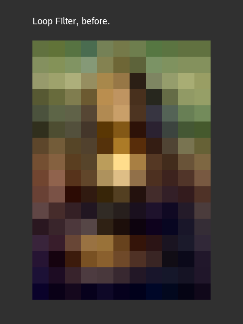

A 3:1 (or 9:3:3:1) filter [regresses to the
mean](../2024/jpeg-chroma-upsampling.md#box-vs-triangle-filtering). The
post-processed samples are smoother but also milder. The colors aren't as
vibrant after filtering, but we can compensate somewhat for this, by using
artificially small quantization "bucket widths" on the encoder side, which by
itself would exaggerate any color contrast and so restores some of the vibrancy
lost to the Loop Filter.


## Handsum Implementations

The reference implementation is the
[`github.com/google/wuffs/lib/handsum`](https://pkg.go.dev/github.com/google/wuffs/lib/handsum)
Go library, which encodes and decodes all c= and q= settings.

The [`handsum`](https://github.com/google/wuffs/tree/main/cmd/handsum) command
line tool, which you run like
`handsum -encode foobar.png > foobar.c3q4.handsum`, uses that reference
implementation.

The [Wuffs standard library](https://github.com/google/wuffs), available as
memory-safe transpiled-to-C code, can decode all c= and q= settings.

The simpler
[basic-handsum-decode](https://github.com/google/wuffs/blob/09b8cbb82f41638408ff66d024120a36b41c779e/snippet/basic-handsum-decode.c)
C library only decodes the c=3, q=4 variant, abbreviated as c3q4. This powers
the Wasm demo linked at the top.


## Studying JPEG

Handsum is a very simplified subset of JPEG (plus a Loop Filter). If you're
curious to learn more about how JPEG (the most popular image format on the web)
actually works, this [Further
Reading](https://github.com/google/wuffs/blob/main/std/jpeg/README.md#further-reading)
section has enough links to keep you occupied.


## Web Server

One final bit of fun: you can run [a web server](./handsum-web-server.go) (or a
FUSE server) that generates favicon-sized PNG images on demand, entirely
defined by the Handsum q=1 data encoded in the URL Path.

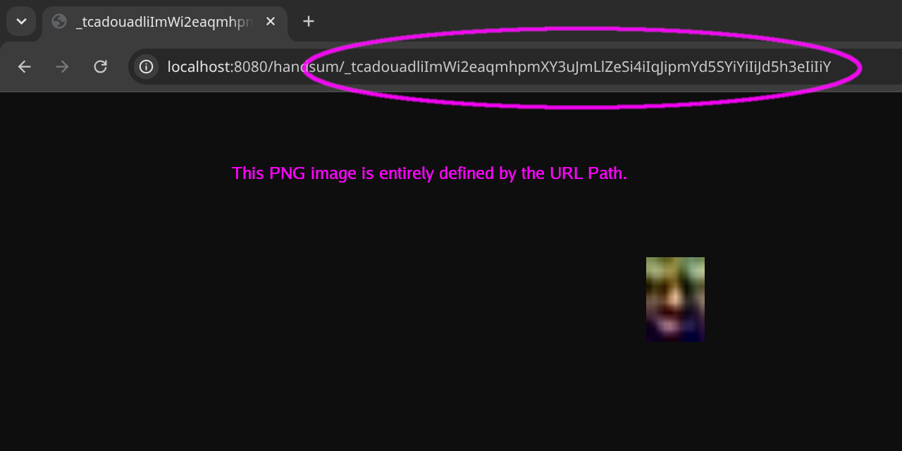


## Conclusion

If you're already using Blurhash, Thumbhash, ETC2 or WebP and it works for you,
that's great. Handsum isn't vastly superior to any of those, just another
alternative in the toolbox of LQIP file formats. Better quality than Blurhash
and Thumbhash, at bigger (and fixed) file sizes. They're all DCT-based and the
"Handsum" name is a pun on "a bigger Thumbhash" and, of course, it rhymes with
"handsome".


---

Published: 2026-07-08
