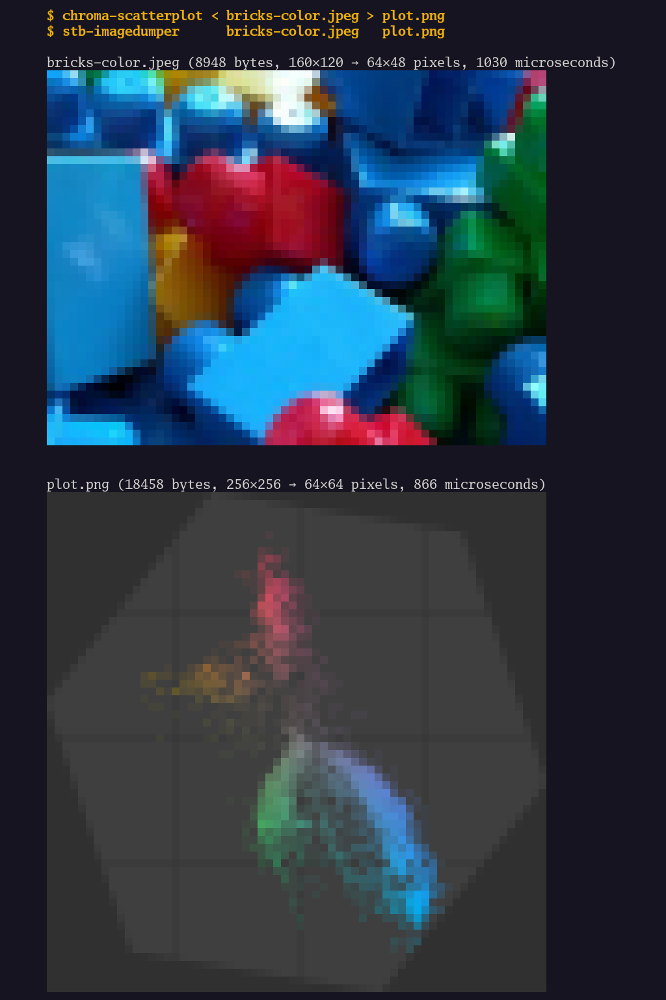
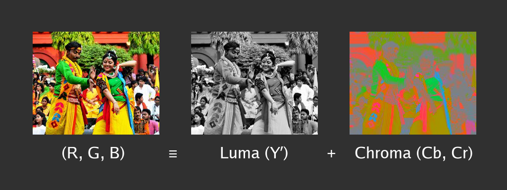
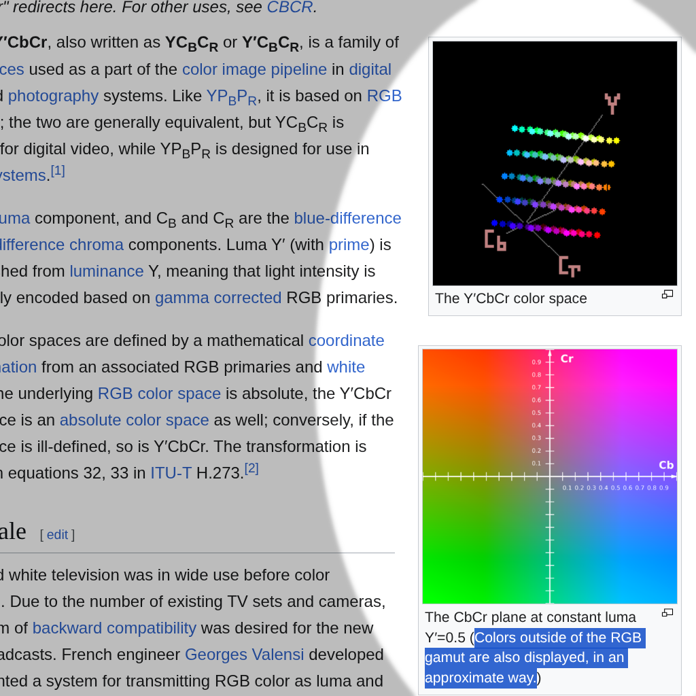
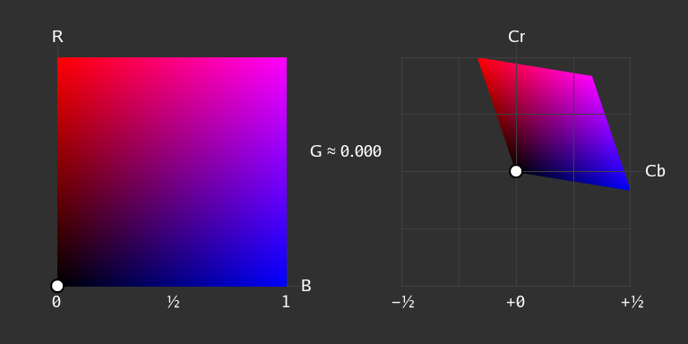
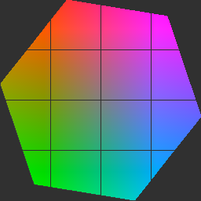
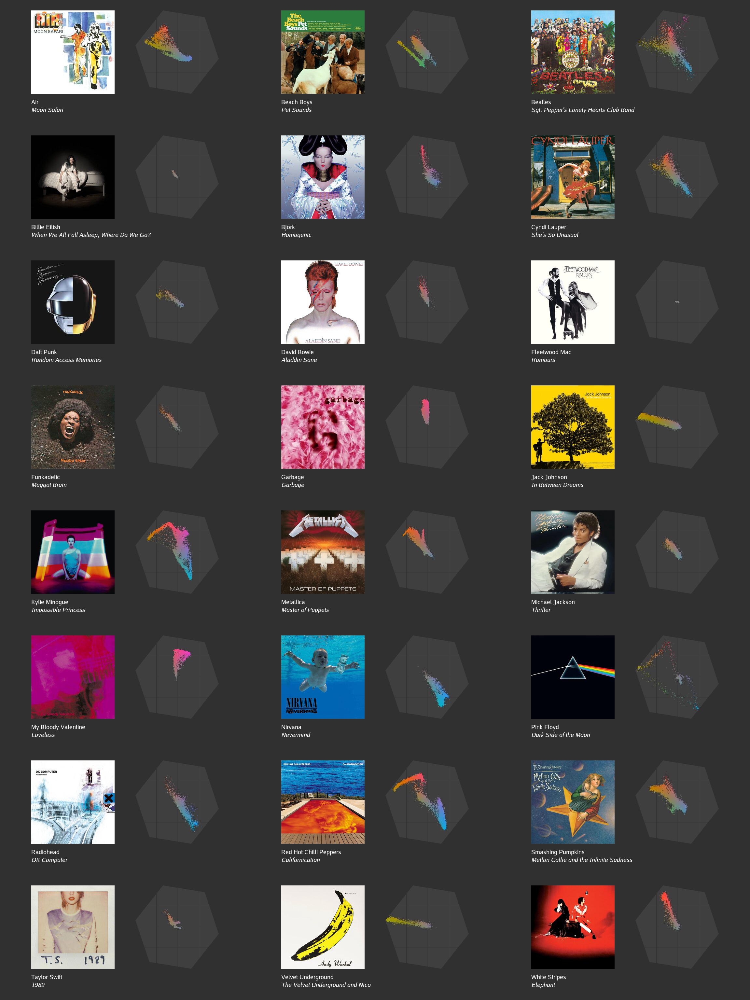
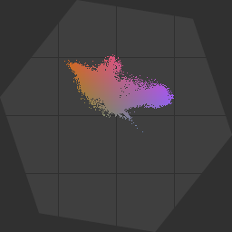

# Visualizing Y′CbCr Chroma Space

_Summary: [`chroma-scatterplot`](./chroma-scatterplot.go) is a small Go program
for visualizing the (Cb, Cr) chroma values used by a JPEG or PNG image._




## Y′CbCr Color Space

Many programmers and UI designers are familiar with RGB triples (three numbers,
each number is two hexadecimal digits) to describe colors, such as [#4169E1 for
"royalblue" or #DB7093 for
"palevioletred"](https://developer.mozilla.org/en-US/docs/Web/CSS/Reference/Values/named-color).

JPEG is the most popular image file format on the web and a key step in how it
works (and achieves pretty good compression, for a 1990s image codec) is
transforming from RGB (Red, Green, Blue) to Y′CbCr (Luma, ChromaBlue,
ChromaRed). Both color spaces are 3-dimensional and equally expressive (and for
linear algebra enthusiasts, it's just a change of basis). But human vision is
more sensitive to luma and less sensitive to chroma, so JPEG (which is a lossy
image codec) can be more aggressive in discarding chroma channel information
(to achieve better compression ratios).

Here's the "Luma plus Chroma" breakdown of a delightful (and colorful!)
[Basantotsav.jpg](https://en.wikipedia.org/wiki/File:Basantotsav.jpg) photo,
CC BY-SA licensed, by Tushar Baran Sinha, which I found on Wikipedia's
[Holi](https://en.wikipedia.org/wiki/Holi) page. Holi is a major Hindu festival
of colors, love, and spring.



*([CC BY-SA](https://creativecommons.org/licenses/by-sa/4.0/deed.en), original
photo by Tushar Baran Sinha, modifications by Nigel Tao.)*

Seeing the Chroma half of the breakdown is all well and good, but I didn't yet
have a good sense of what the Cb and Cr axes look like, on their own. How
"blue" is "Chroma blue"?

Wikipedia's [YCbCr](https://en.wikipedia.org/wiki/YCbCr) page starts with a
3-dimensional animated visualization of the Y′CbCr color space. It's
technically correct (the best sort of correct!) but I didn't find it very
helpful.



There's also a 2-dimensional image of a CbCr plane, with the caveat that
"Colors outside of the RGB gamut are also displayed, in an approximate way".
What is the RGB gamut (in CbCr space)? What parts of that CbCr plane can (in
theory) and do (in practice) RGB images occupy? How "blue" is Cb? Let's find
out!


## BT.601 Formulae

JFIF is an extension to the JPEG file format. Amongst other things, [JFIF
specifies](https://www.w3.org/Graphics/JPEG/jfif3.pdf) the exact formulae
(ignoring fixed-precision rounding errors) for translating between RGB and
Y′CbCr, based on CCIR Recommendation 601, which is also known as [Rec.
601](https://en.wikipedia.org/wiki/Rec._601) or BT.601:

```
Y  = (+0.2990 * R) + (+0.5870 * G) + (+0.1140 * B)
Cb = (-0.1687 * R) + (-0.3313 * G) + (+0.5000 * B) + Bias
Cr = (+0.5000 * R) + (-0.4187 * G) + (-0.0813 * B) + Bias
```

The Chroma's Bias depends on what scale your samples are using. Coming from
RGB, samples usually range in [0, 255] and so the Bias is 128. But for this
blog post, it's simplest if we use the range [0.0, 1.0] for RGB, and for Y, but
the range [-½, +½] for Chroma, so the Bias is zero.

That Wikipedia CbCr plane image uses the range [-1, +1], which is obviously
[-½, +½] doubled. This would require similar doubling of some of the transform
matrix's values.

The "BT" in
["BT.601"](https://www.itu.int/dms_pubrec/itu-r/rec/bt/R-REC-BT.601-7-201103-I!!PDF-E.pdf)
stands for "Broadcasting service (television)". Technically, I think there's a
difference between Y (luminance) and Y′ (luma), between YUV and Y′CbCr and
between analogue and digital color systems. But we're going to hand-wave that
away for this blog post. We start with an (R, G, B) triple and end up with a
(Y′, Cb, Cr) triple and, at the end, this blog post only cares about (Cb, Cr).

JFIF is an optional extension to JPEG. There are valid JPEG files that do not
self-identify as JFIF. If so, software libraries like libjpeg-turbo simply
apply the JFIF YCbCr formulae anyway, unless the JPEG file explicitly opts in
to other, rarer color spaces like CMYK. In practice, "JPEG" almost always means
"just use the BT.601 formulae", as opposed to other RGB ↔ Y′CbCr formulae like
BT.709. The programs in this blog post just use BT.601.


## RGB Gamut in CbCr Space

If R, G and B all range in [0, 1] then staring at the BT.601 formulae confirms
that Cb and Cr range in [-½, +½]. But is it possible for both Cb and Cr to be
+½ *at the same time* (starting from an in-range RGB triple)? The answer is no!

Instead of visualizing the whole RGB cube (and how it maps to CbCr space) at
once, we'll animate it. At any given time, the animation frame shows the whole
Red-Blue range *for a constant value of Green*. The Red-Blue plane (which is a
square in RB space) maps to a parallelogram in CbCr space. As we animate
Green-ness over time, that parallelogram sweeps out the range of possible (Cb,
Cr) values.



We'll also mark (with a filled circle) the gray color (for a given Green value)
where R=G=B. It animates along the R=B diagonal in RB space, but it stays still
at (0, 0) in CbCr space.

Combining all of the parallelograms in CbCr space gives this static image below
(with grid lines overlaid at ¼ unit intervals) that answers the earlier "What
is the RGB gamut (in CbCr space)?" rhetorical question.



Not only is (+½, +½) infeasible, but even (+½, 0) is outside the gamut. Per the
formulae above, pure blue (#0000FF) maps to (+0.5000, -0.0813), which is 9.235°
clockwise of the horizontal (Cb) axis. Pure blue is correlated with but not
exactly the same as pure ChromaBlue. Similarly, pure red (#FF0000) maps to
(-0.1687, +0.5000), which is 18.644° anti-clockwise of the vertical (Cr) axis.

(At this point, linear algebra enthusiasts would point out that, *of course*,
pure blue and pure red aren't the same as Cb and Cr, otherwise there's no
combination of Cb and Cr that could discriminate "lots of green" from "not much
green". It's right there in the equations. Pure Cb is blue with a hearty serve
of anti-green and a small amount of anti-red. Pure Cr is red with a heartier
serve of anti-green and a tiny amount of anti-blue.)

Adding another 90°, for the angle between the two axes, gives approximately
117.88°, a little short of the 120 degrees between Red and Blue used in HSV
(Hue, Saturation, Value) visualizations. Another difference is that the gamut
range is hexagonal (in CbCr space). An HSV color picker typically fills out a
circle (in HS polar coordinate space). CbCr and HS spaces look very similar,
but they are slightly different, and they use different formulae to transform
to and from RGB.


## Chroma Scatterplots

The static image above shows the entire set of possible RGB triples (in CbCr
space). What about just the subset used by any one photo or image? Imagine, for
every pixel in a source image, transforming RGB to Y′CbCr, separating the Y′
from the CbCr and plotting the latter in CbCr space. And animating that as a
particle system, because particles look cool.


*([CC BY-SA](https://creativecommons.org/licenses/by-sa/4.0/deed.en), original
photo by Tushar Baran Sinha, modifications by Nigel Tao.)*

For those familiar with video editing and color grading, the resultant Chroma
scatterplot looks very similar to a (YC) vectorscope (as in, the 2-dimensional
histogram visualization, not the [original analogue waveform analysis
tool](https://en.wikipedia.org/wiki/Vectorscope)). I don't really know what the
details are, as I don't have broadcast television or analogue color experience.
Once again, I'm going to hand-wave the differences away.


## Album Art

That Basantotsav.jpg photo is very colorful. Below are the chroma scatterplots
(without the particle animation) of another suite of (more subdued but then
also more typical?) images: 24 record albums' cover art. My curation choices
probably give you a good guess as to how old I am.

Of the chroma scatterplots, my favorites are *Homogenic*, *Dark Side of the
Moon* and *Californication*. _Update on 2026-06-28: I also added *Impossible
Princess* to the suite._

I also think it's interesting that, to varying extents, most of the *Moon
Safari*, *Sgt. Pepper's Lonely Hearts Club Band* and *She's So Unusual* chroma
values fall within the [-¼, +¼] range, not needing the full [-½, +½], even
though these albums' images are all (subjectively) quite vibrant and colorful.



_Update on 2026-06-07: For an alternative data point (data suite?), of
'natural' photos (instead of 'artificial' album art), here's the same CbCr
visualization for [the Kodak Image suite](./ycbcr-kodim.full-res.png)._


## Making Your Own

If you'd like to make your own chroma scatterplots, here's
[chroma-scatterplot.go](./chroma-scatterplot.go), the source code for a small
Go program that takes a JPEG or PNG image from stdin and emits its chroma
scatterplot as a PNG on stdout. Build it via `go build chroma-scatterplot.go`.
Combine it with your favorite image viewing program, such as the
[stb-imagedumper](https://github.com/google/wuffs/tree/main/example/stb-imagedumper)
terminal program (which doesn't require Kitty or Sixel terminal protocol
extensions) shown in the screenshot at the top of this page.


## Guess Who?

One last thing, just for fun. Can you guess [the famous
image](https://mortenhannemose.github.io/lena/) based on its chroma
scatterplot? I'll give you a hint. It's not a mandrill, but that "spear" from
the centre to the top-left (in CbCr space) is often associated with "skin
tones".




---

Published: 2026-05-25
